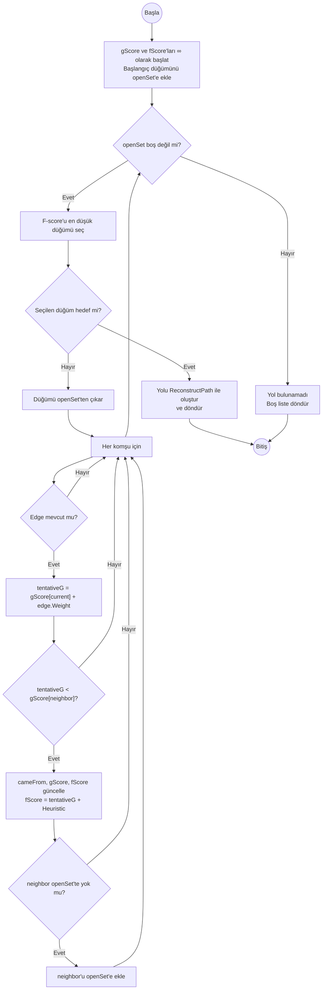
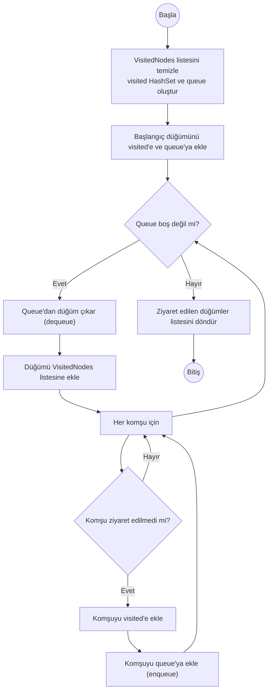
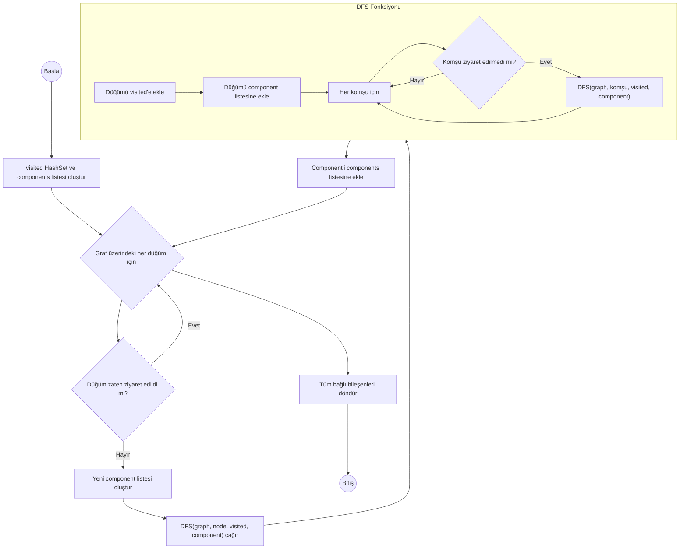
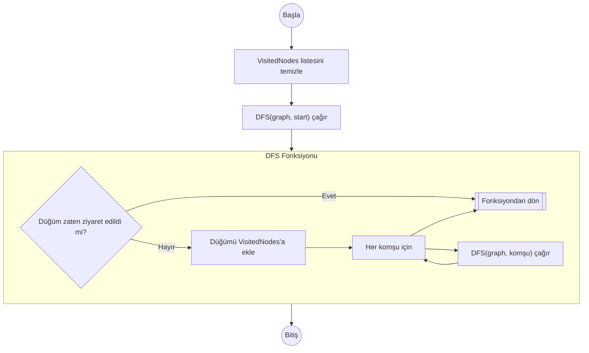
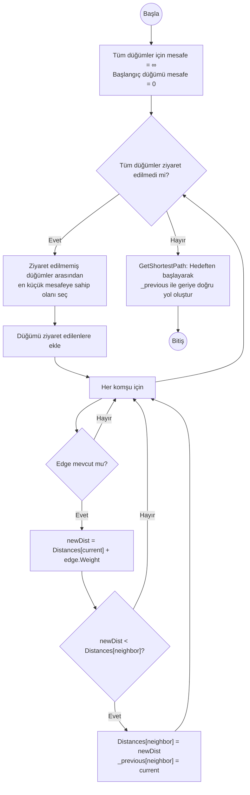
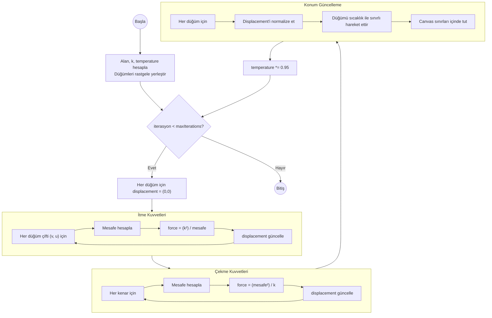
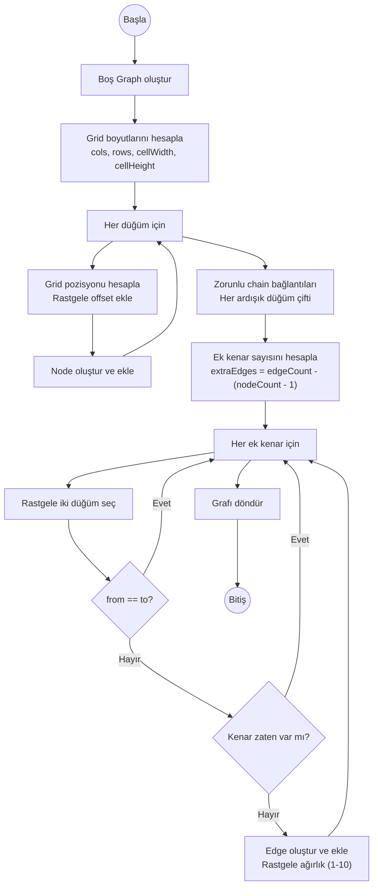
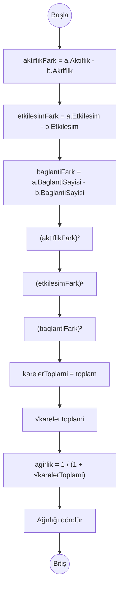
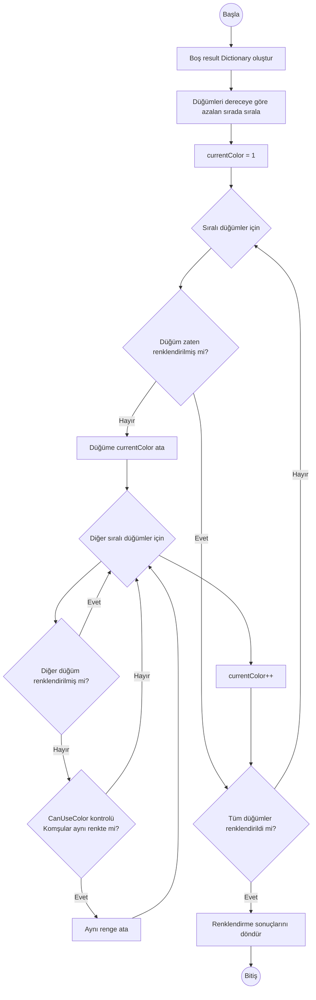

# Algoritmalarla Birlikte Sosyal Ağ Analiz Uygulaması

## 1-) Proje Bilgileri

**Proje Adı:** Algoritmalarla Birlikte Sosyal Ağ Analiz Uygulaması

**Üniversite:** Kocaeli Üniversitesi

**Fakülte:** Teknoloji Fakültesi

**Ders:** Yazılım Geliştirme Laboratuvarı-I

**Ekip Üyeleri:** İbrahim Alperen KESKİN - Emre Geyikçioğlu

**Proglama Dili:** C#

**IDE:** Visual Studio

**Teslim Tarih:** 01.01.2026

## 2-) Proje Tanımı ve Amaç

### 2.1 Problemin Tanımı

Günümüzde sosyal ağlar, bireyler arasındaki ilişkileri ve etkileşimleri modellemek için sıkça kullanılmaktadır. Bu tür ağlarda en etkili kullanıcıları belirlemek, toplulukları ayırt etmek ve en kısa bağlantı yollarını bulmak gibi işlemler için çeşitli graf algoritmaları gereklidir.

Piyasadaki mevcut sosyal ağ analiz araçları genellikle karmaşık yapıda ve kullanıcı dostu değildir. Bu eksikliği gidermek amacıyla, kullanıcıların sosyal ağları görsel olarak tasarlayabileceği, farklı algoritmaları uygulayabileceği ve sonuçları anlaşılır bir şekilde inceleyebileceği interaktif bir uygulama geliştirmeyi hedefledik.

### 2.2 Projenin Amacı

Projemizin temel amacı, kullanıcılar arasındaki ilişkileri graf veri yapısı ile temsil ederek, farklı graf algoritmalarını uygulamak ve sonuçları görselleştirmektir. Projenin ana hedefleri aşağıdaki gibidir:

- **Graf Modelleme:** Kullanıcılar ve bağlantılarını dinamik olarak yönetebilme, düğüm (node) ve kenar (edge) ekleme/silme/güncelleme işlemlerini gerçekleştirme
- **Algoritma Uygulama:** BFS, DFS, Dijkstra, A* gibi temel graf algoritmalarını uygulayarak en kısa yolları bulma ve erişilebilirlik analizi yapma
- **Topluluk Tespiti:** Bağlı bileşenleri ve ayrık toplulukları tespit ederek ağ yapısını anlama
- **Merkeziyet Analizi:** Degree centrality kullanarak en etkili kullanıcıları belirleme ve ağ içindeki önemli düğümleri tespit etme
- **Graf Renklendirme:** Welsh–Powell algoritması ile komşu düğümlerin farklı renklerde boyanmasını sağlama
- **Görselleştirme:** Tüm analiz sonuçlarını görsel ve tablo formatında sunarak kullanıcıya anlaşılır bir arayüz sağlama
- **Veri Yönetimi:** JSON ve CSV formatlarında veri içe/dışa aktarımı yaparak verilerin kalıcı olarak saklanmasını sağlama

Bu proje, nesne yönelimli programlama prensipleri, veri yapıları, algoritma analizi, görselleştirme teknikleri ve yazılım tasarımı konularındaki bilgi ve becerilerimizi pratik bir şekilde uygulama imkanı sağlamıştır.

### 2.3 Kullanım Alanları

Uygulamamızın kullanılabileceği başlıca alanlar şunlardır:

- **Sosyal Medya Analizi:** Kullanıcılar arasındaki etkileşimleri, topluluk yapılarını ve etkili kullanıcıları analiz etme
- **İş Ağı Analizi:** Şirketler, departmanlar veya çalışanlar arasındaki ilişkileri görselleştirme ve analiz etme
- **Akademik Araştırma:** Bilimsel işbirlikleri, atıf ağları ve araştırma topluluklarını inceleme
- **Eğitim Amaçlı:** Graf teorisi, algoritma analizi ve nesne yönelimli programlama kavramlarının öğretilmesi
- **Ağ Optimizasyonu:** En kısa yol problemlerini çözerek iletişim ağlarını optimize etme
- **Topluluk Tespiti:** Farklı grupları ve toplulukları belirleyerek ağ yapısını anlama
- **Performans Analizi:** Algoritmaların çalışma sürelerini ve performans metriklerini karşılaştırma

## 3-) Algoritmalar

### 3.1 A* (A-Star) Algoritması

A* algoritması, Dijkstra algoritmasının heuristik bilgi eklenmiş halidir. Bu algoritma, hedefe yönelik en kısa yol problemlerinde etkili bir şekilde çalışır. Algoritma, gerçek maliyet (g-score) ve tahmini maliyet (heuristic) toplamından oluşan f-score değerini kullanarak optimal yolu belirlemeye çalışır.

#### 3.1.1 Çalışma Mantığı

A* algoritması şu adımlarla çalışır:

1. **Başlangıç:** Başlangıç düğümü `openSet` listesine eklenir ve g-score değeri 0 olarak ayarlanır. F-score ise g-score + heuristic değerine eşittir.

2. **Döngü:** `openSet` boş olana kadar devam eder:
   - F-score değeri en düşük olan düğüm seçilir (en umut verici düğüm)
   - Eğer seçilen düğüm hedef düğüm ise, yol bulunmuştur ve algoritma sonlanır
   - Seçilen düğüm `openSet`'ten çıkarılır

3. **Komşu İnceleme:** Seçilen düğümün tüm komşuları için:
   - Mevcut düğümden komşuya giden yeni maliyet (tentativeG) hesaplanır
   - Eğer yeni maliyet, komşunun mevcut g-score'undan daha küçükse:
     - Komşunun g-score ve f-score değerleri güncellenir
     - Komşu, `cameFrom` sözlüğünde mevcut düğüme bağlanır
     - Eğer komşu `openSet`'te değilse, eklenir

4. **Yol Oluşturma:** Hedef düğüme ulaşıldığında, `cameFrom` sözlüğü kullanılarak geriye doğru yol oluşturulur.

**Heuristik Fonksiyon:** Projemizde Manhattan Distance heuristiği tercih edilmiştir:
```
h(n) = |x₁ - x₂| + |y₁ - y₂|
```
Bu heuristik fonksiyonu, iki düğüm arasındaki dikey ve yatay mesafelerin toplamını hesaplar. Admissible (kabul edilebilir) bir heuristik olduğundan, algoritmanın optimal çözüm üretmesini sağlar.

#### 3.1.2 Akış Diyagramı



#### 3.1.3 Karmaşıklık Analizi

**Zaman Karmaşıklığı:**
- **En İyi Durum:** O(b^d) - b: branching factor (ortalama komşu sayısı), d: optimal yol derinliği
- **Ortalama Durum:** O(b^d) - Heuristik fonksiyonun kalitesine bağlı olarak değişir
- **En Kötü Durum:** O(|V| + |E|) - Tüm düğümler ve kenarlar ziyaret edilirse (Dijkstra ile aynı)

**Uzay Karmaşıklığı:**
- O(|V|) - `openSet`, `cameFrom`, `gScore`, `fScore` sözlükleri için gerekli alan

**Not:** Uygun ve tutarlı bir heuristik kullanıldığında A* algoritması optimal çözümü garanti eder. Manhattan Distance heuristiği bu kriterleri karşıladığı için algoritmanın performansını önemli ölçüde iyileştirir.

#### 3.1.4 Literatür İncelemesi

A* algoritması, 1968 yılında Peter Hart, Nils Nilsson ve Bertram Raphael tarafından ortaya konulmuştur. Algoritma, Dijkstra algoritmasına heuristik bilgi eklenmesiyle daha verimli yol bulma imkanı sunar.

**Temel Kaynaklar:**

1. **Hart, P. E., Nilsson, N. J., & Raphael, B. (1968).** "A Formal Basis for the Heuristic Determination of Minimum Cost Paths." *IEEE Transactions on Systems Science and Cybernetics*, 4(2), 100-107. A* algoritmasının ilk formal tanımı ve matematiksel temelleri bu makalede yer almaktadır.

2. **Russell, S., & Norvig, P. (2020).** *Artificial Intelligence: A Modern Approach* (4th ed.). Prentice Hall. Bu kaynakta A* algoritması detaylı olarak ele alınmış ve farklı varyasyonları açıklanmıştır.

3. **Cormen, T. H., Leiserson, C. E., Rivest, R. L., & Stein, C. (2022).** *Introduction to Algorithms* (4th ed.). MIT Press. Graf algoritmaları bölümünde A* algoritması hakkında bilgiler bulunmaktadır.

4. **Dechter, R., & Pearl, J. (1985).** "Generalized Best-First Search Strategies and the Optimality of A*." *Journal of the ACM*, 32(3), 505-536. Bu çalışmada A* algoritmasının optimalite koşulları ve heuristik fonksiyonların karakteristikleri araştırılmıştır.

**Algoritmanın Özellikleri:**
- **Optimalite:** Uygun ve tutarlı heuristik kullanımı durumunda optimal çözümü garanti eder
- **Tamlık:** Hedefe ulaşılabilir bir yol mevcutsa mutlaka bulur
- **Verimlilik:** Kaliteli bir heuristik ile Dijkstra algoritmasından daha hızlı çalışır
- **Uygulama Alanları:** Oyun geliştirme, robotik uygulamalar, harita servisleri, ağ yönlendirme

**Projede Kullanımı:**
Projemizde A* algoritması, sosyal ağlarda iki kullanıcı arasındaki en kısa bağlantı yolunu tespit etmek amacıyla kullanılmıştır. Düğümlerin 2D koordinat sistemindeki konumlarına dayalı Manhattan Distance heuristiği hesaplanarak algoritmanın performansı optimize edilmiştir.

### 3.2 BFS (Breadth-First Search) Algoritması

BFS (Genişlik Öncelikli Arama) algoritması, bir graf üzerinde başlangıç düğümünden itibaren tüm erişilebilir düğümleri katmanlar halinde ziyaret eden bir graf tarama algoritmasıdır. Kuyruk (queue) veri yapısı kullanılarak çalışır. İlk olarak başlangıç düğümüne en yakın düğümler, ardından daha uzak düğümler ziyaret edilir.

#### 3.2.1 Çalışma Mantığı

BFS algoritması şu adımlarla çalışır:

1. **Başlangıç:** Başlangıç düğümü ziyaret edilenler setine eklenir ve kuyruğa (queue) eklenir.

2. **Döngü:** Kuyruk boş olana kadar devam eder:
   - Kuyruğun başındaki düğüm çıkarılır (dequeue)
   - Bu düğüm ziyaret edilen düğümler listesine eklenir
   - Düğümün tüm komşuları kontrol edilir

3. **Komşu İşleme:** Her komşu için:
   - Eğer komşu daha önce ziyaret edilmediyse:
     - Komşu ziyaret edilenler setine eklenir
     - Komşu kuyruğa eklenir (enqueue)

4. **Sonuç:** Tüm erişilebilir düğümler ziyaret edildikten sonra, ziyaret edilen düğümlerin listesi döndürülür.

**Özellikler:**
- BFS, ağırlıksız graflarda başlangıç düğümünden herhangi bir düğüme olan en kısa yolu bulur
- Algoritma, düğümleri seviye seviye (katman katman) ziyaret eder
- İlk seviyede başlangıç düğümü, ikinci seviyede başlangıç düğümünün komşuları, üçüncü seviyede komşuların komşuları vb. ziyaret edilir

#### 3.2.2 Akış Diyagramı



#### 3.2.3 Karmaşıklık Analizi

**Zaman Karmaşıklığı:**
- **En İyi Durum:** O(1) - Başlangıç düğümü hedef ise
- **Ortalama Durum:** O(|V| + |E|) - V: düğüm sayısı, E: kenar sayısı
- **En Kötü Durum:** O(|V| + |E|) - Tüm düğümler ve kenarlar ziyaret edilirse

**Uzay Karmaşıklığı:**
- O(|V|) - `visited` HashSet ve `queue` için gerekli alan. En kötü durumda tüm düğümler kuyrukta olabilir.

**Not:** Ağırlıksız graflarda BFS algoritması en kısa yolu garanti eder. Her düğüm tam olarak bir kez ziyaret edilir ve her kenar bir kez incelenir. Bu nedenle zaman karmaşıklığı doğrusaldır.

#### 3.2.4 Literatür İncelemesi

BFS algoritması, graf teorisinin temel algoritmalarından biridir ve 1950'li yıllardan itibaren bilgisayar bilimlerinde yaygın bir şekilde kullanılmaktadır. Algoritma, ilk olarak Edward F. Moore tarafından labirent çözme problemi için önerilmiş, daha sonra C. Y. Lee tarafından genelleştirilmiştir.

**Temel Kaynaklar:**

1. **Moore, E. F. (1959).** "The Shortest Path Through a Maze." *Proceedings of an International Symposium on the Theory of Switching*, 285-292. Harvard University Press. Bu çalışmada BFS algoritmasının ilk formal tanımı yer alıyor.

2. **Lee, C. Y. (1961).** "An Algorithm for Path Connections and Its Applications." *IRE Transactions on Electronic Computers*, EC-10(3), 346-365. Bu makalede BFS algoritmasının genelleştirilmiş versiyonu ve uygulama alanları anlatılıyor.

3. **Cormen, T. H., Leiserson, C. E., Rivest, R. L., & Stein, C. (2022).** *Introduction to Algorithms* (4th ed.). MIT Press. Bu kitapta BFS algoritmasının detaylı analizi, karmaşıklık analizi ve uygulama örnekleri var.

4. **Sedgewick, R., & Wayne, K. (2011).** *Algorithms* (4th ed.). Addison-Wesley Professional. Bu kitapta graf algoritmaları bölümünde BFS'in implementasyonu ve varyasyonları ele alınmış.

5. **Skiena, S. S. (2020).** *The Algorithm Design Manual* (3rd ed.). Springer. Bu kitapta BFS algoritmasının pratik uygulamaları ve problem çözme teknikleri anlatılıyor.

**Algoritmanın Özellikleri:**
- **Tamlık:** Başlangıç düğümünden erişilebilir tüm düğümleri buluyor
- **Optimalite:** Ağırlıksız graflarda en kısa yolu garanti ediyor
- **Basitlik:** Uygulaması kolay ve anlaşılır
- **Uygulama Alanları:** Kısa yol bulma, bağlı bileşen tespiti, seviye sıralı gezinme, ağ analizi

**Projede Kullanımı:**
Projemizde BFS algoritması, sosyal ağlarda belirli bir kullanıcıdan başlayarak erişilebilir tüm kullanıcıları tespit etmek amacıyla kullanılmıştır. Algoritma, başlangıç kullanıcısına en yakın bağlantıları öncelikli olarak, daha uzak bağlantıları ise sonraki adımlarda ziyaret ederek sosyal ağın yapısını analiz etmemize olanak sağlamaktadır. Ziyaret edilen düğümler, görsel olarak farklı renklerle işaretlenerek kullanıcıya algoritmanın çalışma prensibi gösterilmektedir.

### 3.3 Merkeziyet Analizi (Centrality Analysis)

Merkeziyet analizi, bir sosyal ağda hangi düğümlerin (kullanıcıların) en önemli veya en etkili olduğunu belirlemek için kullanılan bir graf analiz yöntemidir. Projemizde üç farklı merkeziyet metriği uygulanmıştır: Derece Merkeziyeti (Degree Centrality), Yakınlık Merkeziyeti (Closeness Centrality) ve Aradalık Merkeziyeti (Betweenness Centrality).

#### 3.3.1 Çalışma Mantığı

**3.3.1.1 Derece Merkeziyeti (Degree Centrality)**

Derece merkeziyeti, bir düğümün doğrudan bağlantı sayısını ölçer. En basit merkeziyet metriğidir ve bir düğümün ne kadar "popüler" veya "bağlantılı" olduğunu gösterir.

**Algoritma:**
1. Her düğüm için, o düğüme bağlı kenar sayısı hesaplanır
2. Bir kenar, kaynak (source) veya hedef (target) olarak düğüme bağlıysa sayılır
3. Sonuçlar, düğüm ve derece değeri çiftleri olarak döndürülür

**Formül:**
```
Degree(v) = |{u : (u,v) ∈ E veya (v,u) ∈ E}|
```

**3.3.1.2 Yakınlık Merkeziyeti (Closeness Centrality)**

Yakınlık merkeziyeti, bir düğümün ağdaki diğer tüm düğümlere ne kadar "yakın" olduğunu ölçer. Bir düğümün diğer düğümlere olan ortalama mesafesinin tersi olarak hesaplanır.

**Algoritma:**
1. Her düğüm için, diğer tüm düğümlere olan en kısa mesafeler Dijkstra algoritması kullanılarak hesaplanır
2. Tüm mesafeler toplanır
3. Yakınlık merkeziyeti: (n-1) / toplam_mesafe formülü ile hesaplanır
4. Daha yüksek değer, düğümün ağda daha merkezi olduğunu gösterir

**Formül:**
```
Closeness(v) = (n-1) / Σ d(v,u)
```
Burada n: düğüm sayısı, d(v,u): v ve u arasındaki en kısa mesafe

**3.3.1.3 Aradalık Merkeziyeti (Betweenness Centrality)**

Aradalık merkeziyeti, bir düğümün diğer düğüm çiftleri arasındaki en kısa yolların ne kadarında yer aldığını ölçer. Bir düğüm ne kadar çok en kısa yolun üzerindeyse, o kadar önemlidir.

**Algoritma:**
1. Tüm düğüm çiftleri (source, target) için en kısa yollar Dijkstra algoritması kullanılarak bulunur
2. Her yol için, başlangıç ve bitiş düğümleri hariç, yol üzerindeki tüm ara düğümlerin skorları artırılır
3. Sonuçlar, her düğümün kaç en kısa yolun üzerinde olduğunu gösterir
4. Daha yüksek skor, düğümün ağda daha kritik bir konumda olduğunu gösterir

**Formül:**
```
Betweenness(v) = Σ (σ_st(v) / σ_st)
```
Burada σ_st: s ve t arasındaki en kısa yolların sayısı, σ_st(v): s ve t arasındaki v'den geçen en kısa yolların sayısı

#### 3.3.2 Akış Diyagramı

```mermaid
flowchart TD
    Start((Başla))
    ChooseType{"Merkeziyet Tipi?"}
    DegreeType["Derece Merkeziyeti"]
    ClosenessType["Yakınlık Merkeziyeti"]
    BetweennessType["Aradalık Merkeziyeti"]
    
    Start --> ChooseType
    
    subgraph Degree["Derece Merkeziyeti"]
        ForEachNodeD["Her düğüm için"]
        CountEdges["Bağlı kenar sayısını hesapla"]
        StoreDegree["Sonucu kaydet"]
        DoneD{"Tüm düğümler bitti mi?"}
        ForEachNodeD --> CountEdges --> StoreDegree --> DoneD
        DoneD -->|Hayır| ForEachNodeD
        DoneD -->|Evet| EndD((Bitiş))
    end
    
    subgraph Closeness["Yakınlık Merkeziyeti"]
        ForEachNodeC["Her düğüm için"]
        ForEachTarget["Diğer tüm düğümler için"]
        DijkstraDist["Dijkstra ile mesafe hesapla"]
        SumDist["Mesafeleri topla"]
        CalcCloseness["Closeness = (n-1) / toplam"]
        StoreCloseness["Sonucu kaydet"]
        DoneC{"Tüm düğümler bitti mi?"}
        ForEachNodeC --> ForEachTarget --> DijkstraDist --> SumDist
        SumDist --> CalcCloseness --> StoreCloseness --> DoneC
        DoneC -->|Hayır| ForEachNodeC
        DoneC -->|Evet| EndC((Bitiş))
    end
    
    subgraph Betweenness["Aradalık Merkeziyeti"]
        InitScores["Tüm düğümler için skor = 0"]
        ForEachPair["Her düğüm çifti için"]
        DijkstraPath["Dijkstra ile en kısa yolu bul"]
        CheckPath{"Yol uzunluğu >= 3?"}
        ForEachMiddle["Yoldaki ara düğümler için"]
        IncScore["Skoru artır"]
        DoneB{"Tüm çiftler bitti mi?"}
        InitScores --> ForEachPair --> DijkstraPath --> CheckPath
        CheckPath -->|Evet| ForEachMiddle --> IncScore --> ForEachMiddle
        ForEachMiddle --> DoneB
        CheckPath -->|Hayır| DoneB
        DoneB -->|Hayır| ForEachPair
        DoneB -->|Evet| EndB((Bitiş))
    end
    
    ChooseType -->|Degree| DegreeType --> Degree
    ChooseType -->|Closeness| ClosenessType --> Closeness
    ChooseType -->|Betweenness| BetweennessType --> Betweenness
```



#### 3.3.3 Karmaşıklık Analizi

**Derece Merkeziyeti:**
- **Zaman Karmaşıklığı:** O(|V| × |E|) - Her düğüm için tüm kenarlar kontrol edilir
- **Uzay Karmaşıklığı:** O(|V|) - Sonuçlar için gerekli alan
- **Not:** En basit ve en hızlı merkeziyet metriğidir

**Yakınlık Merkeziyeti:**
- **Zaman Karmaşıklığı:** O(|V|² × (|V| + |E|)) - Her düğüm için tüm diğer düğümlere Dijkstra çalıştırılır
- **Uzay Karmaşıklığı:** O(|V|) - Dijkstra için gerekli alan
- **Not:** Dijkstra algoritmasının |V| kez çalıştırılması nedeniyle maliyetlidir

**Aradalık Merkeziyeti:**
- **Zaman Karmaşıklığı:** O(|V|² × (|V| + |E|)) - Tüm düğüm çiftleri için Dijkstra çalıştırılır
- **Uzay Karmaşıklığı:** O(|V|) - Skorlar ve Dijkstra için gerekli alan
- **Not:** En maliyetli merkeziyet metriğidir, ancak en detaylı bilgiyi sağlar

**Genel Not:** Tüm merkeziyet metrikleri, ağırlıklı graflarda kenar ağırlıklarını dikkate alarak hesaplanmıştır. Bu yaklaşım sayesinde sosyal ağlarda farklı bağlantı türlerinin farklı önem seviyelerine sahip olabileceği gerçeği yansıtılmıştır.

#### 3.3.4 Literatür İncelemesi

Merkeziyet analizi, sosyal ağ analizi ve graf teorisinin temel kavramlarından biridir. İlk olarak sosyologlar tarafından sosyal ağlarda bireylerin konumunu anlamak amacıyla geliştirilmiş, daha sonra bilgisayar bilimleri ve ağ analizi alanlarında yaygın bir şekilde kullanılmaya başlanmıştır.

**Temel Kaynaklar:**

1. **Freeman, L. C. (1978).** "Centrality in Social Networks Conceptual Clarification." *Social Networks*, 1(3), 215-239. Bu makalede merkeziyet kavramının ilk formal tanımları ve derece, yakınlık, aradalık merkeziyetleri yer alıyor.

2. **Freeman, L. C. (1979).** "Centrality in Networks: I. Conceptual Clarification." *Social Networks*, 1(3), 215-239. Bu çalışmada merkeziyet metriklerinin sosyal ağ analizindeki önemi ve uygulama alanları detaylandırılmış.

3. **Brandes, U. (2001).** "A Faster Algorithm for Betweenness Centrality." *Journal of Mathematical Sociology*, 25(2), 163-177. Bu makalede aradalık merkeziyetinin daha verimli hesaplanması için geliştirilmiş algoritmalar var.

4. **Newman, M. E. J. (2010).** *Networks: An Introduction*. Oxford University Press. Bu kitapta merkeziyet metriklerinin detaylı matematiksel açıklamaları, uygulamaları ve varyasyonları anlatılıyor.

5. **Wasserman, S., & Faust, K. (1994).** *Social Network Analysis: Methods and Applications*. Cambridge University Press. Bu kitapta sosyal ağ analizinde merkeziyet metriklerinin kullanımı ve yorumlanması ele alınmış.

6. **Borgatti, S. P., & Everett, M. G. (2006).** "A Graph-theoretic Perspective on Centrality." *Social Networks*, 28(4), 466-484. Bu çalışmada merkeziyet kavramı graf teorisi perspektifinden incelenmiş.

**Merkeziyet Metriklerinin Özellikleri:**
- **Derece Merkeziyeti:** Yerel önemi ölçüyor, hesaplaması hızlı, doğrudan bağlantıları vurguluyor
- **Yakınlık Merkeziyeti:** Global erişilebilirliği ölçüyor, bilgi yayılımında önemli, tüm ağ yapısını dikkate alıyor
- **Aradalık Merkeziyeti:** Ağdaki köprü rolünü ölçüyor, bilgi akışını kontrol eden düğümleri belirliyor, en maliyetli hesaplama

**Projede Kullanımı:**
Projemizde merkeziyet analizi, sosyal ağlarda en etkili kullanıcıları belirlemek amacıyla kullanılmıştır. Derece merkeziyeti ile en fazla bağlantıya sahip kullanıcılar, yakınlık merkeziyeti ile ağda en merkezi konumda bulunan kullanıcılar, aradalık merkeziyeti ile bilgi akışını kontrol eden kritik kullanıcılar tespit edilmiştir. Sonuçlar, en yüksek skorlu 5 düğümü tablo formatında gösterilip görsel olarak vurgulanarak kullanıcıya sunulmaktadır. Tüm hesaplamalar kenar ağırlıklarını dikkate alarak yapılmış ve dinamik ağırlık hesaplama formülü kullanılmıştır.

### 3.4 Bağlı Bileşenler Algoritması (Connected Components)

Bağlı bileşenler algoritması, bir graf içindeki birbirine bağlı düğüm gruplarını (toplulukları) tespit etmek için kullanılır. İki düğüm arasında bir yol mevcutsa aynı bağlı bileşende kabul edilir. Bu algoritma, sosyal ağlarda ayrık toplulukları, izole grupları ve ağın genel yapısını anlamak için kritik öneme sahiptir.

#### 3.4.1 Çalışma Mantığı

Algoritma, Depth-First Search (DFS) algoritmasını kullanarak bağlı bileşenleri bulur:

1. **Başlangıç:** Ziyaret edilen düğümler için bir HashSet ve bağlı bileşenler listesi oluşturulur.

2. **Döngü:** Graf üzerindeki her düğüm için:
   - Eğer düğüm daha önce ziyaret edilmediyse:
     - Yeni bir bağlı bileşen listesi oluşturulur
     - DFS algoritması bu düğümden başlayarak çalıştırılır
     - DFS, başlangıç düğümünden erişilebilir tüm düğümleri bulur ve bileşen listesine ekler
     - Tamamlanan bileşen, bileşenler listesine eklenir

3. **DFS İşlemi:** Her DFS çağrısında:
   - Mevcut düğüm ziyaret edilenler setine eklenir
   - Düğüm, mevcut bileşen listesine eklenir
   - Düğümün tüm komşuları için:
     - Eğer komşu daha önce ziyaret edilmediyse, DFS rekürsif olarak çağrılır

4. **Sonuç:** Tüm düğümler işlendikten sonra, her biri bir bağlı bileşeni temsil eden düğüm listelerinin listesi döndürülür.

**Özellikler:**
- Algoritma, yönsüz graflarda çalışır
- Her düğüm tam olarak bir bağlı bileşene aittir
- İki farklı bileşendeki düğümler arasında yol yoktur
- DFS kullanımı sayesinde algoritma verimli ve anlaşılır bir yapıya sahiptir

#### 3.4.2 Akış Diyagramı



#### 3.4.3 Karmaşıklık Analizi

**Zaman Karmaşıklığı:**
- **En İyi Durum:** O(|V| + |E|) - Tüm düğümler ve kenarlar bir kez ziyaret edilir
- **Ortalama Durum:** O(|V| + |E|) - Her düğüm ve kenar tam olarak bir kez işlenir
- **En Kötü Durum:** O(|V| + |E|) - Tüm düğümler ve kenarlar ziyaret edilir

**Uzay Karmaşıklığı:**
- O(|V|) - `visited` HashSet ve `components` listesi için gerekli alan. DFS'in rekürsif çağrıları için stack alanı da O(|V|) olabilir (en kötü durumda tüm düğümler bir zincir halinde).

**Not:** Algoritma, DFS'in doğrusal zaman karmaşıklığı sayesinde verimli bir şekilde çalışmaktadır. Her düğüm ve kenar tam olarak bir kez işlendiği için optimal zaman karmaşıklığına sahiptir. Bağlı bileşen sayısı algoritmanın performansını etkilememektedir.

#### 3.4.4 Literatür İncelemesi

Bağlı bileşenler problemi, graf teorisinin temel problemlerinden biridir ve 20. yüzyılın başlarından itibaren incelenmektedir. Algoritma DFS veya BFS kullanılarak çözülebilir ve her iki yaklaşım da aynı zaman karmaşıklığına sahiptir.

**Temel Kaynaklar:**

1. **Hopcroft, J., & Tarjan, R. (1973).** "Algorithm 447: Efficient Algorithms for Graph Manipulation." *Communications of the ACM*, 16(6), 372-378. Bu makalede bağlı bileşenler ve diğer graf problemleri için verimli algoritmalar yer alıyor.

2. **Cormen, T. H., Leiserson, C. E., Rivest, R. L., & Stein, C. (2022).** *Introduction to Algorithms* (4th ed.). MIT Press. Bu kitapta bağlı bileşenler algoritmasının detaylı analizi, DFS ve BFS kullanımı anlatılıyor.

3. **Sedgewick, R., & Wayne, K. (2011).** *Algorithms* (4th ed.). Addison-Wesley Professional. Bu kitapta graf algoritmaları bölümünde bağlı bileşenler algoritmasının implementasyonu ve varyasyonları ele alınmış.

4. **Newman, M. E. J. (2010).** *Networks: An Introduction*. Oxford University Press. Bu kitapta ağlarda bağlı bileşenlerin önemi, topluluk tespiti ile ilişkisi ve sosyal ağ analizindeki uygulamaları anlatılıyor.

5. **Skiena, S. S. (2020).** *The Algorithm Design Manual* (3rd ed.). Springer. Bu kitapta bağlı bileşenler algoritmasının pratik uygulamaları ve problem çözme teknikleri var.

6. **Tarjan, R. (1972).** "Depth-First Search and Linear Graph Algorithms." *SIAM Journal on Computing*, 1(2), 146-160. Bu klasik makalede DFS'in çeşitli graf problemlerindeki kullanımı, bağlı bileşenler dahil, detaylandırılmış.

**Algoritmanın Özellikleri:**
- **Tamlık:** Graf içindeki tüm bağlı bileşenleri buluyor
- **Verimlilik:** Doğrusal zaman karmaşıklığına sahip
- **Basitlik:** DFS veya BFS kullanarak kolayca implemente edilebiliyor
- **Uygulama Alanları:** Topluluk tespiti, ağ analizi, izole grup belirleme, ağ bağlantı kontrolü

**Projede Kullanımı:**
Projemizde bağlı bileşenler algoritması, sosyal ağlarda ayrık toplulukları ve izole grupları tespit etmek amacıyla kullanılmıştır. Algoritma, bir kullanıcıdan başlayarak o kullanıcının erişebileceği tüm kullanıcıları bulur ve böylece ağdaki farklı toplulukları belirler. Sonuçlar, her bir bağlı bileşeni görsel olarak farklı renklerle veya gruplar halinde gösterilerek kullanıcıya sunulmaktadır. Bu yaklaşım sayesinde sosyal ağın yapısını anlamak ve farklı topluluklar arasındaki bağlantıları analiz etmek mümkün hale gelmektedir.

### 3.5 DFS (Depth-First Search) Algoritması

DFS (Derinlik Öncelikli Arama) algoritması, bir graf üzerinde başlangıç düğümünden itibaren mümkün olduğunca derine inerek tüm erişilebilir düğümleri ziyaret eden bir graf tarama algoritmasıdır. Algoritma, yığın (stack) veri yapısı veya rekürsif çağrılar kullanarak çalışır ve her dalı mümkün olduğunca derinlemesine keşfeder.

#### 3.5.1 Çalışma Mantığı

DFS algoritması şu adımlarla çalışır:

1. **Başlangıç:** Başlangıç düğümü için DFS fonksiyonu çağrılır.

2. **Rekürsif İşlem:** Her DFS çağrısında:
   - Eğer düğüm daha önce ziyaret edildiyse, fonksiyon sonlanır (base case)
   - Düğüm ziyaret edilenler listesine eklenir
   - Düğümün tüm komşuları için:
     - DFS fonksiyonu rekürsif olarak çağrılır (komşu düğüm için)

3. **Derinlemesine Keşif:** Algoritma, her komşu için derinlemesine ilerler. Bir düğümün tüm komşuları ziyaret edilene kadar, o düğümden çıkılmaz.

4. **Geri Dönüş:** Bir düğümün tüm komşuları ziyaret edildiğinde, algoritma bir önceki düğüme geri döner (backtracking) ve oradan devam eder.

5. **Sonuç:** Tüm erişilebilir düğümler ziyaret edildikten sonra, ziyaret edilen düğümlerin listesi döndürülür.

**Özellikler:**
- DFS, rekürsif veya yığın kullanılarak implemente edilebilir
- Algoritma, her dalı mümkün olduğunca derinlemesine keşfeder
- BFS'den farklı olarak, düğümler seviye seviye değil, derinlik öncelikli olarak ziyaret edilir
- Ağırlıksız graflarda, başlangıç düğümünden erişilebilir tüm düğümleri bulur

**BFS ile Farkları:**
- BFS kuyruk (queue) kullanır, DFS yığın (stack) veya rekürsif çağrılar kullanır
- BFS seviye seviye (genişlik öncelikli), DFS derinlik öncelikli çalışır
- BFS en kısa yolu garanti eder, DFS garantisi yoktur (ağırlıksız graflarda)
- DFS genellikle daha az bellek kullanır (rekürsif derinlik kadar)

#### 3.5.2 Akış Diyagramı



#### 3.5.3 Karmaşıklık Analizi

**Zaman Karmaşıklığı:**
- **En İyi Durum:** O(1) - Başlangıç düğümü hedef ise veya hiç komşu yoksa
- **Ortalama Durum:** O(|V| + |E|) - V: düğüm sayısı, E: kenar sayısı
- **En Kötü Durum:** O(|V| + |E|) - Tüm düğümler ve kenarlar ziyaret edilirse

**Uzay Karmaşıklığı:**
- **Rekürsif Versiyon:** O(|V|) - En kötü durumda rekürsif çağrı derinliği |V| olabilir (tüm düğümler bir zincir halinde)
- **Yığın Kullanan Versiyon:** O(|V|) - Yığın için gerekli alan
- **Not:** DFS, genellikle BFS'den daha az bellek kullanır çünkü aynı anda sadece bir yol üzerindeki düğümler bellekte tutulur

**Not:** DFS algoritması her düğümü tam olarak bir kez ziyaret eder ve her kenarı bir kez inceler. Bu nedenle zaman karmaşıklığı doğrusaldır. Ancak ağırlıksız graflarda en kısa yolu garanti etmez, sadece başlangıç düğümünden erişilebilir tüm düğümleri bulur.

#### 3.5.4 Literatür İncelemesi

DFS algoritması, graf teorisinin en temel algoritmalarından biridir ve 19. yüzyıldan itibaren çeşitli formlarda kullanılmaktadır. Algoritmanın modern bilgisayar bilimlerindeki kullanımı 1950'li yıllarda başlamıştır.

**Temel Kaynaklar:**

1. **Tarjan, R. (1972).** "Depth-First Search and Linear Graph Algorithms." *SIAM Journal on Computing*, 1(2), 146-160. Bu klasik makalede DFS'in çeşitli graf problemlerindeki kullanımı detaylandırılmış ve algoritmanın modern bilgisayar bilimlerindeki temelini oluşturuyor.

2. **Hopcroft, J., & Tarjan, R. (1973).** "Algorithm 447: Efficient Algorithms for Graph Manipulation." *Communications of the ACM*, 16(6), 372-378. Bu makalede DFS'in bağlı bileşenler, topolojik sıralama ve diğer graf problemlerindeki uygulamaları anlatılıyor.

3. **Cormen, T. H., Leiserson, C. E., Rivest, R. L., & Stein, C. (2022).** *Introduction to Algorithms* (4th ed.). MIT Press. Bu kitapta DFS algoritmasının detaylı analizi, implementasyonu ve uygulama alanları yer alıyor.

4. **Sedgewick, R., & Wayne, K. (2011).** *Algorithms* (4th ed.). Addison-Wesley Professional. Bu kitapta graf algoritmaları bölümünde DFS'in rekürsif ve iteratif versiyonları, çeşitli uygulamaları ele alınmış.

5. **Skiena, S. S. (2020).** *The Algorithm Design Manual* (3rd ed.). Springer. Bu kitapta DFS algoritmasının pratik uygulamaları, problem çözme teknikleri ve BFS ile karşılaştırması var.

6. **Even, S. (2011).** *Graph Algorithms* (2nd ed.). Cambridge University Press. Bu kitapta DFS'in teorik temelleri ve çeşitli graf problemlerindeki kullanımı detaylandırılmış.

**Algoritmanın Özellikleri:**
- **Tamlık:** Başlangıç düğümünden erişilebilir tüm düğümleri buluyor
- **Verimlilik:** Doğrusal zaman karmaşıklığına sahip
- **Esneklik:** Rekürsif veya iteratif (yığın kullanarak) implemente edilebiliyor
- **Uygulama Alanları:** Topolojik sıralama, döngü tespiti, bağlı bileşenler, labirent çözme, ağaç gezinme

**BFS ile Karşılaştırma:**
- **Bellek Kullanımı:** DFS genellikle daha az bellek kullanıyor
- **Yol Bulma:** BFS en kısa yolu garanti ediyor, DFS garantisi yok
- **Uygulama:** BFS kuyruk, DFS yığın veya rekürsif çağrılar kullanıyor
- **Ziyaret Sırası:** BFS seviye seviye, DFS derinlik öncelikli

**Projede Kullanımı:**
Projemizde DFS algoritması, sosyal ağlarda bir kullanıcıdan başlayarak erişilebilir tüm kullanıcıları bulmak amacıyla kullanılmıştır. Algoritma, başlangıç kullanıcısından itibaren her bir bağlantıyı derinlemesine keşfeder ve tüm erişilebilir kullanıcıları ziyaret eder. Ziyaret edilen düğümler, görsel olarak farklı renklerle (mor tonları) işaretlenerek kullanıcıya algoritmanın çalışma prensibi gösterilmektedir. BFS'den farklı olarak DFS düğümleri derinlik öncelikli olarak ziyaret eder, bu da sosyal ağın farklı bir perspektiften analiz edilmesini sağlar.

### 3.6 Dijkstra En Kısa Yol Algoritması

Dijkstra algoritması, ağırlıklı bir graf üzerinde başlangıç düğümünden tüm diğer düğümlere olan en kısa yolları bulmak için kullanılan klasik bir graf algoritmasıdır. Algoritma, negatif ağırlıklı kenarların bulunmadığı graflarda optimal çözümü garanti eder ve sosyal ağlarda en kısa bağlantı yollarını bulmak için idealdir.

#### 3.6.1 Çalışma Mantığı

Dijkstra algoritması şu adımlarla çalışır:

1. **Başlangıç:** 
   - Tüm düğümler için mesafe değerleri sonsuz (∞) olarak başlatılır
   - Başlangıç düğümünün mesafesi 0 olarak ayarlanır
   - Ziyaret edilen düğümler için bir HashSet oluşturulur
   - Her düğümün önceki düğümünü tutmak için bir sözlük oluşturulur

2. **Ana Döngü:** Tüm düğümler ziyaret edilene kadar:
   - Ziyaret edilmemiş düğümler arasından en küçük mesafeye sahip olan seçilir
   - Seçilen düğüm ziyaret edilenler setine eklenir

3. **Komşu Güncelleme:** Seçilen düğümün tüm komşuları için:
   - Mevcut düğümden komşuya giden yeni mesafe hesaplanır: `yeniMesafe = mevcutMesafe + kenarAğırlığı`
   - Eğer yeni mesafe, komşunun mevcut mesafesinden küçükse:
     - Komşunun mesafesi güncellenir
     - Komşunun önceki düğümü mevcut düğüm olarak kaydedilir

4. **Yol Oluşturma:** Belirli bir hedef düğüme olan en kısa yol, `_previous` sözlüğü kullanılarak geriye doğru oluşturulur:
   - Hedef düğümden başlayarak, önceki düğümler takip edilir
   - Başlangıç düğümüne ulaşılana kadar devam edilir
   - Yol ters çevrilerek doğru sırada döndürülür

**Özellikler:**
- Algoritma, ağırlıklı graflarda en kısa yolu garanti eder (negatif ağırlık yoksa)
- Her düğüm tam olarak bir kez ziyaret edilir
- Greedy (açgözlü) bir algoritmadır: her adımda en kısa mesafeye sahip düğümü seçer
- Kenar ağırlıkları, sosyal ağlarda bağlantıların önemini veya mesafesini temsil eder

**Kısıtlamalar:**
- Negatif ağırlıklı kenarlar desteklenmez (Bellman-Ford algoritması gerekir)
- Tüm düğümlere olan mesafeler hesaplanır (sadece hedefe değil)

#### 3.6.2 Akış Diyagramı



#### 3.6.3 Karmaşıklık Analizi

**Zaman Karmaşıklığı:**
- **Basit Implementasyon (Bu projede kullanılan):** O(|V|² + |E|) - Her düğüm için tüm düğümler arasından minimum bulma O(|V|), toplamda |V| kez yapılıyor
- **Öncelik Kuyruğu ile:** O((|V| + |E|) × log|V|) - Binary heap veya Fibonacci heap kullanıldığında
- **Fibonacci Heap ile:** O(|E| + |V| × log|V|) - En iyi teorik karmaşıklık

**Uzay Karmaşıklığı:**
- O(|V|) - `Distances`, `_previous` sözlükleri ve `visited` HashSet için gerekli alan

**Not:** Projemizde kullanılan implementasyon basit bir yaklaşım benimser ve küçük-orta ölçekli graflar için yeterlidir. Büyük graflar için öncelik kuyruğu (priority queue) kullanılarak performans artırılabilir. Ancak sosyal ağ analizi uygulamalarında genellikle küçük-orta ölçekli graflar kullanıldığı için mevcut implementasyon yeterlidir.

#### 3.6.4 Literatür İncelemesi

Dijkstra algoritması, 1956 yılında Hollandalı bilgisayar bilimci Edsger W. Dijkstra tarafından geliştirilmiştir. Algoritma, başlangıçta bilgisayar ağlarında yönlendirme problemlerini çözmek için tasarlanmış, daha sonra birçok farklı alanda yaygın olarak kullanılmaya başlanmıştır.

**Temel Kaynaklar:**

1. **Dijkstra, E. W. (1959).** "A Note on Two Problems in Connexion with Graphs." *Numerische Mathematik*, 1(1), 269-271. Bu makale, Dijkstra algoritmasının orijinal tanımını ve matematiksel temellerini sunmaktadır. Algoritma, iki problem için çözüm olarak önerilmiştir: en kısa yol ve minimum spanning tree.

2. **Cormen, T. H., Leiserson, C. E., Rivest, R. L., & Stein, C. (2022).** *Introduction to Algorithms* (4th ed.). MIT Press. Bu kitap, Dijkstra algoritmasının detaylı analizini, karmaşıklık analizini, çeşitli implementasyonlarını ve uygulama örneklerini içermektedir.

3. **Fredman, M. L., & Tarjan, R. E. (1987).** "Fibonacci Heaps and Their Uses in Improved Network Optimization Algorithms." *Journal of the ACM*, 34(3), 596-615. Bu makale, Fibonacci heap kullanılarak Dijkstra algoritmasının performansını artıran optimizasyonları sunmaktadır.

4. **Sedgewick, R., & Wayne, K. (2011).** *Algorithms* (4th ed.). Addison-Wesley Professional. Graf algoritmaları bölümünde Dijkstra algoritmasının implementasyonu, öncelik kuyruğu kullanımı ve pratik uygulamaları ele alınmaktadır.

5. **Skiena, S. S. (2020).** *The Algorithm Design Manual* (3rd ed.). Springer. Bu kitap, Dijkstra algoritmasının pratik uygulamalarını, problem çözme tekniklerini ve diğer en kısa yol algoritmaları ile karşılaştırmasını içermektedir.

6. **Ahuja, R. K., Magnanti, T. L., & Orlin, J. B. (1993).** *Network Flows: Theory, Algorithms, and Applications*. Prentice Hall. Bu kitap, ağ akış problemlerinde Dijkstra algoritmasının kullanımını ve varyasyonlarını detaylandırmaktadır.

**Algoritmanın Özellikleri:**
- **Optimalite:** Negatif ağırlık yoksa optimal çözümü garanti eder
- **Greedy Yaklaşım:** Her adımda en iyi yerel seçimi yapar
- **Tamlık:** Başlangıç düğümünden erişilebilir tüm düğümlere olan en kısa yolları bulur
- **Uygulama Alanları:** Ağ yönlendirme, harita uygulamaları, sosyal ağ analizi, oyun geliştirme, lojistik optimizasyonu

**Diğer Algoritmalar ile Karşılaştırma:**
- **Bellman-Ford:** Negatif ağırlıkları destekler ama daha yavaştır (O(|V| × |E|))
- **Floyd-Warshall:** Tüm düğüm çiftleri arasındaki en kısa yolları bulur ama daha maliyetlidir (O(|V|³))
- **A*:** Heuristik kullanarak daha hızlı çalışır ama sadece tek bir hedef için

**Projede Kullanımı:**
Bu projede Dijkstra algoritması, sosyal ağlarda iki kullanıcı arasındaki en kısa bağlantı yolunu bulmak amacıyla kullanılmaktadır. Algoritma, kenar ağırlıklarını (dinamik ağırlık hesaplama formülü ile hesaplanan) dikkate alarak başlangıç kullanıcısından hedef kullanıcıya olan en optimal yolu belirler. Sonuç, görsel olarak vurgulanan bir yol olarak kullanıcıya sunulur ve yol üzerindeki düğümler yeşil renkle işaretlenir. Ayrıca algoritma, merkeziyet analizinde (yakınlık ve aradalık merkeziyeti) de kullanılmakta ve tüm düğüm çiftleri arasındaki en kısa mesafeleri hesaplamak için yardımcı fonksiyon olarak görev yapmaktadır.

### 3.7 Kuvvet Yönelimli Yerleşim Algoritması (Force-Directed Layout)

Kuvvet yönelimli yerleşim algoritması, graf görselleştirme için kullanılan fizik tabanlı bir yerleşim yöntemidir. Algoritma, düğümleri birbirine bağlı yaylar (springs) ve itme kuvvetleri (repulsion forces) ile modelleyerek grafın estetik ve anlaşılır bir şekilde görselleştirilmesini sağlar. Bu algoritma, sosyal ağların görsel analizinde kritik öneme sahiptir.

#### 3.7.1 Çalışma Mantığı

Kuvvet yönelimli yerleşim algoritması, fiziksel bir simülasyon yaklaşımı kullanır:

1. **Başlangıç:**
   - Düğümler rastgele konumlara yerleştirilir
   - Optimal düğüm mesafesi (k) hesaplanır: `k = √(alan / düğüm_sayısı)`
   - Başlangıç sıcaklığı (temperature) ayarlanır: `temperature = genişlik / 10`
   - Sıcaklık, düğümlerin hareket miktarını kontrol eder

2. **İteratif İyileştirme:** Belirtilen iterasyon sayısı kadar (varsayılan 200):
   
   **a) İtme Kuvvetleri (Repulsion):**
   - Her düğüm çifti (v, u) için:
     - İki düğüm arasındaki mesafe hesaplanır
     - İtme kuvveti: `force = (k²) / mesafe`
     - Kuvvet, düğümlerin birbirinden uzaklaşmasına neden olur
     - Her düğüm için toplam yer değiştirme (displacement) hesaplanır

   **b) Çekme Kuvvetleri (Attraction):**
   - Her kenar (edge) için:
     - Kenarın bağladığı iki düğüm arasındaki mesafe hesaplanır
     - Çekme kuvveti: `force = (mesafe²) / k`
     - Kuvvet, bağlı düğümlerin birbirine yaklaşmasına neden olur
     - Her düğüm için yer değiştirme güncellenir

   **c) Konum Güncelleme:**
   - Her düğüm için:
     - Toplam yer değiştirme vektörü normalize edilir
     - Düğüm, sıcaklık ile sınırlandırılmış miktarda hareket eder
     - Düğümün yeni konumu, canvas sınırları içinde kalacak şekilde sınırlandırılır

   **d) Soğutma (Cooling):**
   - Sıcaklık her iterasyonda %5 azaltılır: `temperature *= 0.95`
   - Bu, algoritmanın yavaş yavaş dengeye ulaşmasını sağlar

3. **Sonuç:** İterasyonlar tamamlandığında, düğümler dengeli ve estetik bir konfigürasyonda yerleşmiş olur.

**Özellikler:**
- Bağlı düğümler birbirine yakın, bağlı olmayan düğümler birbirinden uzak yerleşir
- Algoritma, grafın yapısını görsel olarak yansıtır
- İteratif yaklaşım sayesinde, başlangıç konumlarından bağımsız olarak iyi sonuçlar verir
- Sıcaklık azaltma (cooling) mekanizması, algoritmanın kararlı bir şekilde yakınsamasını sağlar

#### 3.7.2 Akış Diyagramı



#### 3.7.3 Karmaşıklık Analizi

**Zaman Karmaşıklığı:**
- **Her İterasyon:** O(|V|² + |E|) - İtme kuvvetleri için tüm düğüm çiftleri O(|V|²), çekme kuvvetleri için tüm kenarlar O(|E|)
- **Toplam:** O(iterasyon_sayısı × (|V|² + |E|)) - Varsayılan 200 iterasyon için
- **Not:** İterasyon sayısı sabit olduğu için, pratikte O(|V|² + |E|) olarak kabul edilebilir

**Uzay Karmaşıklığı:**
- O(|V|) - Her düğüm için displacement vektörü saklanır

**Not:** Algoritma, özellikle büyük graflar için maliyetli olabilir çünkü her iterasyonda tüm düğüm çiftleri kontrol edilir. Ancak görselleştirme kalitesi ve kullanıcı deneyimi açısından bu maliyet kabul edilebilirdir. Küçük-orta ölçekli graflar (10-100 düğüm) için algoritma makul sürelerde çalışmaktadır.

**Optimizasyon Notları:**
- Barnes-Hut algoritması gibi hiyerarşik yöntemler kullanılarak itme kuvvetleri O(|V| log |V|) zamanında hesaplanabilir
- Çok büyük graflar için, düğüm çiftleri yerine sadece yakın komşular kontrol edilebilir

#### 3.7.4 Literatür İncelemesi

Kuvvet yönelimli yerleşim algoritmaları, 1980'li yıllardan itibaren graf görselleştirme alanında yaygın olarak kullanılmaktadır. İlk modern algoritmalar, Eades (1984) ve Fruchterman-Reingold (1991) tarafından geliştirilmiştir.

**Temel Kaynaklar:**

1. **Eades, P. (1984).** "A Heuristic for Graph Drawing." *Congressus Numerantium*, 42, 149-160. Bu makale, kuvvet yönelimli yerleşim algoritmalarının temelini oluşturan spring-embedder yaklaşımını sunmaktadır.

2. **Fruchterman, T. M. J., & Reingold, E. M. (1991).** "Graph Drawing by Force-Directed Placement." *Software: Practice and Experience*, 21(11), 1129-1164. Bu klasik makale, modern kuvvet yönelimli algoritmaların temelini oluşturur ve sıcaklık azaltma (cooling) mekanizmasını tanıtır.

3. **Kamada, T., & Kawai, S. (1989).** "An Algorithm for Drawing General Undirected Graphs." *Information Processing Letters*, 31(1), 7-15. Bu çalışma, ideal düğüm mesafelerini kullanarak daha iyi yerleşimler üreten bir algoritma sunmaktadır.

4. **Kobourov, S. G. (2012).** "Force-Directed Drawing Algorithms." In *Handbook of Graph Drawing and Visualization* (pp. 383-408). CRC Press. Bu bölüm, kuvvet yönelimli algoritmaların kapsamlı bir incelemesini ve karşılaştırmasını içermektedir.

5. **Herman, I., Melançon, G., & Marshall, M. S. (2000).** "Graph Visualization and Navigation in Information Visualization: A Survey." *IEEE Transactions on Visualization and Computer Graphics*, 6(1), 24-43. Bu makale, graf görselleştirme yöntemlerini, kuvvet yönelimli algoritmalar dahil, kapsamlı bir şekilde ele almaktadır.

6. **Purchase, H. C. (2002).** "Metrics for Graph Drawing Aesthetics." *Journal of Visual Languages & Computing*, 13(5), 501-516. Bu çalışma, graf görselleştirmelerinin estetik kalitesini ölçmek için metrikler sunmaktadır.

**Algoritmanın Özellikleri:**
- **Estetik Kalite:** Bağlı düğümler yakın, bağlı olmayanlar uzak yerleşir
- **Genel Uygulanabilirlik:** Herhangi bir graf yapısına uygulanabilir
- **İteratif İyileştirme:** Başlangıç konumlarından bağımsız olarak iyi sonuçlar verir
- **Uygulama Alanları:** Sosyal ağ görselleştirme, bilgi mimarisi, ağ analizi, veri görselleştirme

**Varyasyonlar ve Geliştirmeler:**
- **Fruchterman-Reingold:** Sıcaklık azaltma ile daha hızlı yakınsama
- **Kamada-Kawai:** İdeal mesafeler kullanarak daha dengeli yerleşimler
- **Barnes-Hut:** Büyük graflar için hiyerarşik optimizasyon
- **Multilevel:** Çok seviyeli yaklaşımla büyük grafların hızlı yerleşimi

**Projede Kullanımı:**
Bu projede kuvvet yönelimli yerleşim algoritması, sosyal ağların görsel olarak anlaşılır bir şekilde gösterilmesi için kullanılmaktadır. Algoritma, kullanıcılar arasındaki bağlantıları görsel olarak yansıtarak yakın ilişkileri olan kullanıcıların birbirine yakın, uzak ilişkileri olanların ise birbirinden uzak yerleşmesini sağlar. Bu yaklaşım, sosyal ağın yapısını anlamak ve toplulukları tespit etmek için görsel bir yardımcı sağlamaktadır. Algoritma, graf içe aktarıldığında veya rastgele graf oluşturulduğunda otomatik olarak çalıştırılabilir ve kullanıcıya düzenli ve estetik bir görselleştirme sunmaktadır.

### 3.8 Rastgele Graf Üretici (Random Graph Generator)

Rastgele graf üretici, test ve görselleştirme amaçları için belirli parametrelere göre rastgele graflar oluşturan bir yardımcı algoritmadır. Algoritma, düğüm sayısı, kenar sayısı ve canvas boyutları gibi parametreleri alarak bağlantılı ve test edilebilir bir graf yapısı üretir.

#### 3.8.1 Çalışma Mantığı

Rastgele graf üretici algoritması şu adımlarla çalışır:

1. **Düğüm Yerleşimi (Grid Layout):**
   - Düğüm sayısına göre grid boyutları hesaplanır:
     - Sütun sayısı: `cols = ⌈√düğüm_sayısı⌉`
     - Satır sayısı: `rows = ⌈düğüm_sayısı / cols⌉`
   - Canvas alanı, padding değerleri çıkarılarak grid hücrelerine bölünür
   - Her düğüm, grid hücresine rastgele bir offset ile yerleştirilir
   - Düğüm isimleri: A0, B1, C2, ... şeklinde otomatik oluşturulur

2. **Zorunlu Bağlantılar (Chain):**
   - Tüm düğümlerin bağlı olmasını garanti etmek için, düğümler sıralı olarak birbirine bağlanır
   - Her ardışık düğüm çifti arasında bir kenar oluşturulur
   - Bu, grafın en az bir bağlı bileşene sahip olmasını garanti eder
   - Kenar ağırlıkları rastgele olarak 1-10 arasında atanır

3. **Rastgele Kenar Ekleme:**
   - İstenen toplam kenar sayısına ulaşmak için ek kenarlar eklenir
   - Ek kenar sayısı: `ek_kenar = toplam_kenar - (düğüm_sayısı - 1)`
   - Her ek kenar için:
     - Rastgele iki düğüm seçilir
     - Self-loop kontrolü yapılır (aynı düğüm seçilirse atlanır)
     - Duplicate kenar kontrolü yapılır (zaten varsa atlanır)
     - Yeni kenar, rastgele ağırlık (1-10) ile eklenir

4. **Sonuç:** Tüm düğümler ve kenarlar oluşturulduktan sonra, tam bir graf yapısı döndürülür.

**Özellikler:**
- Graf her zaman bağlıdır (chain yapısı sayesinde)
- Düğümler düzenli bir grid üzerinde dağıtılır, görselleştirme için uygundur
- Kenar ağırlıkları rastgele atanır, gerçekçi test senaryoları oluşturur
- Duplicate kenarlar ve self-loop'lar engellenir

**Kısıtlamalar:**
- Maksimum kenar sayısı, tam grafın kenar sayısı ile sınırlıdır: `max_kenar = n × (n-1) / 2`
- Çok fazla kenar istenirse, algoritma tüm olası kenarları ekleyene kadar çalışır

#### 3.8.2 Akış Diyagramı



#### 3.8.3 Karmaşıklık Analizi

**Zaman Karmaşıklığı:**
- **Düğüm Oluşturma:** O(|V|) - Her düğüm bir kez oluşturulur
- **Chain Bağlantıları:** O(|V|) - (|V| - 1) kenar oluşturulur
- **Rastgele Kenar Ekleme:** O(|E| × |E|) - En kötü durumda, her kenar için tüm mevcut kenarlar kontrol edilir (duplicate kontrolü)
- **Toplam:** O(|V| + |E|²) - En kötü durumda
- **Pratikte:** O(|V| + |E|) - Duplicate kontrolü hash set kullanılarak optimize edilebilir

**Uzay Karmaşıklığı:**
- O(|V| + |E|) - Oluşturulan graf için gerekli alan

**Not:** Algoritma, test ve görselleştirme amaçlı olduğu için performans kritik değildir. Küçük-orta ölçekli graflar (10-100 düğüm) için algoritma anında çalışmaktadır. Duplicate kenar kontrolü, mevcut implementasyonda tüm kenarlar üzerinde lineer arama yapıldığı için maliyetli olabilir, ancak pratik kullanımda kabul edilebilirdir.

#### 3.8.4 Literatür İncelemesi

Rastgele graf üretimi, graf teorisi ve algoritma testlerinde yaygın olarak kullanılan bir yöntemdir. Farklı rastgele graf modelleri, farklı özelliklere sahip graflar üretmek amacıyla geliştirilmiştir.

**Temel Kaynaklar:**

1. **Erdős, P., & Rényi, A. (1959).** "On Random Graphs." *Publicationes Mathematicae*, 6, 290-297. Bu klasik makale, rastgele graf teorisinin temelini oluşturur ve Erdős-Rényi modelini tanıtır.

2. **Erdős, P., & Rényi, A. (1960).** "On the Evolution of Random Graphs." *Publications of the Mathematical Institute of the Hungarian Academy of Sciences*, 5, 17-61. Bu çalışma, rastgele grafların evrimini ve özelliklerini detaylandırmaktadır.

3. **Newman, M. E. J. (2010).** *Networks: An Introduction*. Oxford University Press. Bu kitap, rastgele graf modellerini, özelliklerini ve uygulamalarını kapsamlı bir şekilde ele almaktadır.

4. **Bollobás, B. (2001).** *Random Graphs* (2nd ed.). Cambridge University Press. Bu kitap, rastgele graf teorisinin matematiksel temellerini ve çeşitli modelleri detaylandırmaktadır.

5. **Watts, D. J., & Strogatz, S. H. (1998).** "Collective Dynamics of 'Small-World' Networks." *Nature*, 393(6684), 440-442. Bu makale, küçük dünya (small-world) ağlarını ve rastgele graf modellerini incelemektedir.

6. **Barabási, A. L., & Albert, R. (1999).** "Emergence of Scaling in Random Networks." *Science*, 286(5439), 509-512. Bu çalışma, ölçeklenebilir (scale-free) ağların rastgele oluşumunu incelemektedir.

**Rastgele Graf Modelleri:**
- **Erdős-Rényi Modeli:** Her kenarın bağımsız olarak eklenme olasılığına sahip olduğu model
- **Watts-Strogatz Modeli:** Küçük dünya özelliklerine sahip ağlar üreten model
- **Barabási-Albert Modeli:** Ölçeklenebilir ağlar üreten, tercihli bağlanma (preferential attachment) kullanan model
- **Grid-Based Modeli:** Bu projede kullanılan, düzenli grid üzerinde düğümlerin yerleştirildiği model

**Algoritmanın Özellikleri:**
- **Bağlantılılık Garantisi:** Chain yapısı sayesinde graf her zaman bağlıdır
- **Görselleştirme Uygunluğu:** Grid yerleşimi, düğümlerin düzenli dağılımını sağlar
- **Test Senaryoları:** Farklı düğüm ve kenar sayıları ile test edilebilir graflar üretir
- **Uygulama Alanları:** Algoritma testleri, görselleştirme örnekleri, eğitim amaçlı graf oluşturma

**Projede Kullanımı:**
Bu projede rastgele graf üretici algoritması, test ve görselleştirme amaçları için kullanılmaktadır. Kullanıcılar, farklı düğüm ve kenar sayıları ile rastgele graflar oluşturarak algoritmaları test edebilir ve görselleştirme özelliklerini deneyebilir. Algoritma, her zaman bağlı bir graf ürettiği için tüm algoritmaların (BFS, DFS, Dijkstra, A*, vb.) çalıştırılabilmesini garanti eder. Oluşturulan graf, kuvvet yönelimli yerleşim algoritması ile daha estetik bir görünüme kavuşturulabilir ve kullanıcıya sunulmaktadır.

### 3.9 Dinamik Ağırlık Hesaplama Algoritması (Weight Calculator)

Dinamik ağırlık hesaplama algoritması, sosyal ağlarda iki düğüm (kullanıcı) arasındaki kenar ağırlığını düğümlerin sayısal özelliklerine göre hesaplayan bir metrik fonksiyonudur. Algoritma, Öklidyen mesafe tabanlı bir formül kullanarak benzer özelliklere sahip düğümler arasında yüksek ağırlık, farklı özelliklere sahip düğümler arasında düşük ağırlık üretir.

#### 3.9.1 Çalışma Mantığı

Dinamik ağırlık hesaplama algoritması şu adımlarla çalışır:

1. **Özellik Farklarını Hesaplama:**
   - İki düğüm (a, b) arasındaki üç özellik farkı hesaplanır:
     - `aktiflikFark = a.Aktiflik - b.Aktiflik`
     - `etkilesimFark = a.Etkilesim - b.Etkilesim`
     - `baglantiFark = a.BaglantiSayisi - b.BaglantiSayisi`

2. **Kareler Toplamı:**
   - Her özellik farkının karesi alınır ve toplanır:
     - `karelerToplami = (aktiflikFark)² + (etkilesimFark)² + (baglantiFark)²`
   - Bu, 3 boyutlu Öklidyen uzayında iki nokta arasındaki mesafenin karesidir

3. **Ağırlık Hesaplama:**
   - Kareler toplamının karekökü alınır (Öklidyen mesafe)
   - Ağırlık, mesafenin tersi olarak hesaplanır:
     - `agirlik = 1 / (1 + √karelerToplami)`

**Matematiksel Formül:**
\[
Ağırlık_{i,j} = \frac{1}{1 + \sqrt{(Aktiflik_i - Aktiflik_j)^2 + (Etkilesim_i - Etkilesim_j)^2 + (Bağlantı_i - Bağlantı_j)^2}}
\]

**Özellikler:**
- **Benzerlik Tabanlı:** Benzer özelliklere sahip düğümler arasında yüksek ağırlık (düşük mesafe)
- **Farklılık Tabanlı:** Farklı özelliklere sahip düğümler arasında düşük ağırlık (yüksek mesafe)
- **Normalize Edilmiş:** Ağırlık değeri her zaman 0 ile 1 arasındadır
- **Öklidyen Mesafe:** 3 boyutlu özellik uzayında gerçek mesafeyi yansıtır

**Ağırlık Değerlerinin Yorumu:**
- **Yüksek Ağırlık (≈1):** Düğümler çok benzer özelliklere sahip, güçlü bağlantı
- **Orta Ağırlık (0.3-0.7):** Düğümler orta düzeyde benzer, orta güçte bağlantı
- **Düşük Ağırlık (≈0):** Düğümler çok farklı özelliklere sahip, zayıf bağlantı

#### 3.9.2 Akış Diyagramı



#### 3.9.3 Karmaşıklık Analizi

**Zaman Karmaşıklığı:**
- **Sabit Zaman:** O(1) - İki düğüm arasındaki ağırlık hesaplaması sabit zaman alır
- **Bağımsız:** Düğüm sayısı veya kenar sayısından bağımsızdır
- **İşlemler:** Toplama, çıkarma, kare alma, karekök alma - tümü sabit zaman

**Uzay Karmaşıklığı:**
- O(1) - Sadece birkaç değişken için gerekli alan

**Not:** Algoritma, her kenar için bağımsız olarak çalıştırıldığı için tüm graf için toplam zaman karmaşıklığı O(|E|) olur. Ancak tek bir ağırlık hesaplaması O(1) zaman alır ve çok verimlidir.

**Performans Notları:**
- Algoritma, matematiksel işlemler açısından çok hızlıdır
- Büyük graflarda bile, tüm kenar ağırlıkları hızlıca hesaplanabilir
- Gerçek zamanlı güncellemeler için uygundur

#### 3.9.4 Literatür İncelemesi

Dinamik ağırlık hesaplama, sosyal ağ analizi ve benzerlik ölçümlerinde yaygın olarak kullanılan bir yaklaşımdır. Öklidyen mesafe, çok boyutlu veri analizinde en yaygın kullanılan benzerlik ölçümlerinden biridir.

**Temel Kaynaklar:**

1. **Euclid (c. 300 BCE).** *Elements*. Öklidyen mesafe kavramının matematiksel temelleri, Öklid'in geometri çalışmalarında ortaya çıkmıştır.

2. **Deza, E., & Deza, M. M. (2009).** *Encyclopedia of Distances*. Springer. Bu kaynak, çeşitli mesafe ölçümlerini, Öklidyen mesafe dahil, kapsamlı bir şekilde ele almaktadır.

3. **Jain, A. K., Murty, M. N., & Flynn, P. J. (1999).** "Data Clustering: A Review." *ACM Computing Surveys*, 31(3), 264-323. Bu makale, kümeleme algoritmalarında mesafe ölçümlerinin kullanımını, Öklidyen mesafe dahil, incelemektedir.

4. **Wasserman, S., & Faust, K. (1994).** *Social Network Analysis: Methods and Applications*. Cambridge University Press. Bu kitap, sosyal ağ analizinde benzerlik ölçümlerini ve ağırlık hesaplama yöntemlerini ele almaktadır.

5. **Newman, M. E. J. (2010).** *Networks: An Introduction*. Oxford University Press. Bu kitap, ağlarda kenar ağırlıklarının önemini ve hesaplama yöntemlerini detaylandırmaktadır.

6. **Borgatti, S. P., Everett, M. G., & Johnson, J. C. (2018).** *Analyzing Social Networks* (2nd ed.). SAGE Publications. Bu kitap, sosyal ağ analizinde ağırlıklı grafların kullanımını ve ağırlık hesaplama tekniklerini içermektedir.

**Mesafe Ölçümleri:**
- **Öklidyen Mesafe:** En yaygın kullanılan mesafe ölçümü, geometrik mesafeyi yansıtır
- **Manhattan Mesafe:** L1 norm, şehir blokları mesafesi
- **Minkowski Mesafe:** Genelleştirilmiş mesafe ölçümü
- **Kosinüs Benzerliği:** Yön odaklı benzerlik ölçümü

**Ağırlık Hesaplama Yaklaşımları:**
- **Benzerlik Tabanlı:** Benzer özelliklere sahip düğümler arasında yüksek ağırlık
- **Mesafe Tabanlı:** Fiziksel veya kavramsal mesafeye göre ağırlık
- **Etkileşim Tabanlı:** Gerçek etkileşim verilerine dayalı ağırlık
- **Kombine Yaklaşım:** Birden fazla faktörü birleştiren ağırlık

**Projede Kullanımı:**
Bu projede dinamik ağırlık hesaplama algoritması, sosyal ağlarda kullanıcılar arasındaki bağlantıların önemini veya gücünü belirlemek amacıyla kullanılmaktadır. Algoritma, her düğümün üç sayısal özelliğini (Aktiflik, Etkileşim, Bağlantı Sayısı) dikkate alarak iki kullanıcı arasındaki benzerlik derecesini ölçer. Benzer kullanıcılar arasında yüksek ağırlık, farklı kullanıcılar arasında düşük ağırlık üretilir. Bu ağırlıklar, Dijkstra, A*, merkeziyet analizi gibi tüm ağırlıklı algoritmalarda kenar maliyeti olarak kullanılmaktadır. Kullanıcı, "Dinamik" butonuna basarak tüm mevcut kenarların ağırlıklarını bu formüle göre yeniden hesaplatabilir. Bu yaklaşım, sosyal ağın dinamik yapısını yansıtır ve algoritmaların gerçekçi sonuçlar üretmesini sağlamaktadır.

### 3.10 Welsh–Powell Graf Renklendirme Algoritması

Welsh–Powell algoritması, bir grafın düğümlerini komşu düğümlerin farklı renklere sahip olması koşuluyla minimum sayıda renk kullanarak renklendiren bir greedy (açgözlü) algoritmasıdır. Algoritma, düğümleri derecelerine göre sıralayarak yüksek dereceli düğümleri öncelikli olarak renklendirir.

#### 3.10.1 Çalışma Mantığı

Welsh–Powell algoritması şu adımlarla çalışır:

1. **Düğüm Sıralama:**
   - Tüm düğümler, derecelerine göre azalan sırada sıralanır
   - Derece: bir düğüme bağlı kenar sayısı
   - Yüksek dereceli düğümler önce işlenir (daha zor renklendirilir)

2. **Renklendirme Döngüsü:**
   - İlk renk (currentColor = 1) ile başlanır
   - Sıralı düğümler listesi üzerinde döngü:
     - Eğer düğüm zaten renklendirilmişse, atlanır
     - Düğüm mevcut renge atanır

3. **Aynı Renk Atama:**
   - Mevcut düğümden sonraki tüm sıralı düğümler kontrol edilir:
     - Eğer düğüm zaten renklendirilmişse, atlanır
     - `CanUseColor` fonksiyonu ile kontrol edilir:
       - Düğümün tüm komşuları kontrol edilir
       - Eğer hiçbir komşu mevcut renge sahip değilse, düğüm aynı renge atanır

4. **Renk Artırma:**
   - Mevcut renkle renklendirilebilecek tüm düğümler işlendikten sonra
   - Renk numarası artırılır (currentColor++)
   - Yeni renkle işlem tekrarlanır

5. **Sonuç:** Tüm düğümler renklendirildiğinde, her düğüm ve atanan renk numarası döndürülür.

**CanUseColor Kontrolü:**
- Bir düğümün belirli bir renge atanabilmesi için:
  - Düğümün tüm komşuları kontrol edilir
  - Eğer herhangi bir komşu o renge sahipse, düğüm o renge atanamaz
  - Hiçbir komşu o renge sahip değilse, düğüm o renge atanabilir

**Özellikler:**
- **Greedy Yaklaşım:** Her adımda en iyi yerel seçimi yapar
- **Derece Önceliği:** Yüksek dereceli düğümler önce renklendirilir
- **Optimal Olmayan:** Minimum renk sayısını garanti etmez, ancak genellikle iyi sonuçlar verir
- **Hızlı:** Pratik kullanım için yeterince hızlıdır

#### 3.10.2 Akış Diyagramı



#### 3.10.3 Karmaşıklık Analizi

**Zaman Karmaşıklığı:**
- **Sıralama:** O(|V| × log|V|) - Düğümlerin derecelerine göre sıralanması
- **Renklendirme Döngüsü:** O(|V|²) - En kötü durumda, her düğüm için tüm diğer düğümler kontrol edilir
- **CanUseColor Kontrolü:** O(|E|) - Her kontrol için tüm kenarlar incelenir
- **Toplam:** O(|V|² × |E|) - En kötü durumda
- **Pratikte:** O(|V|² + |E|) - Genellikle daha iyi performans gösterir

**Uzay Karmaşıklığı:**
- O(|V|) - Renklendirme sonuçları için Dictionary ve sıralı düğüm listesi

**Not:** Algoritma optimal renk sayısını garanti etmez. Graf renklendirme problemi NP-tam bir problemdir ve optimal çözüm için üstel zaman gerekir. Welsh–Powell algoritması, polynomial zaman içinde iyi bir yaklaşık çözüm üretir. Pratik kullanımda algoritma genellikle optimal çözüme yakın sonuçlar vermektedir.

**Performans İyileştirmeleri:**
- Komşuluk listesi kullanılarak CanUseColor kontrolü optimize edilebilir
- Sıralama, derece hesaplaması ile birleştirilebilir

#### 3.10.4 Literatür İncelemesi

Welsh–Powell algoritması, 1967 yılında D. J. A. Welsh ve M. B. Powell tarafından geliştirilmiştir. Algoritma, graf renklendirme problemine greedy bir yaklaşım sunar ve pratik uygulamalarda yaygın olarak kullanılmaktadır.

**Temel Kaynaklar:**

1. **Welsh, D. J. A., & Powell, M. B. (1967).** "An Upper Bound for the Chromatic Number of a Graph and Its Application to Timetabling Problems." *The Computer Journal*, 10(1), 85-86. Bu makale, Welsh–Powell algoritmasının orijinal tanımını ve matematiksel temellerini sunmaktadır.

2. **Appel, K., & Haken, W. (1977).** "Every Planar Map is Four Colorable. Part I: Discharging." *Illinois Journal of Mathematics*, 21(3), 429-490. Bu çalışma, dört renk teoremini kanıtlamış ve graf renklendirme teorisine önemli katkılar sağlamıştır.

3. **Jensen, T. R., & Toft, B. (1995).** *Graph Coloring Problems*. Wiley-Interscience. Bu kitap, graf renklendirme problemlerinin kapsamlı bir incelemesini, Welsh–Powell algoritması dahil, içermektedir.

4. **Cormen, T. H., Leiserson, C. E., Rivest, R. L., & Stein, C. (2022).** *Introduction to Algorithms* (4th ed.). MIT Press. Bu kitap, graf renklendirme algoritmalarını, greedy yaklaşımları ve karmaşıklık analizini içermektedir.

5. **Kubale, M. (2004).** *Graph Colorings*. American Mathematical Society. Bu kitap, graf renklendirme teorisinin matematiksel temellerini ve çeşitli algoritmaları detaylandırmaktadır.

6. **Garey, M. R., & Johnson, D. S. (1979).** *Computers and Intractability: A Guide to the Theory of NP-Completeness*. W. H. Freeman. Bu klasik kitap, graf renklendirme probleminin NP-tam olduğunu ve optimal çözümün zorluğunu açıklamaktadır.

**Graf Renklendirme Problemleri:**
- **Kromatik Sayı:** Bir grafı renklendirmek için gereken minimum renk sayısı
- **NP-Tam Problem:** Optimal çözüm için üstel zaman gerekir
- **Yaklaşık Algoritmalar:** Polynomial zaman içinde iyi çözümler üretir
- **Uygulama Alanları:** Zaman çizelgeleme, kaynak tahsisi, frekans atama, register allocation

**Algoritmanın Özellikleri:**
- **Greedy Yaklaşım:** Her adımda en iyi yerel seçimi yapar
- **Hızlı:** Polynomial zaman karmaşıklığına sahiptir
- **Pratik:** Çoğu durumda iyi sonuçlar üretir
- **Basit:** Uygulaması kolay ve anlaşılır

**Diğer Renklendirme Algoritmaları:**
- **Greedy Renklendirme:** Sıralama olmadan, sırayla renklendirme
- **DSATUR:** En zor renklendirilebilir düğümü seçen algoritma
- **Recursive Largest First (RLF):** Daha iyi sonuçlar üreten ama daha yavaş algoritma
- **Optimal Algoritmalar:** Backtracking ve branch-and-bound kullanan, üstel zaman algoritmaları

**Projede Kullanımı:**
Bu projede Welsh–Powell algoritması, sosyal ağlarda komşu düğümlerin (kullanıcıların) farklı renklerle gösterilmesi için kullanılmaktadır. Algoritma, her bir ayrık toplulukta (bağlı bileşende) komşu kullanıcıların farklı renklere sahip olmasını garanti eder. Bu yaklaşım, sosyal ağın görsel analizini kolaylaştırır ve farklı toplulukları ayırt etmeyi sağlamaktadır. Renklendirme sonuçları, görsel olarak düğümlerin renkleri ile gösterilir ve ayrıca bir tablo halinde kullanıcıya sunulmaktadır. Algoritma, sosyal ağlarda topluluk yapısını anlamak ve görsel olarak analiz etmek için kritik öneme sahiptir.


