# Algoritmalarla Birlikte Sosyal Ağ Analiz Uygulaması

## 1-) Proje Bilgileri

**Proje Adı:** Algoritmalarla Birlikte Sosyal Ağ Analiz Uygulaması

**Üniversite:** Kocaeli Üniversitesi

**Fakülte:** Teknoloji Fakültesi

**Ders:** Yazılım Geliştirme Laboratuvarı-I

**Ekip Üyeleri:** İbrahim Alperen KESKİN - Emre Geyikçioğlu

**Proglama Dili:** C#

**IDE:** Visual Studio

**Teslim Tarih:** 01.01.2026

## 2-) Proje Tanımı ve Amaç

### 2.1 Problemin Tanımı

Günümüzde sosyal ağlar, bireyler arasındaki ilişkileri ve etkileşimleri modellemek için sıkça kullanılmaktadır. Bu tür ağlarda en etkili kullanıcıları belirlemek, toplulukları ayırt etmek ve en kısa bağlantı yollarını bulmak gibi işlemler için çeşitli graf algoritmaları gereklidir.

Piyasadaki mevcut sosyal ağ analiz araçları genellikle karmaşık yapıda ve kullanıcı dostu değildir. Bu eksikliği gidermek amacıyla, kullanıcıların sosyal ağları görsel olarak tasarlayabileceği, farklı algoritmaları uygulayabileceği ve sonuçları anlaşılır bir şekilde inceleyebileceği interaktif bir uygulama geliştirmeyi hedefledik.

### 2.2 Projenin Amacı

Projemizin temel amacı, kullanıcılar arasındaki ilişkileri graf veri yapısı ile temsil ederek, farklı graf algoritmalarını uygulamak ve sonuçları görselleştirmektir. Projenin ana hedefleri aşağıdaki gibidir:

- **Graf Modelleme:** Kullanıcılar ve bağlantılarını dinamik olarak yönetebilme, düğüm (node) ve kenar (edge) ekleme/silme/güncelleme işlemlerini gerçekleştirme
- **Algoritma Uygulama:** BFS, DFS, Dijkstra, A* gibi temel graf algoritmalarını uygulayarak en kısa yolları bulma ve erişilebilirlik analizi yapma
- **Topluluk Tespiti:** Bağlı bileşenleri ve ayrık toplulukları tespit ederek ağ yapısını anlama
- **Merkeziyet Analizi:** Degree centrality kullanarak en etkili kullanıcıları belirleme ve ağ içindeki önemli düğümleri tespit etme
- **Graf Renklendirme:** Welsh–Powell algoritması ile komşu düğümlerin farklı renklerde boyanmasını sağlama
- **Görselleştirme:** Tüm analiz sonuçlarını görsel ve tablo formatında sunarak kullanıcıya anlaşılır bir arayüz sağlama
- **Veri Yönetimi:** JSON ve CSV formatlarında veri içe/dışa aktarımı yaparak verilerin kalıcı olarak saklanmasını sağlama

Bu proje, nesne yönelimli programlama prensipleri, veri yapıları, algoritma analizi, görselleştirme teknikleri ve yazılım tasarımı konularındaki bilgi ve becerilerimizi pratik bir şekilde uygulama imkanı sağlamıştır.

### 2.3 Kullanım Alanları

Uygulamamızın kullanılabileceği başlıca alanlar şunlardır:

- **Sosyal Medya Analizi:** Kullanıcılar arasındaki etkileşimleri, topluluk yapılarını ve etkili kullanıcıları analiz etme
- **İş Ağı Analizi:** Şirketler, departmanlar veya çalışanlar arasındaki ilişkileri görselleştirme ve analiz etme
- **Akademik Araştırma:** Bilimsel işbirlikleri, atıf ağları ve araştırma topluluklarını inceleme
- **Eğitim Amaçlı:** Graf teorisi, algoritma analizi ve nesne yönelimli programlama kavramlarının öğretilmesi
- **Ağ Optimizasyonu:** En kısa yol problemlerini çözerek iletişim ağlarını optimize etme
- **Topluluk Tespiti:** Farklı grupları ve toplulukları belirleyerek ağ yapısını anlama
- **Performans Analizi:** Algoritmaların çalışma sürelerini ve performans metriklerini karşılaştırma

## 3-) Algoritmalar

### 3.1 A* (A-Star) Algoritması

A* algoritması, Dijkstra algoritmasının heuristik bilgi eklenmiş halidir. Bu algoritma, hedefe yönelik en kısa yol problemlerinde etkili bir şekilde çalışır. Algoritma, gerçek maliyet (g-score) ve tahmini maliyet (heuristic) toplamından oluşan f-score değerini kullanarak optimal yolu belirlemeye çalışır.

#### 3.1.1 Çalışma Mantığı

A* algoritması şu adımlarla çalışır:

1. **Başlangıç:** Başlangıç düğümü `openSet` listesine eklenir ve g-score değeri 0 olarak ayarlanır. F-score ise g-score + heuristic değerine eşittir.

2. **Döngü:** `openSet` boş olana kadar devam eder:
   - F-score değeri en düşük olan düğüm seçilir (en umut verici düğüm)
   - Eğer seçilen düğüm hedef düğüm ise, yol bulunmuştur ve algoritma sonlanır
   - Seçilen düğüm `openSet`'ten çıkarılır

3. **Komşu İnceleme:** Seçilen düğümün tüm komşuları için:
   - Mevcut düğümden komşuya giden yeni maliyet (tentativeG) hesaplanır
   - Eğer yeni maliyet, komşunun mevcut g-score'undan daha küçükse:
     - Komşunun g-score ve f-score değerleri güncellenir
     - Komşu, `cameFrom` sözlüğünde mevcut düğüme bağlanır
     - Eğer komşu `openSet`'te değilse, eklenir

4. **Yol Oluşturma:** Hedef düğüme ulaşıldığında, `cameFrom` sözlüğü kullanılarak geriye doğru yol oluşturulur.

**Heuristik Fonksiyon:** Projemizde Manhattan Distance heuristiği tercih edilmiştir:
```
h(n) = |x₁ - x₂| + |y₁ - y₂|
```
Bu heuristik fonksiyonu, iki düğüm arasındaki dikey ve yatay mesafelerin toplamını hesaplar. Admissible (kabul edilebilir) bir heuristik olduğundan, algoritmanın optimal çözüm üretmesini sağlar.

#### 3.1.2 Akış Diyagramı


#### 3.1.3 Karmaşıklık Analizi

**Zaman Karmaşıklığı:**
- **En İyi Durum:** O(b^d) - b: branching factor (ortalama komşu sayısı), d: optimal yol derinliği
- **Ortalama Durum:** O(b^d) - Heuristik fonksiyonun kalitesine bağlı olarak değişir
- **En Kötü Durum:** O(|V| + |E|) - Tüm düğümler ve kenarlar ziyaret edilirse (Dijkstra ile aynı)

**Uzay Karmaşıklığı:**
- O(|V|) - `openSet`, `cameFrom`, `gScore`, `fScore` sözlükleri için gerekli alan

**Not:** Uygun ve tutarlı bir heuristik kullanıldığında A* algoritması optimal çözümü garanti eder. Manhattan Distance heuristiği bu kriterleri karşıladığı için algoritmanın performansını önemli ölçüde iyileştirir.

#### 3.1.4 Literatür İncelemesi

A* algoritması, 1968 yılında Peter Hart, Nils Nilsson ve Bertram Raphael tarafından ortaya konulmuştur. Algoritma, Dijkstra algoritmasına heuristik bilgi eklenmesiyle daha verimli yol bulma imkanı sunar.

**Temel Kaynaklar:**

1. **Cormen, T. H., Leiserson, C. E., Rivest, R. L., & Stein, C. (2022).** *Introduction to Algorithms* (4th ed.). MIT Press. Graf algoritmaları bölümünde A* algoritması hakkında bilgiler bulunmaktadır.


**Algoritmanın Özellikleri:**
- **Optimalite:** Uygun ve tutarlı heuristik kullanımı durumunda optimal çözümü garanti eder
- **Tamlık:** Hedefe ulaşılabilir bir yol mevcutsa mutlaka bulur
- **Verimlilik:** Kaliteli bir heuristik ile Dijkstra algoritmasından daha hızlı çalışır
- **Uygulama Alanları:** Oyun geliştirme, robotik uygulamalar, harita servisleri, ağ yönlendirme

**Projede Kullanımı:**
Projemizde A* algoritması, sosyal ağlarda iki kullanıcı arasındaki en kısa bağlantı yolunu tespit etmek amacıyla kullanılmıştır. Düğümlerin 2D koordinat sistemindeki konumlarına dayalı Manhattan Distance heuristiği hesaplanarak algoritmanın performansı optimize edilmiştir.

### 3.2 BFS (Breadth-First Search) Algoritması

BFS (Genişlik Öncelikli Arama) algoritması, bir graf üzerinde başlangıç düğümünden itibaren tüm erişilebilir düğümleri katmanlar halinde ziyaret eden bir graf tarama algoritmasıdır. Kuyruk (queue) veri yapısı kullanılarak çalışır. İlk olarak başlangıç düğümüne en yakın düğümler, ardından daha uzak düğümler ziyaret edilir.

#### 3.2.1 Çalışma Mantığı

BFS algoritması şu adımlarla çalışır:

1. **Başlangıç:** Başlangıç düğümü ziyaret edilenler setine eklenir ve kuyruğa (queue) eklenir.

2. **Döngü:** Kuyruk boş olana kadar devam eder:
   - Kuyruğun başındaki düğüm çıkarılır (dequeue)
   - Bu düğüm ziyaret edilen düğümler listesine eklenir
   - Düğümün tüm komşuları kontrol edilir

3. **Komşu İşleme:** Her komşu için:
   - Eğer komşu daha önce ziyaret edilmediyse:
     - Komşu ziyaret edilenler setine eklenir
     - Komşu kuyruğa eklenir (enqueue)

4. **Sonuç:** Tüm erişilebilir düğümler ziyaret edildikten sonra, ziyaret edilen düğümlerin listesi döndürülür.

**Özellikler:**
- BFS, ağırlıksız graflarda başlangıç düğümünden herhangi bir düğüme olan en kısa yolu bulur
- Algoritma, düğümleri seviye seviye (katman katman) ziyaret eder
- İlk seviyede başlangıç düğümü, ikinci seviyede başlangıç düğümünün komşuları, üçüncü seviyede komşuların komşuları vb. ziyaret edilir

#### 3.2.2 Akış Diyagramı


#### 3.2.3 Karmaşıklık Analizi

**Zaman Karmaşıklığı:**
- **En İyi Durum:** O(1) - Başlangıç düğümü hedef ise
- **Ortalama Durum:** O(|V| + |E|) - V: düğüm sayısı, E: kenar sayısı
- **En Kötü Durum:** O(|V| + |E|) - Tüm düğümler ve kenarlar ziyaret edilirse

**Uzay Karmaşıklığı:**
- O(|V|) - `visited` HashSet ve `queue` için gerekli alan. En kötü durumda tüm düğümler kuyrukta olabilir.

**Not:** Ağırlıksız graflarda BFS algoritması en kısa yolu garanti eder. Her düğüm tam olarak bir kez ziyaret edilir ve her kenar bir kez incelenir. Bu nedenle zaman karmaşıklığı doğrusaldır.

#### 3.2.4 Literatür İncelemesi

BFS algoritması, graf teorisinin temel algoritmalarından biridir ve 1950'li yıllardan itibaren bilgisayar bilimlerinde yaygın bir şekilde kullanılmaktadır. Algoritma, ilk olarak Edward F. Moore tarafından labirent çözme problemi için önerilmiş, daha sonra C. Y. Lee tarafından genelleştirilmiştir.

**Temel Kaynaklar:**

1. **Skiena, S. S. (2020).** *The Algorithm Design Manual* (3rd ed.). Springer. Bu kitapta BFS algoritmasının pratik uygulamaları ve problem çözme teknikleri anlatılıyor.


**Algoritmanın Özellikleri:**
- **Tamlık:** Başlangıç düğümünden erişilebilir tüm düğümleri buluyor
- **Optimalite:** Ağırlıksız graflarda en kısa yolu garanti ediyor
- **Basitlik:** Uygulaması kolay ve anlaşılır
- **Uygulama Alanları:** Kısa yol bulma, bağlı bileşen tespiti, seviye sıralı gezinme, ağ analizi

**Projede Kullanımı:**
Projemizde BFS algoritması, sosyal ağlarda belirli bir kullanıcıdan başlayarak erişilebilir tüm kullanıcıları tespit etmek amacıyla kullanılmıştır. Algoritma, başlangıç kullanıcısına en yakın bağlantıları öncelikli olarak, daha uzak bağlantıları ise sonraki adımlarda ziyaret ederek sosyal ağın yapısını analiz etmemize olanak sağlamaktadır. Ziyaret edilen düğümler, görsel olarak farklı renklerle işaretlenerek kullanıcıya algoritmanın çalışma prensibi gösterilmektedir.

### 3.3 Merkeziyet Analizi (Centrality Analysis)

Merkeziyet analizi, bir sosyal ağda hangi düğümlerin (kullanıcıların) en önemli veya en etkili olduğunu belirlemek için kullanılan bir graf analiz yöntemidir. Projemizde üç farklı merkeziyet metriği uygulanmıştır: Derece Merkeziyeti (Degree Centrality), Yakınlık Merkeziyeti (Closeness Centrality) ve Aradalık Merkeziyeti (Betweenness Centrality).

#### 3.3.1 Çalışma Mantığı

**3.3.1.1 Derece Merkeziyeti (Degree Centrality)**

Derece merkeziyeti, bir düğümün doğrudan bağlantı sayısını ölçer. En basit merkeziyet metriğidir ve bir düğümün ne kadar "popüler" veya "bağlantılı" olduğunu gösterir.

**Algoritma:**
1. Her düğüm için, o düğüme bağlı kenar sayısı hesaplanır
2. Bir kenar, kaynak (source) veya hedef (target) olarak düğüme bağlıysa sayılır
3. Sonuçlar, düğüm ve derece değeri çiftleri olarak döndürülür

**Formül:**
```
Degree(v) = |{u : (u,v) ∈ E veya (v,u) ∈ E}|
```

**3.3.1.2 Yakınlık Merkeziyeti (Closeness Centrality)**

Yakınlık merkeziyeti, bir düğümün ağdaki diğer tüm düğümlere ne kadar "yakın" olduğunu ölçer. Bir düğümün diğer düğümlere olan ortalama mesafesinin tersi olarak hesaplanır.

**Algoritma:**
1. Her düğüm için, diğer tüm düğümlere olan en kısa mesafeler Dijkstra algoritması kullanılarak hesaplanır
2. Tüm mesafeler toplanır
3. Yakınlık merkeziyeti: (n-1) / toplam_mesafe formülü ile hesaplanır
4. Daha yüksek değer, düğümün ağda daha merkezi olduğunu gösterir

**Formül:**
```
Closeness(v) = (n-1) / Σ d(v,u)
```
Burada n: düğüm sayısı, d(v,u): v ve u arasındaki en kısa mesafe

**3.3.1.3 Aradalık Merkeziyeti (Betweenness Centrality)**

Aradalık merkeziyeti, bir düğümün diğer düğüm çiftleri arasındaki en kısa yolların ne kadarında yer aldığını ölçer. Bir düğüm ne kadar çok en kısa yolun üzerindeyse, o kadar önemlidir.

**Algoritma:**
1. Tüm düğüm çiftleri (source, target) için en kısa yollar Dijkstra algoritması kullanılarak bulunur
2. Her yol için, başlangıç ve bitiş düğümleri hariç, yol üzerindeki tüm ara düğümlerin skorları artırılır
3. Sonuçlar, her düğümün kaç en kısa yolun üzerinde olduğunu gösterir
4. Daha yüksek skor, düğümün ağda daha kritik bir konumda olduğunu gösterir

**Formül:**
```
Betweenness(v) = Σ (σ_st(v) / σ_st)
```
Burada σ_st: s ve t arasındaki en kısa yolların sayısı, σ_st(v): s ve t arasındaki v'den geçen en kısa yolların sayısı

#### 3.3.2 Akış Diyagramı


#### 3.3.3 Karmaşıklık Analizi

**Derece Merkeziyeti:**
- **Zaman Karmaşıklığı:** O(|V| × |E|) - Her düğüm için tüm kenarlar kontrol edilir
- **Uzay Karmaşıklığı:** O(|V|) - Sonuçlar için gerekli alan
- **Not:** En basit ve en hızlı merkeziyet metriğidir

**Yakınlık Merkeziyeti:**
- **Zaman Karmaşıklığı:** O(|V|² × (|V| + |E|)) - Her düğüm için tüm diğer düğümlere Dijkstra çalıştırılır
- **Uzay Karmaşıklığı:** O(|V|) - Dijkstra için gerekli alan
- **Not:** Dijkstra algoritmasının |V| kez çalıştırılması nedeniyle maliyetlidir

**Aradalık Merkeziyeti:**
- **Zaman Karmaşıklığı:** O(|V|² × (|V| + |E|)) - Tüm düğüm çiftleri için Dijkstra çalıştırılır
- **Uzay Karmaşıklığı:** O(|V|) - Skorlar ve Dijkstra için gerekli alan
- **Not:** En maliyetli merkeziyet metriğidir, ancak en detaylı bilgiyi sağlar

**Genel Not:** Tüm merkeziyet metrikleri, ağırlıklı graflarda kenar ağırlıklarını dikkate alarak hesaplanmıştır. Bu yaklaşım sayesinde sosyal ağlarda farklı bağlantı türlerinin farklı önem seviyelerine sahip olabileceği gerçeği yansıtılmıştır.

#### 3.3.4 Literatür İncelemesi

Merkeziyet analizi, sosyal ağ analizi ve graf teorisinin temel kavramlarından biridir. İlk olarak sosyologlar tarafından sosyal ağlarda bireylerin konumunu anlamak amacıyla geliştirilmiş, daha sonra bilgisayar bilimleri ve ağ analizi alanlarında yaygın bir şekilde kullanılmaya başlanmıştır.

**Temel Kaynaklar:**

1. **Newman, M. E. J. (2010).** *Networks: An Introduction*. Oxford University Press. Bu kitapta merkeziyet metriklerinin detaylı matematiksel açıklamaları, uygulamaları ve varyasyonları anlatılıyor.


**Merkeziyet Metriklerinin Özellikleri:**
- **Derece Merkeziyeti:** Yerel önemi ölçüyor, hesaplaması hızlı, doğrudan bağlantıları vurguluyor
- **Yakınlık Merkeziyeti:** Global erişilebilirliği ölçüyor, bilgi yayılımında önemli, tüm ağ yapısını dikkate alıyor
- **Aradalık Merkeziyeti:** Ağdaki köprü rolünü ölçüyor, bilgi akışını kontrol eden düğümleri belirliyor, en maliyetli hesaplama

**Projede Kullanımı:**
Projemizde merkeziyet analizi, sosyal ağlarda en etkili kullanıcıları belirlemek amacıyla kullanılmıştır. Derece merkeziyeti ile en fazla bağlantıya sahip kullanıcılar, yakınlık merkeziyeti ile ağda en merkezi konumda bulunan kullanıcılar, aradalık merkeziyeti ile bilgi akışını kontrol eden kritik kullanıcılar tespit edilmiştir. Sonuçlar, en yüksek skorlu 5 düğümü tablo formatında gösterilip görsel olarak vurgulanarak kullanıcıya sunulmaktadır. Tüm hesaplamalar kenar ağırlıklarını dikkate alarak yapılmış ve dinamik ağırlık hesaplama formülü kullanılmıştır.

### 3.4 Bağlı Bileşenler Algoritması (Connected Components)

Bağlı bileşenler algoritması, bir graf içindeki birbirine bağlı düğüm gruplarını (toplulukları) tespit etmek için kullanılır. İki düğüm arasında bir yol mevcutsa aynı bağlı bileşende kabul edilir. Bu algoritma, sosyal ağlarda ayrık toplulukları, izole grupları ve ağın genel yapısını anlamak için kritik öneme sahiptir.

#### 3.4.1 Çalışma Mantığı

Algoritma, Depth-First Search (DFS) algoritmasını kullanarak bağlı bileşenleri bulur:

1. **Başlangıç:** Ziyaret edilen düğümler için bir HashSet ve bağlı bileşenler listesi oluşturulur.

2. **Döngü:** Graf üzerindeki her düğüm için:
   - Eğer düğüm daha önce ziyaret edilmediyse:
     - Yeni bir bağlı bileşen listesi oluşturulur
     - DFS algoritması bu düğümden başlayarak çalıştırılır
     - DFS, başlangıç düğümünden erişilebilir tüm düğümleri bulur ve bileşen listesine ekler
     - Tamamlanan bileşen, bileşenler listesine eklenir

3. **DFS İşlemi:** Her DFS çağrısında:
   - Mevcut düğüm ziyaret edilenler setine eklenir
   - Düğüm, mevcut bileşen listesine eklenir
   - Düğümün tüm komşuları için:
     - Eğer komşu daha önce ziyaret edilmediyse, DFS rekürsif olarak çağrılır

4. **Sonuç:** Tüm düğümler işlendikten sonra, her biri bir bağlı bileşeni temsil eden düğüm listelerinin listesi döndürülür.

**Özellikler:**
- Algoritma, yönsüz graflarda çalışır
- Her düğüm tam olarak bir bağlı bileşene aittir
- İki farklı bileşendeki düğümler arasında yol yoktur
- DFS kullanımı sayesinde algoritma verimli ve anlaşılır bir yapıya sahiptir

#### 3.4.2 Akış Diyagramı


#### 3.4.3 Karmaşıklık Analizi

**Zaman Karmaşıklığı:**
- **En İyi Durum:** O(|V| + |E|) - Tüm düğümler ve kenarlar bir kez ziyaret edilir
- **Ortalama Durum:** O(|V| + |E|) - Her düğüm ve kenar tam olarak bir kez işlenir
- **En Kötü Durum:** O(|V| + |E|) - Tüm düğümler ve kenarlar ziyaret edilir

**Uzay Karmaşıklığı:**
- O(|V|) - `visited` HashSet ve `components` listesi için gerekli alan. DFS'in rekürsif çağrıları için stack alanı da O(|V|) olabilir (en kötü durumda tüm düğümler bir zincir halinde).

**Not:** Algoritma, DFS'in doğrusal zaman karmaşıklığı sayesinde verimli bir şekilde çalışmaktadır. Her düğüm ve kenar tam olarak bir kez işlendiği için optimal zaman karmaşıklığına sahiptir. Bağlı bileşen sayısı algoritmanın performansını etkilememektedir.

#### 3.4.4 Literatür İncelemesi

Bağlı bileşenler problemi, graf teorisinin temel problemlerinden biridir ve 20. yüzyılın başlarından itibaren incelenmektedir. Algoritma DFS veya BFS kullanılarak çözülebilir ve her iki yaklaşım da aynı zaman karmaşıklığına sahiptir.

**Temel Kaynaklar:**

1. **Sedgewick, R., & Wayne, K. (2011).** *Algorithms* (4th ed.). Addison-Wesley Professional. Bu kitapta graf algoritmaları bölümünde bağlı bileşenler algoritmasının implementasyonu ve varyasyonları ele alınmış.


**Algoritmanın Özellikleri:**
- **Tamlık:** Graf içindeki tüm bağlı bileşenleri buluyor
- **Verimlilik:** Doğrusal zaman karmaşıklığına sahip
- **Basitlik:** DFS veya BFS kullanarak kolayca implemente edilebiliyor
- **Uygulama Alanları:** Topluluk tespiti, ağ analizi, izole grup belirleme, ağ bağlantı kontrolü

**Projede Kullanımı:**
Projemizde bağlı bileşenler algoritması, sosyal ağlarda ayrık toplulukları ve izole grupları tespit etmek amacıyla kullanılmıştır. Algoritma, bir kullanıcıdan başlayarak o kullanıcının erişebileceği tüm kullanıcıları bulur ve böylece ağdaki farklı toplulukları belirler. Sonuçlar, her bir bağlı bileşeni görsel olarak farklı renklerle veya gruplar halinde gösterilerek kullanıcıya sunulmaktadır. Bu yaklaşım sayesinde sosyal ağın yapısını anlamak ve farklı topluluklar arasındaki bağlantıları analiz etmek mümkün hale gelmektedir.

### 3.5 DFS (Depth-First Search) Algoritması

DFS (Derinlik Öncelikli Arama) algoritması, bir graf üzerinde başlangıç düğümünden itibaren mümkün olduğunca derine inerek tüm erişilebilir düğümleri ziyaret eden bir graf tarama algoritmasıdır. Algoritma, yığın (stack) veri yapısı veya rekürsif çağrılar kullanarak çalışır ve her dalı mümkün olduğunca derinlemesine keşfeder.

#### 3.5.1 Çalışma Mantığı

DFS algoritması şu adımlarla çalışır:

1. **Başlangıç:** Başlangıç düğümü için DFS fonksiyonu çağrılır.

2. **Rekürsif İşlem:** Her DFS çağrısında:
   - Eğer düğüm daha önce ziyaret edildiyse, fonksiyon sonlanır (base case)
   - Düğüm ziyaret edilenler listesine eklenir
   - Düğümün tüm komşuları için:
     - DFS fonksiyonu rekürsif olarak çağrılır (komşu düğüm için)

3. **Derinlemesine Keşif:** Algoritma, her komşu için derinlemesine ilerler. Bir düğümün tüm komşuları ziyaret edilene kadar, o düğümden çıkılmaz.

4. **Geri Dönüş:** Bir düğümün tüm komşuları ziyaret edildiğinde, algoritma bir önceki düğüme geri döner (backtracking) ve oradan devam eder.

5. **Sonuç:** Tüm erişilebilir düğümler ziyaret edildikten sonra, ziyaret edilen düğümlerin listesi döndürülür.

**Özellikler:**
- DFS, rekürsif veya yığın kullanılarak implemente edilebilir
- Algoritma, her dalı mümkün olduğunca derinlemesine keşfeder
- BFS'den farklı olarak, düğümler seviye seviye değil, derinlik öncelikli olarak ziyaret edilir
- Ağırlıksız graflarda, başlangıç düğümünden erişilebilir tüm düğümleri bulur

**BFS ile Farkları:**
- BFS kuyruk (queue) kullanır, DFS yığın (stack) veya rekürsif çağrılar kullanır
- BFS seviye seviye (genişlik öncelikli), DFS derinlik öncelikli çalışır
- BFS en kısa yolu garanti eder, DFS garantisi yoktur (ağırlıksız graflarda)
- DFS genellikle daha az bellek kullanır (rekürsif derinlik kadar)

#### 3.5.2 Akış Diyagramı


#### 3.5.3 Karmaşıklık Analizi

**Zaman Karmaşıklığı:**
- **En İyi Durum:** O(1) - Başlangıç düğümü hedef ise veya hiç komşu yoksa
- **Ortalama Durum:** O(|V| + |E|) - V: düğüm sayısı, E: kenar sayısı
- **En Kötü Durum:** O(|V| + |E|) - Tüm düğümler ve kenarlar ziyaret edilirse

**Uzay Karmaşıklığı:**
- **Rekürsif Versiyon:** O(|V|) - En kötü durumda rekürsif çağrı derinliği |V| olabilir (tüm düğümler bir zincir halinde)
- **Yığın Kullanan Versiyon:** O(|V|) - Yığın için gerekli alan
- **Not:** DFS, genellikle BFS'den daha az bellek kullanır çünkü aynı anda sadece bir yol üzerindeki düğümler bellekte tutulur

**Not:** DFS algoritması her düğümü tam olarak bir kez ziyaret eder ve her kenarı bir kez inceler. Bu nedenle zaman karmaşıklığı doğrusaldır. Ancak ağırlıksız graflarda en kısa yolu garanti etmez, sadece başlangıç düğümünden erişilebilir tüm düğümleri bulur.

#### 3.5.4 Literatür İncelemesi

DFS algoritması, graf teorisinin en temel algoritmalarından biridir ve 19. yüzyıldan itibaren çeşitli formlarda kullanılmaktadır. Algoritmanın modern bilgisayar bilimlerindeki kullanımı 1950'li yıllarda başlamıştır.

**Temel Kaynaklar:**

1. **Even, S. (2011).** *Graph Algorithms* (2nd ed.). Cambridge University Press. Bu kitapta DFS'in teorik temelleri ve çeşitli graf problemlerindeki kullanımı detaylandırılmış.


**Algoritmanın Özellikleri:**
- **Tamlık:** Başlangıç düğümünden erişilebilir tüm düğümleri buluyor
- **Verimlilik:** Doğrusal zaman karmaşıklığına sahip
- **Esneklik:** Rekürsif veya iteratif (yığın kullanarak) implemente edilebiliyor
- **Uygulama Alanları:** Topolojik sıralama, döngü tespiti, bağlı bileşenler, labirent çözme, ağaç gezinme

**BFS ile Karşılaştırma:**
- **Bellek Kullanımı:** DFS genellikle daha az bellek kullanıyor
- **Yol Bulma:** BFS en kısa yolu garanti ediyor, DFS garantisi yok
- **Uygulama:** BFS kuyruk, DFS yığın veya rekürsif çağrılar kullanıyor
- **Ziyaret Sırası:** BFS seviye seviye, DFS derinlik öncelikli

**Projede Kullanımı:**
Projemizde DFS algoritması, sosyal ağlarda bir kullanıcıdan başlayarak erişilebilir tüm kullanıcıları bulmak amacıyla kullanılmıştır. Algoritma, başlangıç kullanıcısından itibaren her bir bağlantıyı derinlemesine keşfeder ve tüm erişilebilir kullanıcıları ziyaret eder. Ziyaret edilen düğümler, görsel olarak farklı renklerle (mor tonları) işaretlenerek kullanıcıya algoritmanın çalışma prensibi gösterilmektedir. BFS'den farklı olarak DFS düğümleri derinlik öncelikli olarak ziyaret eder, bu da sosyal ağın farklı bir perspektiften analiz edilmesini sağlar.

### 3.6 Dijkstra En Kısa Yol Algoritması

Dijkstra algoritması, ağırlıklı bir graf üzerinde başlangıç düğümünden tüm diğer düğümlere olan en kısa yolları bulmak için kullanılan klasik bir graf algoritmasıdır. Algoritma, negatif ağırlıklı kenarların bulunmadığı graflarda optimal çözümü garanti eder ve sosyal ağlarda en kısa bağlantı yollarını bulmak için idealdir.

#### 3.6.1 Çalışma Mantığı

Dijkstra algoritması şu adımlarla çalışır:

1. **Başlangıç:** 
   - Tüm düğümler için mesafe değerleri sonsuz (∞) olarak başlatılır
   - Başlangıç düğümünün mesafesi 0 olarak ayarlanır
   - Ziyaret edilen düğümler için bir HashSet oluşturulur
   - Her düğümün önceki düğümünü tutmak için bir sözlük oluşturulur

2. **Ana Döngü:** Tüm düğümler ziyaret edilene kadar:
   - Ziyaret edilmemiş düğümler arasından en küçük mesafeye sahip olan seçilir
   - Seçilen düğüm ziyaret edilenler setine eklenir

3. **Komşu Güncelleme:** Seçilen düğümün tüm komşuları için:
   - Mevcut düğümden komşuya giden yeni mesafe hesaplanır: `yeniMesafe = mevcutMesafe + kenarAğırlığı`
   - Eğer yeni mesafe, komşunun mevcut mesafesinden küçükse:
     - Komşunun mesafesi güncellenir
     - Komşunun önceki düğümü mevcut düğüm olarak kaydedilir

4. **Yol Oluşturma:** Belirli bir hedef düğüme olan en kısa yol, `_previous` sözlüğü kullanılarak geriye doğru oluşturulur:
   - Hedef düğümden başlayarak, önceki düğümler takip edilir
   - Başlangıç düğümüne ulaşılana kadar devam edilir
   - Yol ters çevrilerek doğru sırada döndürülür

**Özellikler:**
- Algoritma, ağırlıklı graflarda en kısa yolu garanti eder (negatif ağırlık yoksa)
- Her düğüm tam olarak bir kez ziyaret edilir
- Greedy (açgözlü) bir algoritmadır: her adımda en kısa mesafeye sahip düğümü seçer
- Kenar ağırlıkları, sosyal ağlarda bağlantıların önemini veya mesafesini temsil eder

**Kısıtlamalar:**
- Negatif ağırlıklı kenarlar desteklenmez (Bellman-Ford algoritması gerekir)
- Tüm düğümlere olan mesafeler hesaplanır (sadece hedefe değil)

#### 3.6.2 Akış Diyagramı


#### 3.6.3 Karmaşıklık Analizi

**Zaman Karmaşıklığı:**
- **Basit Implementasyon (Bu projede kullanılan):** O(|V|² + |E|) - Her düğüm için tüm düğümler arasından minimum bulma O(|V|), toplamda |V| kez yapılıyor
- **Öncelik Kuyruğu ile:** O((|V| + |E|) × log|V|) - Binary heap veya Fibonacci heap kullanıldığında
- **Fibonacci Heap ile:** O(|E| + |V| × log|V|) - En iyi teorik karmaşıklık

**Uzay Karmaşıklığı:**
- O(|V|) - `Distances`, `_previous` sözlükleri ve `visited` HashSet için gerekli alan

**Not:** Projemizde kullanılan implementasyon basit bir yaklaşım benimser ve küçük-orta ölçekli graflar için yeterlidir. Büyük graflar için öncelik kuyruğu (priority queue) kullanılarak performans artırılabilir. Ancak sosyal ağ analizi uygulamalarında genellikle küçük-orta ölçekli graflar kullanıldığı için mevcut implementasyon yeterlidir.

#### 3.6.4 Literatür İncelemesi

Dijkstra algoritması, 1956 yılında Hollandalı bilgisayar bilimci Edsger W. Dijkstra tarafından geliştirilmiştir. Algoritma, başlangıçta bilgisayar ağlarında yönlendirme problemlerini çözmek için tasarlanmış, daha sonra birçok farklı alanda yaygın olarak kullanılmaya başlanmıştır.

**Temel Kaynaklar:**

1. **Cormen, T. H., Leiserson, C. E., Rivest, R. L., & Stein, C. (2022).** *Introduction to Algorithms* (4th ed.). MIT Press. Bu kitap, Dijkstra algoritmasının detaylı analizini, karmaşıklık analizini, çeşitli implementasyonlarını ve uygulama örneklerini içermektedir.


**Algoritmanın Özellikleri:**
- **Optimalite:** Negatif ağırlık yoksa optimal çözümü garanti eder
- **Greedy Yaklaşım:** Her adımda en iyi yerel seçimi yapar
- **Tamlık:** Başlangıç düğümünden erişilebilir tüm düğümlere olan en kısa yolları bulur
- **Uygulama Alanları:** Ağ yönlendirme, harita uygulamaları, sosyal ağ analizi, oyun geliştirme, lojistik optimizasyonu

**Diğer Algoritmalar ile Karşılaştırma:**
- **Bellman-Ford:** Negatif ağırlıkları destekler ama daha yavaştır (O(|V| × |E|))
- **Floyd-Warshall:** Tüm düğüm çiftleri arasındaki en kısa yolları bulur ama daha maliyetlidir (O(|V|³))
- **A*:** Heuristik kullanarak daha hızlı çalışır ama sadece tek bir hedef için

**Projede Kullanımı:**
Bu projede Dijkstra algoritması, sosyal ağlarda iki kullanıcı arasındaki en kısa bağlantı yolunu bulmak amacıyla kullanılmaktadır. Algoritma, kenar ağırlıklarını (dinamik ağırlık hesaplama formülü ile hesaplanan) dikkate alarak başlangıç kullanıcısından hedef kullanıcıya olan en optimal yolu belirler. Sonuç, görsel olarak vurgulanan bir yol olarak kullanıcıya sunulur ve yol üzerindeki düğümler yeşil renkle işaretlenir. Ayrıca algoritma, merkeziyet analizinde (yakınlık ve aradalık merkeziyeti) de kullanılmakta ve tüm düğüm çiftleri arasındaki en kısa mesafeleri hesaplamak için yardımcı fonksiyon olarak görev yapmaktadır.

### 3.7 Kuvvet Yönelimli Yerleşim Algoritması (Force-Directed Layout)

Kuvvet yönelimli yerleşim algoritması, graf görselleştirme için kullanılan fizik tabanlı bir yerleşim yöntemidir. Algoritma, düğümleri birbirine bağlı yaylar (springs) ve itme kuvvetleri (repulsion forces) ile modelleyerek grafın estetik ve anlaşılır bir şekilde görselleştirilmesini sağlar. Bu algoritma, sosyal ağların görsel analizinde kritik öneme sahiptir.

#### 3.7.1 Çalışma Mantığı

Kuvvet yönelimli yerleşim algoritması, fiziksel bir simülasyon yaklaşımı kullanır:

1. **Başlangıç:**
   - Düğümler rastgele konumlara yerleştirilir
   - Optimal düğüm mesafesi (k) hesaplanır: `k = √(alan / düğüm_sayısı)`
   - Başlangıç sıcaklığı (temperature) ayarlanır: `temperature = genişlik / 10`
   - Sıcaklık, düğümlerin hareket miktarını kontrol eder

2. **İteratif İyileştirme:** Belirtilen iterasyon sayısı kadar (varsayılan 200):
   
   **a) İtme Kuvvetleri (Repulsion):**
   - Her düğüm çifti (v, u) için:
     - İki düğüm arasındaki mesafe hesaplanır
     - İtme kuvveti: `force = (k²) / mesafe`
     - Kuvvet, düğümlerin birbirinden uzaklaşmasına neden olur
     - Her düğüm için toplam yer değiştirme (displacement) hesaplanır

   **b) Çekme Kuvvetleri (Attraction):**
   - Her kenar (edge) için:
     - Kenarın bağladığı iki düğüm arasındaki mesafe hesaplanır
     - Çekme kuvveti: `force = (mesafe²) / k`
     - Kuvvet, bağlı düğümlerin birbirine yaklaşmasına neden olur
     - Her düğüm için yer değiştirme güncellenir

   **c) Konum Güncelleme:**
   - Her düğüm için:
     - Toplam yer değiştirme vektörü normalize edilir
     - Düğüm, sıcaklık ile sınırlandırılmış miktarda hareket eder
     - Düğümün yeni konumu, canvas sınırları içinde kalacak şekilde sınırlandırılır

   **d) Soğutma (Cooling):**
   - Sıcaklık her iterasyonda %5 azaltılır: `temperature *= 0.95`
   - Bu, algoritmanın yavaş yavaş dengeye ulaşmasını sağlar

3. **Sonuç:** İterasyonlar tamamlandığında, düğümler dengeli ve estetik bir konfigürasyonda yerleşmiş olur.

**Özellikler:**
- Bağlı düğümler birbirine yakın, bağlı olmayan düğümler birbirinden uzak yerleşir
- Algoritma, grafın yapısını görsel olarak yansıtır
- İteratif yaklaşım sayesinde, başlangıç konumlarından bağımsız olarak iyi sonuçlar verir
- Sıcaklık azaltma (cooling) mekanizması, algoritmanın kararlı bir şekilde yakınsamasını sağlar

#### 3.7.2 Akış Diyagramı


#### 3.7.3 Karmaşıklık Analizi

**Zaman Karmaşıklığı:**
- **Her İterasyon:** O(|V|² + |E|) - İtme kuvvetleri için tüm düğüm çiftleri O(|V|²), çekme kuvvetleri için tüm kenarlar O(|E|)
- **Toplam:** O(iterasyon_sayısı × (|V|² + |E|)) - Varsayılan 200 iterasyon için
- **Not:** İterasyon sayısı sabit olduğu için, pratikte O(|V|² + |E|) olarak kabul edilebilir

**Uzay Karmaşıklığı:**
- O(|V|) - Her düğüm için displacement vektörü saklanır

**Not:** Algoritma, özellikle büyük graflar için maliyetli olabilir çünkü her iterasyonda tüm düğüm çiftleri kontrol edilir. Ancak görselleştirme kalitesi ve kullanıcı deneyimi açısından bu maliyet kabul edilebilirdir. Küçük-orta ölçekli graflar (10-100 düğüm) için algoritma makul sürelerde çalışmaktadır.

**Optimizasyon Notları:**
- Barnes-Hut algoritması gibi hiyerarşik yöntemler kullanılarak itme kuvvetleri O(|V| log |V|) zamanında hesaplanabilir
- Çok büyük graflar için, düğüm çiftleri yerine sadece yakın komşular kontrol edilebilir

#### 3.7.4 Literatür İncelemesi

Kuvvet yönelimli yerleşim algoritmaları, 1980'li yıllardan itibaren graf görselleştirme alanında yaygın olarak kullanılmaktadır. İlk modern algoritmalar, Eades (1984) ve Fruchterman-Reingold (1991) tarafından geliştirilmiştir.

**Temel Kaynaklar:**

1. **Kobourov, S. G. (2012).** "Force-Directed Drawing Algorithms." In *Handbook of Graph Drawing and Visualization* (pp. 383-408). CRC Press. Bu bölüm, kuvvet yönelimli algoritmaların kapsamlı bir incelemesini ve karşılaştırmasını içermektedir.


**Algoritmanın Özellikleri:**
- **Estetik Kalite:** Bağlı düğümler yakın, bağlı olmayanlar uzak yerleşir
- **Genel Uygulanabilirlik:** Herhangi bir graf yapısına uygulanabilir
- **İteratif İyileştirme:** Başlangıç konumlarından bağımsız olarak iyi sonuçlar verir
- **Uygulama Alanları:** Sosyal ağ görselleştirme, bilgi mimarisi, ağ analizi, veri görselleştirme

**Varyasyonlar ve Geliştirmeler:**
- **Fruchterman-Reingold:** Sıcaklık azaltma ile daha hızlı yakınsama
- **Kamada-Kawai:** İdeal mesafeler kullanarak daha dengeli yerleşimler
- **Barnes-Hut:** Büyük graflar için hiyerarşik optimizasyon
- **Multilevel:** Çok seviyeli yaklaşımla büyük grafların hızlı yerleşimi

**Projede Kullanımı:**
Bu projede kuvvet yönelimli yerleşim algoritması, sosyal ağların görsel olarak anlaşılır bir şekilde gösterilmesi için kullanılmaktadır. Algoritma, kullanıcılar arasındaki bağlantıları görsel olarak yansıtarak yakın ilişkileri olan kullanıcıların birbirine yakın, uzak ilişkileri olanların ise birbirinden uzak yerleşmesini sağlar. Bu yaklaşım, sosyal ağın yapısını anlamak ve toplulukları tespit etmek için görsel bir yardımcı sağlamaktadır. Algoritma, graf içe aktarıldığında veya rastgele graf oluşturulduğunda otomatik olarak çalıştırılabilir ve kullanıcıya düzenli ve estetik bir görselleştirme sunmaktadır.

### 3.8 Rastgele Graf Üretici (Random Graph Generator)

Rastgele graf üretici, test ve görselleştirme amaçları için belirli parametrelere göre rastgele graflar oluşturan bir yardımcı algoritmadır. Algoritma, düğüm sayısı, kenar sayısı ve canvas boyutları gibi parametreleri alarak bağlantılı ve test edilebilir bir graf yapısı üretir.

#### 3.8.1 Çalışma Mantığı

Rastgele graf üretici algoritması şu adımlarla çalışır:

1. **Düğüm Yerleşimi (Grid Layout):**
   - Düğüm sayısına göre grid boyutları hesaplanır:
     - Sütun sayısı: `cols = ⌈√düğüm_sayısı⌉`
     - Satır sayısı: `rows = ⌈düğüm_sayısı / cols⌉`
   - Canvas alanı, padding değerleri çıkarılarak grid hücrelerine bölünür
   - Her düğüm, grid hücresine rastgele bir offset ile yerleştirilir
   - Düğüm isimleri: A0, B1, C2, ... şeklinde otomatik oluşturulur

2. **Zorunlu Bağlantılar (Chain):**
   - Tüm düğümlerin bağlı olmasını garanti etmek için, düğümler sıralı olarak birbirine bağlanır
   - Her ardışık düğüm çifti arasında bir kenar oluşturulur
   - Bu, grafın en az bir bağlı bileşene sahip olmasını garanti eder
   - Kenar ağırlıkları rastgele olarak 1-10 arasında atanır

3. **Rastgele Kenar Ekleme:**
   - İstenen toplam kenar sayısına ulaşmak için ek kenarlar eklenir
   - Ek kenar sayısı: `ek_kenar = toplam_kenar - (düğüm_sayısı - 1)`
   - Her ek kenar için:
     - Rastgele iki düğüm seçilir
     - Self-loop kontrolü yapılır (aynı düğüm seçilirse atlanır)
     - Duplicate kenar kontrolü yapılır (zaten varsa atlanır)
     - Yeni kenar, rastgele ağırlık (1-10) ile eklenir

4. **Sonuç:** Tüm düğümler ve kenarlar oluşturulduktan sonra, tam bir graf yapısı döndürülür.

**Özellikler:**
- Graf her zaman bağlıdır (chain yapısı sayesinde)
- Düğümler düzenli bir grid üzerinde dağıtılır, görselleştirme için uygundur
- Kenar ağırlıkları rastgele atanır, gerçekçi test senaryoları oluşturur
- Duplicate kenarlar ve self-loop'lar engellenir

**Kısıtlamalar:**
- Maksimum kenar sayısı, tam grafın kenar sayısı ile sınırlıdır: `max_kenar = n × (n-1) / 2`
- Çok fazla kenar istenirse, algoritma tüm olası kenarları ekleyene kadar çalışır

#### 3.8.2 Akış Diyagramı


#### 3.8.3 Karmaşıklık Analizi

**Zaman Karmaşıklığı:**
- **Düğüm Oluşturma:** O(|V|) - Her düğüm bir kez oluşturulur
- **Chain Bağlantıları:** O(|V|) - (|V| - 1) kenar oluşturulur
- **Rastgele Kenar Ekleme:** O(|E| × |E|) - En kötü durumda, her kenar için tüm mevcut kenarlar kontrol edilir (duplicate kontrolü)
- **Toplam:** O(|V| + |E|²) - En kötü durumda
- **Pratikte:** O(|V| + |E|) - Duplicate kontrolü hash set kullanılarak optimize edilebilir

**Uzay Karmaşıklığı:**
- O(|V| + |E|) - Oluşturulan graf için gerekli alan

**Not:** Algoritma, test ve görselleştirme amaçlı olduğu için performans kritik değildir. Küçük-orta ölçekli graflar (10-100 düğüm) için algoritma anında çalışmaktadır. Duplicate kenar kontrolü, mevcut implementasyonda tüm kenarlar üzerinde lineer arama yapıldığı için maliyetli olabilir, ancak pratik kullanımda kabul edilebilirdir.

#### 3.8.4 Literatür İncelemesi

Rastgele graf üretimi, graf teorisi ve algoritma testlerinde yaygın olarak kullanılan bir yöntemdir. Farklı rastgele graf modelleri, farklı özelliklere sahip graflar üretmek amacıyla geliştirilmiştir.

**Temel Kaynaklar:**

1. **Newman, M. E. J. (2010).** *Networks: An Introduction*. Oxford University Press. Bu kitap, rastgele graf modellerini, özelliklerini ve uygulamalarını kapsamlı bir şekilde ele almaktadır.


**Rastgele Graf Modelleri:**
- **Erdős-Rényi Modeli:** Her kenarın bağımsız olarak eklenme olasılığına sahip olduğu model
- **Watts-Strogatz Modeli:** Küçük dünya özelliklerine sahip ağlar üreten model
- **Barabási-Albert Modeli:** Ölçeklenebilir ağlar üreten, tercihli bağlanma (preferential attachment) kullanan model
- **Grid-Based Modeli:** Bu projede kullanılan, düzenli grid üzerinde düğümlerin yerleştirildiği model

**Algoritmanın Özellikleri:**
- **Bağlantılılık Garantisi:** Chain yapısı sayesinde graf her zaman bağlıdır
- **Görselleştirme Uygunluğu:** Grid yerleşimi, düğümlerin düzenli dağılımını sağlar
- **Test Senaryoları:** Farklı düğüm ve kenar sayıları ile test edilebilir graflar üretir
- **Uygulama Alanları:** Algoritma testleri, görselleştirme örnekleri, eğitim amaçlı graf oluşturma

**Projede Kullanımı:**
Bu projede rastgele graf üretici algoritması, test ve görselleştirme amaçları için kullanılmaktadır. Kullanıcılar, farklı düğüm ve kenar sayıları ile rastgele graflar oluşturarak algoritmaları test edebilir ve görselleştirme özelliklerini deneyebilir. Algoritma, her zaman bağlı bir graf ürettiği için tüm algoritmaların (BFS, DFS, Dijkstra, A*, vb.) çalıştırılabilmesini garanti eder. Oluşturulan graf, kuvvet yönelimli yerleşim algoritması ile daha estetik bir görünüme kavuşturulabilir ve kullanıcıya sunulmaktadır.

### 3.9 Dinamik Ağırlık Hesaplama Algoritması (Weight Calculator)

Dinamik ağırlık hesaplama algoritması, sosyal ağlarda iki düğüm (kullanıcı) arasındaki kenar ağırlığını düğümlerin sayısal özelliklerine göre hesaplayan bir metrik fonksiyonudur. Algoritma, Öklidyen mesafe tabanlı bir formül kullanarak benzer özelliklere sahip düğümler arasında yüksek ağırlık, farklı özelliklere sahip düğümler arasında düşük ağırlık üretir.

#### 3.9.1 Çalışma Mantığı

Dinamik ağırlık hesaplama algoritması şu adımlarla çalışır:

1. **Özellik Farklarını Hesaplama:**
   - İki düğüm (a, b) arasındaki üç özellik farkı hesaplanır:
     - `aktiflikFark = a.Aktiflik - b.Aktiflik`
     - `etkilesimFark = a.Etkilesim - b.Etkilesim`
     - `baglantiFark = a.BaglantiSayisi - b.BaglantiSayisi`

2. **Kareler Toplamı:**
   - Her özellik farkının karesi alınır ve toplanır:
     - `karelerToplami = (aktiflikFark)² + (etkilesimFark)² + (baglantiFark)²`
   - Bu, 3 boyutlu Öklidyen uzayında iki nokta arasındaki mesafenin karesidir

3. **Ağırlık Hesaplama:**
   - Kareler toplamının karekökü alınır (Öklidyen mesafe)
   - Ağırlık, mesafenin tersi olarak hesaplanır:
     - `agirlik = 1 / (1 + √karelerToplami)`

**Matematiksel Formül:**
\[
Ağırlık_{i,j} = \frac{1}{1 + \sqrt{(Aktiflik_i - Aktiflik_j)^2 + (Etkilesim_i - Etkilesim_j)^2 + (Bağlantı_i - Bağlantı_j)^2}}
\]

**Özellikler:**
- **Benzerlik Tabanlı:** Benzer özelliklere sahip düğümler arasında yüksek ağırlık (düşük mesafe)
- **Farklılık Tabanlı:** Farklı özelliklere sahip düğümler arasında düşük ağırlık (yüksek mesafe)
- **Normalize Edilmiş:** Ağırlık değeri her zaman 0 ile 1 arasındadır
- **Öklidyen Mesafe:** 3 boyutlu özellik uzayında gerçek mesafeyi yansıtır

**Ağırlık Değerlerinin Yorumu:**
- **Yüksek Ağırlık (≈1):** Düğümler çok benzer özelliklere sahip, güçlü bağlantı
- **Orta Ağırlık (0.3-0.7):** Düğümler orta düzeyde benzer, orta güçte bağlantı
- **Düşük Ağırlık (≈0):** Düğümler çok farklı özelliklere sahip, zayıf bağlantı

#### 3.9.2 Akış Diyagramı


#### 3.9.3 Karmaşıklık Analizi

**Zaman Karmaşıklığı:**
- **Sabit Zaman:** O(1) - İki düğüm arasındaki ağırlık hesaplaması sabit zaman alır
- **Bağımsız:** Düğüm sayısı veya kenar sayısından bağımsızdır
- **İşlemler:** Toplama, çıkarma, kare alma, karekök alma - tümü sabit zaman

**Uzay Karmaşıklığı:**
- O(1) - Sadece birkaç değişken için gerekli alan

**Not:** Algoritma, her kenar için bağımsız olarak çalıştırıldığı için tüm graf için toplam zaman karmaşıklığı O(|E|) olur. Ancak tek bir ağırlık hesaplaması O(1) zaman alır ve çok verimlidir.

**Performans Notları:**
- Algoritma, matematiksel işlemler açısından çok hızlıdır
- Büyük graflarda bile, tüm kenar ağırlıkları hızlıca hesaplanabilir
- Gerçek zamanlı güncellemeler için uygundur

#### 3.9.4 Literatür İncelemesi

Dinamik ağırlık hesaplama, sosyal ağ analizi ve benzerlik ölçümlerinde yaygın olarak kullanılan bir yaklaşımdır. Öklidyen mesafe, çok boyutlu veri analizinde en yaygın kullanılan benzerlik ölçümlerinden biridir.

**Temel Kaynaklar:**

1. **Borgatti, S. P., Everett, M. G., & Johnson, J. C. (2018).** *Analyzing Social Networks* (2nd ed.). SAGE Publications. Bu kitap, sosyal ağ analizinde ağırlıklı grafların kullanımını ve ağırlık hesaplama tekniklerini içermektedir.


**Mesafe Ölçümleri:**
- **Öklidyen Mesafe:** En yaygın kullanılan mesafe ölçümü, geometrik mesafeyi yansıtır
- **Manhattan Mesafe:** L1 norm, şehir blokları mesafesi
- **Minkowski Mesafe:** Genelleştirilmiş mesafe ölçümü
- **Kosinüs Benzerliği:** Yön odaklı benzerlik ölçümü

**Ağırlık Hesaplama Yaklaşımları:**
- **Benzerlik Tabanlı:** Benzer özelliklere sahip düğümler arasında yüksek ağırlık
- **Mesafe Tabanlı:** Fiziksel veya kavramsal mesafeye göre ağırlık
- **Etkileşim Tabanlı:** Gerçek etkileşim verilerine dayalı ağırlık
- **Kombine Yaklaşım:** Birden fazla faktörü birleştiren ağırlık

**Projede Kullanımı:**
Bu projede dinamik ağırlık hesaplama algoritması, sosyal ağlarda kullanıcılar arasındaki bağlantıların önemini veya gücünü belirlemek amacıyla kullanılmaktadır. Algoritma, her düğümün üç sayısal özelliğini (Aktiflik, Etkileşim, Bağlantı Sayısı) dikkate alarak iki kullanıcı arasındaki benzerlik derecesini ölçer. Benzer kullanıcılar arasında yüksek ağırlık, farklı kullanıcılar arasında düşük ağırlık üretilir. Bu ağırlıklar, Dijkstra, A*, merkeziyet analizi gibi tüm ağırlıklı algoritmalarda kenar maliyeti olarak kullanılmaktadır. Kullanıcı, "Dinamik" butonuna basarak tüm mevcut kenarların ağırlıklarını bu formüle göre yeniden hesaplatabilir. Bu yaklaşım, sosyal ağın dinamik yapısını yansıtır ve algoritmaların gerçekçi sonuçlar üretmesini sağlamaktadır.

### 3.10 Welsh–Powell Graf Renklendirme Algoritması

Welsh–Powell algoritması, bir grafın düğümlerini komşu düğümlerin farklı renklere sahip olması koşuluyla minimum sayıda renk kullanarak renklendiren bir greedy (açgözlü) algoritmasıdır. Algoritma, düğümleri derecelerine göre sıralayarak yüksek dereceli düğümleri öncelikli olarak renklendirir.

#### 3.10.1 Çalışma Mantığı

Welsh–Powell algoritması şu adımlarla çalışır:

1. **Düğüm Sıralama:**
   - Tüm düğümler, derecelerine göre azalan sırada sıralanır
   - Derece: bir düğüme bağlı kenar sayısı
   - Yüksek dereceli düğümler önce işlenir (daha zor renklendirilir)

2. **Renklendirme Döngüsü:**
   - İlk renk (currentColor = 1) ile başlanır
   - Sıralı düğümler listesi üzerinde döngü:
     - Eğer düğüm zaten renklendirilmişse, atlanır
     - Düğüm mevcut renge atanır

3. **Aynı Renk Atama:**
   - Mevcut düğümden sonraki tüm sıralı düğümler kontrol edilir:
     - Eğer düğüm zaten renklendirilmişse, atlanır
     - `CanUseColor` fonksiyonu ile kontrol edilir:
       - Düğümün tüm komşuları kontrol edilir
       - Eğer hiçbir komşu mevcut renge sahip değilse, düğüm aynı renge atanır

4. **Renk Artırma:**
   - Mevcut renkle renklendirilebilecek tüm düğümler işlendikten sonra
   - Renk numarası artırılır (currentColor++)
   - Yeni renkle işlem tekrarlanır

5. **Sonuç:** Tüm düğümler renklendirildiğinde, her düğüm ve atanan renk numarası döndürülür.

**CanUseColor Kontrolü:**
- Bir düğümün belirli bir renge atanabilmesi için:
  - Düğümün tüm komşuları kontrol edilir
  - Eğer herhangi bir komşu o renge sahipse, düğüm o renge atanamaz
  - Hiçbir komşu o renge sahip değilse, düğüm o renge atanabilir

**Özellikler:**
- **Greedy Yaklaşım:** Her adımda en iyi yerel seçimi yapar
- **Derece Önceliği:** Yüksek dereceli düğümler önce renklendirilir
- **Optimal Olmayan:** Minimum renk sayısını garanti etmez, ancak genellikle iyi sonuçlar verir
- **Hızlı:** Pratik kullanım için yeterince hızlıdır

#### 3.10.2 Akış Diyagramı


#### 3.10.3 Karmaşıklık Analizi

**Zaman Karmaşıklığı:**
- **Sıralama:** O(|V| × log|V|) - Düğümlerin derecelerine göre sıralanması
- **Renklendirme Döngüsü:** O(|V|²) - En kötü durumda, her düğüm için tüm diğer düğümler kontrol edilir
- **CanUseColor Kontrolü:** O(|E|) - Her kontrol için tüm kenarlar incelenir
- **Toplam:** O(|V|² × |E|) - En kötü durumda
- **Pratikte:** O(|V|² + |E|) - Genellikle daha iyi performans gösterir

**Uzay Karmaşıklığı:**
- O(|V|) - Renklendirme sonuçları için Dictionary ve sıralı düğüm listesi

**Not:** Algoritma optimal renk sayısını garanti etmez. Graf renklendirme problemi NP-tam bir problemdir ve optimal çözüm için üstel zaman gerekir. Welsh–Powell algoritması, polynomial zaman içinde iyi bir yaklaşık çözüm üretir. Pratik kullanımda algoritma genellikle optimal çözüme yakın sonuçlar vermektedir.

**Performans İyileştirmeleri:**
- Komşuluk listesi kullanılarak CanUseColor kontrolü optimize edilebilir
- Sıralama, derece hesaplaması ile birleştirilebilir

#### 3.10.4 Literatür İncelemesi

Welsh–Powell algoritması, 1967 yılında D. J. A. Welsh ve M. B. Powell tarafından geliştirilmiştir. Algoritma, graf renklendirme problemine greedy bir yaklaşım sunar ve pratik uygulamalarda yaygın olarak kullanılmaktadır.

**Temel Kaynaklar:**

1. **Kubale, M. (2004).** *Graph Colorings*. American Mathematical Society. Bu kitap, graf renklendirme teorisinin matematiksel temellerini ve çeşitli algoritmaları detaylandırmaktadır.


**Graf Renklendirme Problemleri:**
- **Kromatik Sayı:** Bir grafı renklendirmek için gereken minimum renk sayısı
- **NP-Tam Problem:** Optimal çözüm için üstel zaman gerekir
- **Yaklaşık Algoritmalar:** Polynomial zaman içinde iyi çözümler üretir
- **Uygulama Alanları:** Zaman çizelgeleme, kaynak tahsisi, frekans atama, register allocation

**Algoritmanın Özellikleri:**
- **Greedy Yaklaşım:** Her adımda en iyi yerel seçimi yapar
- **Hızlı:** Polynomial zaman karmaşıklığına sahiptir
- **Pratik:** Çoğu durumda iyi sonuçlar üretir
- **Basit:** Uygulaması kolay ve anlaşılır

**Diğer Renklendirme Algoritmaları:**
- **Greedy Renklendirme:** Sıralama olmadan, sırayla renklendirme
- **DSATUR:** En zor renklendirilebilir düğümü seçen algoritma
- **Recursive Largest First (RLF):** Daha iyi sonuçlar üreten ama daha yavaş algoritma
- **Optimal Algoritmalar:** Backtracking ve branch-and-bound kullanan, üstel zaman algoritmaları

**Projede Kullanımı:**
Bu projede Welsh–Powell algoritması, sosyal ağlarda komşu düğümlerin (kullanıcıların) farklı renklerle gösterilmesi için kullanılmaktadır. Algoritma, her bir ayrık toplulukta (bağlı bileşende) komşu kullanıcıların farklı renklere sahip olmasını garanti eder. Bu yaklaşım, sosyal ağın görsel analizini kolaylaştırır ve farklı toplulukları ayırt etmeyi sağlamaktadır. Renklendirme sonuçları, görsel olarak düğümlerin renkleri ile gösterilir ve ayrıca bir tablo halinde kullanıcıya sunulmaktadır. Algoritma, sosyal ağlarda topluluk yapısını anlamak ve görsel olarak analiz etmek için kritik öneme sahiptir.

## 4-) Proje Yapısı ve Sınıf Diyagramları

### 4.1 Genel Sınıf Yapısı

Proje, nesne yönelimli programlama prensiplerine uygun olarak modüler bir yapıda tasarlanmıştır. Sistem, temel olarak üç ana katmandan oluşmaktadır: **Models** (Veri Modelleri), **Algorithms** (Algoritmalar) ve **UI** (Kullanıcı Arayüzü). Ayrıca **IO** (Giriş/Çıkış) ve **Interfaces** (Arayüzler) katmanları ile sistemin genişletilebilirliği ve bakım kolaylığı sağlanmıştır.

Aşağıdaki sınıf diyagramı, projenin genel yapısını ve sınıflar arasındaki ilişkileri göstermektedir:

```mermaid
classDiagram
    class Node {
        +int Id
        +string Name
        +int X
        +int Y
        +double Aktiflik
        +double Etkilesim
        +int BaglantiSayisi
        +Color Color
    }
    
    class Edge {
        +Node Source
        +Node Target
        +double Weight
    }
    
    class Graph {
        +List~Node~ Nodes
        +List~Edge~ Edges
        +GetNeighbors(Node) List~Node~
        +GetEdge(Node, Node) Edge?
        +GetWeightedNeighbors(Node) List~tuple~
        +Clone() Graph
    }
    
    class IGraphAlgorithm {
        <<interface>>
        +long ElapsedMilliseconds
        +Execute(Graph, Node) void
    }
    
    class AStarAlgorithm {
        -Dictionary~Node,Node~ _cameFrom
        -Dictionary~Node,double~ _gScore
        -Dictionary~Node,double~ _fScore
        +long ElapsedMilliseconds
        +Execute(Graph, Node) void
        +FindPath(Graph, Node, Node) List~Node~
        -Heuristic(Node, Node) double
        -ReconstructPath(Node) List~Node~
    }
    
    class BFSAlgorithm {
        +long ElapsedMilliseconds
        +Execute(Graph, Node) void
        +GetVisitedNodes() List~Node~
    }
    
    class DFSAlgorithm {
        +long ElapsedMilliseconds
        +Execute(Graph, Node) void
        +GetVisitedNodes() List~Node~
    }
    
    class DijkstraAlgorithm {
        -Dictionary~Node,double~ Distances
        -Dictionary~Node,Node~ _previous
        +long ElapsedMilliseconds
        +Execute(Graph, Node) void
        +GetShortestPath(Node) List~Node~
    }
    
    class CentralityCalculator {
        +CalculateDegree(Graph) Dictionary~Node,int~
        +CalculateCloseness(Graph) Dictionary~Node,double~
        +CalculateBetweenness(Graph) Dictionary~Node,double~
        -DijkstraDistance(Graph, Node) Dictionary~Node,double~
        -DijkstraPath(Graph, Node, Node) List~Node~
    }
    
    class ConnectedComponentsAlgorithm {
        +FindComponents(Graph) List~List~Node~~
        -DFS(Graph, Node, HashSet~Node~, List~Node~) void
    }
    
    class ForceDirectedLayout {
        <<static>>
        +Apply(Graph, int, int, int) void
    }
    
    class GraphGenerator {
        <<static>>
        +Generate(int, int, int, int) Graph
    }
    
    class WeightCalculator {
        <<static>>
        +Calculate(Node, Node) double
    }
    
    class WelshPowellColoring {
        +ColorGraph(Graph) Dictionary~Node,int~
        -CanUseColor(Graph, Node, int, Dictionary~Node,int~) bool
        -GetDegree(Graph, Node) int
    }
    
    class IGraphImporter {
        <<interface>>
        +Import(string) Graph
    }
    
    class IGraphExporter {
        <<interface>>
        +Export(Graph, string) void
    }
    
    class JsonGraphImporter {
        +Import(string) Graph
    }
    
    class JsonGraphExporter {
        +Export(Graph, string) void
    }
    
    class CsvGraphImporter {
        +Import(string) Graph
    }
    
    class CsvGraphExporter {
        +Export(Graph, string) void
    }
    
    class GraphDto {
        +List~NodeDto~ Nodes
        +List~EdgeDto~ Edges
    }
    
    class NodeDto {
        +int Id
        +string Name
        +double X
        +double Y
        +int ColorArgb
    }
    
    class EdgeDto {
        +int SourceId
        +int TargetId
        +double Weight
    }
    
    class Form1 {
        -Graph _graph
        -List~Node~ _activeNodes
        -List~Node~ _shortestPath
        -float _zoom
        -bool _drawEdges
        +Paint_Event() void
        +Node_Click() void
        +Edge_Click() void
        +Algorithm_Execute() void
    }
    
    Graph "1" *-- "many" Node : contains
    Graph "1" *-- "many" Edge : contains
    Edge "1" --> "1" Node : Source
    Edge "1" --> "1" Node : Target
    
    IGraphAlgorithm <|.. AStarAlgorithm : implements
    IGraphAlgorithm <|.. BFSAlgorithm : implements
    IGraphAlgorithm <|.. DFSAlgorithm : implements
    IGraphAlgorithm <|.. DijkstraAlgorithm : implements
    
    AStarAlgorithm ..> Graph : uses
    AStarAlgorithm ..> Node : uses
    BFSAlgorithm ..> Graph : uses
    BFSAlgorithm ..> Node : uses
    DFSAlgorithm ..> Graph : uses
    DFSAlgorithm ..> Node : uses
    DijkstraAlgorithm ..> Graph : uses
    DijkstraAlgorithm ..> Node : uses
    CentralityCalculator ..> Graph : uses
    CentralityCalculator ..> Node : uses
    CentralityCalculator ..> DijkstraAlgorithm : uses
    ConnectedComponentsAlgorithm ..> Graph : uses
    ConnectedComponentsAlgorithm ..> Node : uses
    ForceDirectedLayout ..> Graph : uses
    ForceDirectedLayout ..> Node : uses
    GraphGenerator ..> Graph : uses
    GraphGenerator ..> Node : uses
    GraphGenerator ..> Edge : uses
    WeightCalculator ..> Node : uses
    WelshPowellColoring ..> Graph : uses
    WelshPowellColoring ..> Node : uses
    
    IGraphImporter <|.. JsonGraphImporter : implements
    IGraphImporter <|.. CsvGraphImporter : implements
    IGraphExporter <|.. JsonGraphExporter : implements
    IGraphExporter <|.. CsvGraphExporter : implements
    
    JsonGraphImporter ..> Graph : creates
    JsonGraphImporter ..> GraphDto : uses
    JsonGraphExporter ..> Graph : uses
    JsonGraphExporter ..> GraphDto : uses
    CsvGraphImporter ..> Graph : creates
    CsvGraphExporter ..> Graph : uses
    
    GraphDto "1" *-- "many" NodeDto : contains
    GraphDto "1" *-- "many" EdgeDto : contains
    
    Form1 "1" --> "1" Graph : uses
    Form1 ..> AStarAlgorithm : uses
    Form1 ..> BFSAlgorithm : uses
    Form1 ..> DFSAlgorithm : uses
    Form1 ..> DijkstraAlgorithm : uses
    Form1 ..> CentralityCalculator : uses
    Form1 ..> ConnectedComponentsAlgorithm : uses
    Form1 ..> ForceDirectedLayout : uses
    Form1 ..> GraphGenerator : uses
    Form1 ..> WeightCalculator : uses
    Form1 ..> WelshPowellColoring : uses
    Form1 ..> JsonGraphImporter : uses
    Form1 ..> JsonGraphExporter : uses
    Form1 ..> CsvGraphImporter : uses
    Form1 ..> CsvGraphExporter : uses
```



**Sınıf Yapısı Açıklaması:**

**Models Katmanı:**
- **Node:** Graf düğümlerini temsil eden sınıf. Her düğüm, ID, isim, koordinatlar (X, Y), aktiflik, etkileşim, bağlantı sayısı ve renk bilgilerini içerir.
- **Edge:** Graf kenarlarını temsil eden sınıf. Kaynak (Source) ve hedef (Target) düğümleri ile ağırlık (Weight) bilgisini içerir.
- **Graph:** Graf veri yapısını temsil eden ana sınıf. Düğüm ve kenar listelerini içerir ve komşuluk, kenar bulma gibi temel işlemleri sağlar.

**Algorithms Katmanı:**
- **IGraphAlgorithm:** Tüm graf algoritmaları için ortak arayüz. Zaman ölçümü ve temel çalıştırma metodunu tanımlar.
- **AStarAlgorithm, BFSAlgorithm, DFSAlgorithm, DijkstraAlgorithm:** En kısa yol ve gezinme algoritmaları. IGraphAlgorithm arayüzünü implement eder.
- **CentralityCalculator:** Merkeziyet analizi algoritmalarını içeren sınıf (Derece, Yakınlık, Aradalık).
- **ConnectedComponentsAlgorithm:** Bağlı bileşenleri tespit eden algoritma.
- **ForceDirectedLayout:** Graf görselleştirme için kuvvet yönelimli yerleşim algoritması (static).
- **GraphGenerator:** Rastgele graf üretimi için yardımcı sınıf (static).
- **WeightCalculator:** Dinamik ağırlık hesaplama için yardımcı sınıf (static).

**Coloring Katmanı:**
- **WelshPowellColoring:** Graf renklendirme algoritması. Komşu düğümlerin farklı renklere sahip olmasını sağlar.

**IO Katmanı:**
- **IGraphImporter, IGraphExporter:** Veri içe/dışa aktarma için arayüzler.
- **JsonGraphImporter, JsonGraphExporter:** JSON formatında veri işleme sınıfları.
- **CsvGraphImporter, CsvGraphExporter:** CSV formatında veri işleme sınıfları.
- **GraphDto, NodeDto, EdgeDto:** Veri transfer nesneleri (DTO). JSON/CSV işlemlerinde kullanılır.

**UI Katmanı:**
- **Form1:** Ana kullanıcı arayüzü sınıfı. Tüm algoritmaları, veri işleme sınıflarını ve graf modelini kullanarak kullanıcı etkileşimlerini yönetir.

Bu modüler yapı sayesinde, yeni algoritmalar veya veri formatları kolayca sisteme eklenebilir ve mevcut kod yapısı korunur.

### 4.2 Interface ve Abstract Class İlişkileri

Proje, nesne yönelimli programlama prensiplerinden biri olan **Interface Segregation** ve **Dependency Inversion** prensiplerine uygun olarak tasarlanmıştır. Sistemde üç ana interface bulunmaktadır ve bu interface'ler, farklı sınıflar tarafından implement edilerek sistemin genişletilebilirliği ve bakım kolaylığı sağlanmıştır.

Aşağıdaki diyagram, interface'ler ve bunları implement eden sınıflar arasındaki ilişkileri göstermektedir:


**Interface Yapısı Açıklaması:**

**1. IGraphAlgorithm Interface:**
- **Amaç:** Tüm graf algoritmaları için ortak bir arayüz sağlar. Bu sayede algoritmalar polimorfik olarak kullanılabilir.
- **Özellikler:**
  - `ElapsedMilliseconds`: Algoritmanın çalışma süresini milisaniye cinsinden döndürür
  - `Execute(Graph, Node)`: Algoritmayı çalıştırır
- **Implement Eden Sınıflar:**
  - `AStarAlgorithm`: A* en kısa yol algoritması
  - `BFSAlgorithm`: Genişlik öncelikli arama algoritması
  - `DFSAlgorithm`: Derinlik öncelikli arama algoritması
  - `DijkstraAlgorithm`: Dijkstra en kısa yol algoritması
- **Avantajlar:**
  - Yeni algoritmalar eklenirken mevcut kod değiştirilmez (Open/Closed Principle)
  - Algoritmalar birbirinin yerine kullanılabilir (Liskov Substitution Principle)
  - UI katmanı, algoritma detaylarından bağımsız çalışır (Dependency Inversion Principle)

**2. IGraphImporter Interface:**
- **Amaç:** Farklı formatlardan (JSON, CSV, vb.) graf verilerini içe aktarmak için ortak bir arayüz sağlar.
- **Özellikler:**
  - `Import(string)`: Dosya yolundan graf verilerini okur ve Graph nesnesi döndürür
- **Implement Eden Sınıflar:**
  - `JsonGraphImporter`: JSON formatından graf içe aktarma
  - `CsvGraphImporter`: CSV formatından graf içe aktarma
- **Avantajlar:**
  - Yeni dosya formatları (XML, YAML, vb.) kolayca eklenebilir
  - Import işlemleri polimorfik olarak yönetilebilir
  - Test edilebilirlik artar (mock importer'lar oluşturulabilir)

**3. IGraphExporter Interface:**
- **Amaç:** Graf verilerini farklı formatlara (JSON, CSV, vb.) dışa aktarmak için ortak bir arayüz sağlar.
- **Özellikler:**
  - `Export(Graph, string)`: Graph nesnesini belirtilen dosya yoluna kaydeder
- **Implement Eden Sınıflar:**
  - `JsonGraphExporter`: Graf verilerini JSON formatına dışa aktarma
  - `CsvGraphExporter`: Graf verilerini CSV formatına dışa aktarma
- **Avantajlar:**
  - Yeni export formatları kolayca eklenebilir
  - Export işlemleri tutarlı bir şekilde yönetilebilir
  - Kod tekrarı azalır

**Interface Kullanım Senaryoları:**

1. **Polimorfizm:** UI katmanında, algoritma tipine göre farklı algoritma sınıfları kullanılabilir:
   ```csharp
   IGraphAlgorithm algorithm = new AStarAlgorithm();
   algorithm.Execute(graph, startNode);
   ```

2. **Genişletilebilirlik:** Yeni bir algoritma eklemek için sadece `IGraphAlgorithm` interface'ini implement etmek yeterlidir.

3. **Test Edilebilirlik:** Interface'ler sayesinde mock nesneler oluşturularak birim testleri yazılabilir.

4. **Bağımlılık Yönetimi:** UI katmanı, somut sınıflar yerine interface'lere bağımlı olduğu için sistem daha esnek hale gelir.

Bu interface yapısı, projenin **SOLID** prensiplerine uygun olarak tasarlanmasını sağlamış ve sistemin bakımını ve genişletilmesini kolaylaştırmıştır.

### 4.3 Sistem Mimarisi

Proje, **katmanlı mimari (Layered Architecture)** prensibine uygun olarak tasarlanmıştır. Sistem, birbirinden bağımsız ve sorumlulukları net bir şekilde ayrılmış katmanlardan oluşmaktadır. Bu mimari yapı, kodun bakımını, test edilebilirliğini ve genişletilebilirliğini artırmaktadır.

Aşağıdaki diyagram, sistemin genel mimari yapısını ve katmanlar arasındaki ilişkileri göstermektedir:


**Mimari Katmanlar:**

**1. Presentation Layer (Sunum Katmanı - UI):**
- **Sorumluluk:** Kullanıcı etkileşimlerini yönetmek, görselleştirme işlemlerini gerçekleştirmek ve kullanıcıya sonuçları sunmak
- **Bileşenler:**
  - `Form1`: Ana Windows Forms arayüzü
  - Event handlers: Kullanıcı tıklamaları, sürükle-bırak işlemleri, paint olayları
- **Özellikler:**
  - Kullanıcı girdilerini alır ve işler
  - Algoritma sonuçlarını görsel olarak gösterir
  - Graf görselleştirmesini yönetir
  - Zoom, pan gibi görsel işlemleri kontrol eder

**2. Business Logic Layer (İş Mantığı Katmanı):**
- **Sorumluluk:** Graf algoritmalarını, analiz işlemlerini ve iş kurallarını içerir
- **Modüller:**
  - **Algorithms Module:**
    - Yol algoritmaları: A*, BFS, DFS, Dijkstra
    - Analiz algoritmaları: Merkeziyet analizi, bağlı bileşenler
    - Yerleşim algoritmaları: Kuvvet yönelimli yerleşim
    - Yardımcı algoritmalar: Graf üretici, ağırlık hesaplayıcı
  - **Coloring Module:**
    - Welsh-Powell renklendirme algoritması
- **Özellikler:**
  - Tüm algoritmalar Graph modeli üzerinde çalışır
  - Interface'ler aracılığıyla polimorfik kullanım sağlanır
  - Her algoritma bağımsız olarak test edilebilir

**3. Data Layer (Veri Katmanı):**
- **Sorumluluk:** Veri modellerini, veri erişim işlemlerini ve kalıcılık işlemlerini yönetir
- **Modüller:**
  - **Models:**
    - `Graph`: Ana graf veri yapısı
    - `Node`: Düğüm modeli
    - `Edge`: Kenar modeli
  - **I/O Module:**
    - Importers: JSON ve CSV formatlarından veri okuma
    - Exporters: JSON ve CSV formatlarına veri yazma
    - DTOs: Veri transfer nesneleri (GraphDto, NodeDto, EdgeDto)
- **Özellikler:**
  - Veri modelleri business logic'ten bağımsızdır
  - I/O işlemleri interface'ler aracılığıyla soyutlanmıştır
  - Yeni dosya formatları kolayca eklenebilir

**4. Interface Layer (Arayüz Katmanı):**
- **Sorumluluk:** Katmanlar arası bağımlılıkları azaltmak ve genişletilebilirliği sağlamak
- **Bileşenler:**
  - `IGraphAlgorithm`: Algoritma arayüzü
  - `IGraphImporter`: İçe aktarma arayüzü
  - `IGraphExporter`: Dışa aktarma arayüzü
- **Özellikler:**
  - Dependency Inversion Principle uygulanır
  - Katmanlar arası gevşek bağlantı (loose coupling) sağlanır
  - Test edilebilirlik artar (mock nesneler kullanılabilir)

**Sistem Akışı:**

1. **Veri Yükleme Akışı:**
   ```
   Kullanıcı → Form1 → IGraphImporter → Dosya Sistemi → Graph Modeli
   ```

2. **Algoritma Çalıştırma Akışı:**
   ```
   Kullanıcı → Form1 → IGraphAlgorithm → Graph Modeli → Sonuçlar → Form1 (Görselleştirme)
   ```

3. **Veri Kaydetme Akışı:**
   ```
   Graph Modeli → Form1 → IGraphExporter → Dosya Sistemi
   ```

**Mimari Prensipler:**

1. **Separation of Concerns (SoC):** Her katman kendi sorumluluğuna odaklanır
2. **Single Responsibility Principle (SRP):** Her sınıf tek bir sorumluluğa sahiptir
3. **Dependency Inversion Principle (DIP):** Üst katmanlar alt katmanlara değil, interface'lere bağımlıdır
4. **Open/Closed Principle (OCP):** Sistem genişletmeye açık, değişikliğe kapalıdır
5. **Loose Coupling:** Katmanlar arası bağımlılık minimize edilmiştir

**Avantajlar:**

- **Bakım Kolaylığı:** Her katman bağımsız olarak geliştirilebilir ve test edilebilir
- **Genişletilebilirlik:** Yeni algoritmalar veya dosya formatları kolayca eklenebilir
- **Test Edilebilirlik:** Her katman mock nesneler kullanılarak test edilebilir
- **Yeniden Kullanılabilirlik:** Business logic katmanı farklı UI teknolojileri ile kullanılabilir
- **Performans:** Katmanlar arası net ayrım sayesinde optimizasyonlar kolayca yapılabilir

Bu mimari yapı, projenin ölçeklenebilir, bakımı kolay ve genişletilebilir olmasını sağlamaktadır.

### 4.4 Sequence Diyagramı

Sequence diyagramları, sistemdeki farklı bileşenler arasındaki etkileşimleri zaman sırasına göre gösterir. Projede kullanılan temel işlevler için sequence diyagramlarını hazırladım.

#### 4.4.1 Graf Yükleme Senaryosu (JSON Import)

Aşağıda JSON dosyasından graf yükleme işleminin sequence diyagramını çizdim:


#### 4.4.2 Algoritma Çalıştırma Senaryosu (A* En Kısa Yol)

Aşağıda A* algoritmasının çalıştırılması ve en kısa yolun bulunması işleminin sequence diyagramını hazırladım:


#### 4.4.3 Merkeziyet Analizi Senaryosu

Aşağıda merkeziyet analizi algoritmasının çalıştırılması ve en etkili kullanıcıların belirlenmesi işleminin sequence diyagramını çizdim:


#### 4.4.4 Graf Kaydetme Senaryosu (JSON Export)

Aşağıda graf verilerinin JSON formatında kaydedilmesi işleminin sequence diyagramını hazırladım:


#### 4.4.5 Dinamik Ağırlık Hesaplama Senaryosu

Aşağıda "Dinamik" butonuna basıldığında tüm kenarların ağırlıklarının yeniden hesaplanması işleminin sequence diyagramını çizdim:


**Sequence Diyagramları Hakkında:**

Hazırladığım sequence diyagramları, sistemin temel işlevlerini gerçekleştirirken bileşenler arasındaki etkileşimleri zaman sırasına göre gösteriyor. Her diyagramda şu adımları takip ettim:

1. **Kullanıcı Etkileşimi:** Kullanıcının başlattığı işlem
2. **UI Katmanı:** Form1'in işlemi yönetmesi
3. **Business Logic:** Algoritma veya iş mantığı sınıflarının çalışması
4. **Data Layer:** Veri modelleri ve I/O işlemleri
5. **Sonuç:** İşlemin tamamlanması ve kullanıcıya geri bildirim

Bu diyagramları, sistemin nasıl çalıştığını daha iyi anlamak ve hata ayıklama yaparken referans olarak kullanıyorum.

### 4.5 State Diyagramları

State diyagramları, sistemdeki nesnelerin veya bileşenlerin farklı durumlarını ve bu durumlar arasındaki geçişleri gösterir. Projenin temel bileşenlerinin durum geçişlerini gösteren state diyagramlarını hazırladım.

#### 4.5.1 Graph (Graf) Durum Diyagramı

Aşağıda Graph nesnesinin yaşam döngüsü boyunca geçtiği farklı durumları gösteren state diyagramını çizdim:


**Durum Açıklamaları:**
- **Empty:** Graf henüz oluşturulmamış veya temizlenmiş durum
- **Loading:** Dosyadan graf yükleme işlemi devam ediyor
- **Generating:** Rastgele graf üretimi yapılıyor
- **Creating:** Kullanıcı manuel olarak graf oluşturuyor
- **Loaded:** Graf başarıyla yüklendi ve kullanıma hazır
- **Processing:** Bir algoritma graf üzerinde çalışıyor
- **Visualizing:** Kuvvet yönelimli yerleşim gibi görselleştirme işlemi uygulanıyor
- **Visualized:** Algoritma sonuçları görselleştirilmiş durum
- **Modifying:** Düğüm veya kenar ekleme/silme işlemi yapılıyor
- **Saving:** Graf dosyaya kaydediliyor
- **Error:** Yükleme sırasında hata oluştu

#### 4.5.2 Node (Düğüm) Durum Diyagramı

Aşağıda Node nesnesinin uygulama içindeki farklı görsel ve işlevsel durumlarını gösteren state diyagramını hazırladım:


**Durum Açıklamaları:**
- **Normal:** Düğümün varsayılan durumu, herhangi bir özel işaretleme yok
- **Selected:** Kullanıcı tarafından seçilmiş, bilgileri gösteriliyor
- **Visited:** BFS/DFS gibi algoritmalar tarafından ziyaret edilmiş
- **Highlighted:** Algoritma sonucunda özel olarak vurgulanmış
- **Central:** Merkeziyet analizinde en yüksek skorlu düğümlerden biri
- **InPath:** En kısa yol algoritması sonucunda yol üzerinde bulunan düğüm
- **Dragging:** Kullanıcı düğümü sürükleyerek konumunu değiştiriyor
- **Colored:** Welsh-Powell renklendirme algoritması tarafından renklendirilmiş
- **Editing:** Düğüm özellikleri (isim, aktiflik, vb.) düzenleniyor

#### 4.5.3 UI (Kullanıcı Arayüzü) Durum Diyagramı

Aşağıda Form1 (ana UI) nesnesinin farklı durumlarını ve kullanıcı etkileşimlerine göre geçişlerini gösteren state diyagramını çizdim:

```mermaid
stateDiagram-v2
    [*] --> NoGraph: Uygulama başlatıldı
    
    NoGraph --> Loading: "Graf Yükle" butonuna tıklandı
    NoGraph --> Generating: "Rastgele Graf" butonuna tıklandı
    NoGraph --> Creating: "Graf Oluştur" butonuna tıklandı
    
    Loading --> GraphLoaded: Graf başarıyla yüklendi
    Loading --> NoGraph: Yükleme iptal edildi veya hata oluştu
    
    Generating --> GraphLoaded: Graf başarıyla üretildi
    Creating --> GraphLoaded: Graf manuel olarak oluşturuldu
    
    GraphLoaded --> AlgorithmRunning: Algoritma butonuna tıklandı
    GraphLoaded --> Visualizing: "Yerleşim" butonuna tıklandı
    GraphLoaded --> Modifying: Düğüm/kenar ekleme/silme
    GraphLoaded --> Saving: "Kaydet" butonuna tıklandı
    GraphLoaded --> NoGraph: "Temizle" butonuna tıklandı
    
    AlgorithmRunning --> ResultsDisplayed: Algoritma tamamlandı
    AlgorithmRunning --> GraphLoaded: Algoritma iptal edildi
    
    ResultsDisplayed --> GraphLoaded: Yeni işlem başlatıldı
    ResultsDisplayed --> AlgorithmRunning: Başka bir algoritma çalıştırıldı
    ResultsDisplayed --> Visualizing: Görselleştirme uygulandı
    
    Visualizing --> GraphLoaded: Görselleştirme tamamlandı
    Visualizing --> ResultsDisplayed: Algoritma sonuçları gösterildi
    
    Modifying --> GraphLoaded: Değişiklikler uygulandı
    Modifying --> AlgorithmRunning: Değişiklikler sonrası algoritma çalıştırıldı
    
    Saving --> GraphLoaded: Graf başarıyla kaydedildi
    Saving --> GraphLoaded: Kaydetme iptal edildi
    
    GraphLoaded --> [*]: Uygulama kapatıldı
    NoGraph --> [*]: Uygulama kapatıldı
```

**Durum Açıklamaları:**
- **NoGraph:** Uygulamada henüz graf yok, sadece graf yükleme/oluşturma seçenekleri aktif
- **Loading:** Dosyadan graf yükleme işlemi devam ediyor
- **Generating:** Rastgele graf üretimi yapılıyor
- **Creating:** Kullanıcı manuel olarak graf oluşturuyor
- **GraphLoaded:** Graf yüklendi, tüm işlemler yapılabilir
- **AlgorithmRunning:** Bir algoritma çalışıyor, UI geçici olarak kilitlenmiş olabilir
- **ResultsDisplayed:** Algoritma sonuçları görselleştirilmiş ve gösteriliyor
- **Visualizing:** Kuvvet yönelimli yerleşim gibi görselleştirme işlemi uygulanıyor
- **Modifying:** Kullanıcı düğüm veya kenar ekleme/silme işlemi yapıyor
- **Saving:** Graf dosyaya kaydediliyor

#### 4.5.4 Algoritma Çalıştırma Durum Diyagramı

Aşağıda bir algoritmanın çalıştırılması sırasındaki durum geçişlerini gösteren state diyagramını hazırladım:

```mermaid
stateDiagram-v2
    [*] --> Idle: Algoritma hazır
    
    Idle --> Initializing: Execute() çağrıldı
    Idle --> FindingPath: FindPath() çağrıldı (A*, Dijkstra)
    
    Initializing --> Processing: Başlangıç parametreleri ayarlandı
    FindingPath --> Processing: Başlangıç ve hedef düğümler belirlendi
    
    Processing --> Exploring: Düğümler keşfediliyor
    Processing --> Calculating: Mesafeler/ağırlıklar hesaplanıyor
    Processing --> Updating: Durum güncellemeleri yapılıyor
    
    Exploring --> Calculating: Komşular bulundu
    Exploring --> Completed: Hedef bulundu (A*, Dijkstra)
    Exploring --> Processing: Daha fazla düğüm keşfedilecek
    
    Calculating --> Updating: Hesaplamalar tamamlandı
    Calculating --> Processing: Daha fazla hesaplama gerekiyor
    
    Updating --> Processing: Güncellemeler uygulandı
    Updating --> Exploring: Yeni düğümler keşfedilebilir
    
    Processing --> Completed: Tüm düğümler işlendi
    Processing --> Failed: Hata oluştu (graf boş, düğüm bulunamadı)
    
    Completed --> ResultsReady: Sonuçlar hazırlandı
    Failed --> Idle: Hata durumu, algoritma sıfırlandı
    
    ResultsReady --> Idle: Sonuçlar döndürüldü
    ResultsReady --> [*]: Algoritma nesnesi yok edildi
```

**Durum Açıklamaları:**
- **Idle:** Algoritma hazır durumda, henüz çalıştırılmamış
- **Initializing:** Algoritma başlatılıyor, başlangıç parametreleri ayarlanıyor
- **FindingPath:** En kısa yol algoritmaları için başlangıç ve hedef belirleniyor
- **Processing:** Ana işlem döngüsü çalışıyor
- **Exploring:** Düğümler keşfediliyor, komşular bulunuyor
- **Calculating:** Mesafeler, ağırlıklar veya skorlar hesaplanıyor
- **Updating:** Algoritma durumu güncelleniyor (mesafeler, önceki düğümler, vb.)
- **Completed:** Algoritma başarıyla tamamlandı
- **Failed:** Hata oluştu (örneğin graf boş, hedef düğüm bulunamadı)
- **ResultsReady:** Sonuçlar hazırlandı ve döndürülmeye hazır

**State Diyagramları Hakkında:**

Hazırladığım state diyagramları, sistemin farklı bileşenlerinin yaşam döngüsü boyunca geçtiği durumları ve bu durumlar arasındaki geçişleri gösteriyor. Bu diyagramları hazırlarken şu noktalara dikkat ettim:

1. **Sistem Davranışını Anlama:** Bileşenlerin farklı durumlarda nasıl davrandığını göstermek
2. **Durum Geçişlerini Kontrol Etme:** Hangi olayların hangi durum geçişlerine neden olduğunu açıklamak
3. **Hata Durumlarını Yönetme:** Hata durumlarının nasıl ele alındığını göstermek
4. **Test Senaryoları Oluşturma:** Farklı durum geçişlerini test etmek için senaryolar oluşturmak
5. **Dokümantasyon:** Sistemin davranışını görsel olarak dokümante etmek

Bu state diyagramlarını, sistemin durum yönetimini anlamak ve hata ayıklama yaparken referans olarak kullanıyorum.

### 4.6 Veri Akış Diyagramları

Veri akış diyagramları (Data Flow Diagrams - DFD), sistemdeki veri akışını, veri işleme süreçlerini ve veri depolama noktalarını gösterir. Projenin temel işlevlerini gerçekleştirirken verinin nasıl aktığını gösteren diyagramları hazırladım.

#### 4.6.1 Genel Sistem Veri Akış Diyagramı

Aşağıda sistemin genel veri akışını ve ana bileşenler arasındaki veri transferlerini gösteren diyagramı çizdim:

```mermaid
flowchart LR
    subgraph External["🌐 Dış Varlıklar"]
        User[👤 Kullanıcı]
        FileSystem[📁 Dosya Sistemi<br/>JSON/CSV]
    end
    
    subgraph UI["🎨 UI Katmanı"]
        Form1[Form1<br/>Kullanıcı Arayüzü]
        UserInput[Kullanıcı Girdileri<br/>Tıklama, Seçim]
        VisualOutput[Görsel Çıktı<br/>Graf, Sonuçlar]
    end
    
    subgraph BL["⚙️ İş Mantığı Katmanı"]
        Algorithms[Algoritmalar<br/>A*, BFS, DFS, Dijkstra<br/>Centrality, Components]
        WeightCalc[WeightCalculator<br/>Ağırlık Hesaplama]
        Layout[ForceDirectedLayout<br/>Yerleşim Algoritması]
        Coloring[WelshPowellColoring<br/>Renklendirme]
    end
    
    subgraph DL["💾 Veri Katmanı"]
        GraphModel[(Graph Modeli<br/>Nodes + Edges)]
        DTOs[DTO Nesneleri<br/>GraphDto, NodeDto, EdgeDto]
        Importers[Importers<br/>JSON, CSV]
        Exporters[Exporters<br/>JSON, CSV]
    end
    
    User -->|Komutlar| UserInput
    UserInput --> Form1
    Form1 -->|Görselleştirme| VisualOutput
    VisualOutput -->|Görüntü| User
    
    Form1 <-->|Okuma/Yazma| GraphModel
    
    Form1 -->|Graf + Parametreler| Algorithms
    Algorithms -->|Sonuçlar<br/>Path, VisitedNodes, Scores| Form1
    
    Form1 -->|Node çiftleri| WeightCalc
    WeightCalc -->|Ağırlık değerleri| GraphModel
    
    Form1 -->|Graf| Layout
    Layout -->|Güncellenmiş koordinatlar| GraphModel
    
    Form1 -->|Graf| Coloring
    Coloring -->|Renk atamaları| GraphModel
    
    FileSystem -->|JSON/CSV verisi| Importers
    Importers -->|GraphDto| DTOs
    DTOs -->|Dönüştürülmüş veri| GraphModel
    
    GraphModel -->|Graph nesnesi| Exporters
    Exporters -->|GraphDto| DTOs
    DTOs -->|JSON/CSV verisi| FileSystem
    
    Form1 <-->|Import/Export| Importers
    Form1 <-->|Import/Export| Exporters
    
    style External fill:#ffe0e0
    style UI fill:#e0f0ff
    style BL fill:#fff0e0
    style DL fill:#e0ffe0
```

#### 4.6.2 Graf Yükleme ve İşleme Veri Akışı

Aşağıda dosyadan graf yükleme ve işleme sürecindeki veri akışını gösteren diyagramı hazırladım:

```mermaid
flowchart TD
    Start([📁 JSON/CSV Dosyası]) --> Read[📖 Dosya Okuma<br/>ReadAllText/ReadAllLines]
    
    Read --> Parse[🔍 Veri Ayrıştırma<br/>Deserialize/Parse]
    
    Parse --> DTO1[📦 GraphDto<br/>nodes + edges]
    
    DTO1 --> NodeDTO[📦 NodeDto<br/>id, name, x, y, color]
    DTO1 --> EdgeDTO[📦 EdgeDto<br/>sourceId, targetId, weight]
    
    NodeDTO --> Transform1[🔄 Dönüştürme<br/>NodeDto → Node]
    EdgeDTO --> Transform2[🔄 Dönüştürme<br/>EdgeDto → Edge]
    
    Transform1 --> NodeModel[🔵 Node Nesneleri<br/>Id, Name, X, Y<br/>Aktiflik, Etkileşim<br/>BağlantıSayısı, Color]
    
    Transform2 --> EdgeModel[➖ Edge Nesneleri<br/>Source, Target, Weight]
    
    NodeModel --> GraphBuild[🏗️ Graph Oluşturma<br/>Nodes.Add<br/>Edges.Add]
    EdgeModel --> GraphBuild
    
    GraphBuild --> GraphStore[(💾 Graph Modeli<br/>Nodes List<br/>Edges List)]
    
    GraphStore --> UIUpdate[🖥️ UI Güncelleme<br/>Invalidate<br/>Görselleştirme]
    
    UIUpdate --> End([✅ Graf Görüntülendi])
    
    style Start fill:#ffe0e0
    style GraphStore fill:#e0ffe0
    style End fill:#e0f0ff
```

#### 4.6.3 Algoritma Çalıştırma ve Sonuç Üretme Veri Akışı

Aşağıda bir algoritmanın çalıştırılması ve sonuçların üretilmesi sürecindeki veri akışını gösteren diyagramı çizdim:

```mermaid
flowchart TD
    Start([👤 Kullanıcı Algoritma Seçer]) --> Input[📥 Girdi Parametreleri<br/>Graph, StartNode, EndNode]
    
    Input --> GraphRead[(📊 Graph Modeli<br/>Nodes + Edges)]
    
    GraphRead --> AlgoProcess[⚙️ Algoritma İşleme<br/>A*/BFS/DFS/Dijkstra]
    
    AlgoProcess --> DataFlow1[📊 Ara Veriler<br/>VisitedNodes<br/>Distances<br/>PreviousNodes<br/>Scores]
    
    DataFlow1 --> AlgoProcess
    
    AlgoProcess --> ResultGen[📤 Sonuç Üretme<br/>Path Reconstruction<br/>Score Calculation<br/>Node Filtering]
    
    ResultGen --> Results[📋 Sonuç Verileri<br/>ShortestPath: List~Node~<br/>VisitedNodes: List~Node~<br/>CentralityScores: Dictionary<br/>Components: List~List~Node~~]
    
    Results --> VisualPrep[🎨 Görselleştirme Hazırlığı<br/>Renk Atama<br/>Vurgulama<br/>Koordinat Hesaplama]
    
    VisualPrep --> VisualData[🖼️ Görsel Veri<br/>Node Colors<br/>Path Highlighting<br/>Node Positions]
    
    VisualData --> UIUpdate[🖥️ UI Güncelleme<br/>Paint Event<br/>Invalidate]
    
    UIUpdate --> Display[📺 Ekran Görüntüsü<br/>Graf + Sonuçlar]
    
    Display --> User[👤 Kullanıcı Görüntüler]
    
    Results --> Metrics[📊 Performans Metrikleri<br/>ElapsedMilliseconds<br/>Node Count<br/>Edge Count]
    
    Metrics --> Report[📄 Sonuç Raporu<br/>Tablo Formatında<br/>MessageBox]
    
    Report --> User
    
    style Start fill:#ffe0e0
    style GraphRead fill:#e0ffe0
    style Results fill:#fff0e0
    style Display fill:#e0f0ff
```

#### 4.6.4 Dinamik Ağırlık Hesaplama Veri Akışı

Aşağıda dinamik ağırlık hesaplama sürecindeki veri akışını gösteren diyagramı hazırladım:

```mermaid
flowchart TD
    Start([👤 Dinamik Butonuna Tıklama]) --> GraphRead[(📊 Graph Modeli<br/>Nodes + Edges)]
    
    GraphRead --> EdgeIter[🔄 Edge Döngüsü<br/>Her Edge için]
    
    EdgeIter --> NodePair[🔗 Node Çifti<br/>Source Node<br/>Target Node]
    
    NodePair --> NodeProps1[📋 Source Node Özellikleri<br/>Aktiflik<br/>Etkileşim<br/>BağlantıSayısı]
    
    NodePair --> NodeProps2[📋 Target Node Özellikleri<br/>Aktiflik<br/>Etkileşim<br/>BağlantıSayısı]
    
    NodeProps1 --> DiffCalc[➖ Fark Hesaplama<br/>aktiflikFark<br/>etkilesimFark<br/>baglantiFark]
    NodeProps2 --> DiffCalc
    
    DiffCalc --> SquareCalc[🔢 Kare Hesaplama<br/>aktiflikFark kare<br/>etkilesimFark kare<br/>baglantiFark kare]
    
    SquareCalc --> SumCalc[➕ Toplama<br/>karelerToplami]
    
    SumCalc --> SqrtCalc[Karekök Hesaplama<br/>karelerToplami karekök]
    
    SqrtCalc --> WeightCalc[⚖️ Ağırlık Hesaplama<br/>1 bölü 1 artı karekök]
    
    WeightCalc --> WeightUpdate[💾 Ağırlık Güncelleme<br/>Edge.Weight = yeniAgirlik]
    
    WeightUpdate --> EdgeIter
    
    EdgeIter --> GraphUpdate[(📊 Güncellenmiş Graph<br/>Yeni Ağırlıklar)]
    
    GraphUpdate --> UIUpdate[🖥️ UI Güncelleme<br/>Invalidate]
    
    UIUpdate --> VisualUpdate[🖼️ Görsel Güncelleme<br/>Kenar Kalınlıkları<br/>Renk Yoğunlukları]
    
    VisualUpdate --> End([✅ Tüm Ağırlıklar Güncellendi])
    
    style Start fill:#ffe0e0
    style GraphRead fill:#e0ffe0
    style WeightCalc fill:#fff0e0
    style GraphUpdate fill:#e0ffe0
    style End fill:#e0f0ff
```

#### 4.6.5 Merkeziyet Analizi Veri Akışı

Aşağıda merkeziyet analizi algoritmasının veri akışını gösteren diyagramı çizdim:

```mermaid
flowchart TD
    Start([👤 Merkeziyet Analizi Başlat]) --> GraphRead[(📊 Graph Modeli<br/>Nodes + Edges)]
    
    GraphRead --> NodeIter[🔄 Node Döngüsü<br/>Her Node için]
    
    NodeIter --> AlgoSelect{📌 Algoritma Tipi}
    
    AlgoSelect -->|Degree| DegreeCalc[📊 Derece Hesaplama<br/>Komşu Sayısı]
    AlgoSelect -->|Closeness| ClosenessCalc[📊 Yakınlık Hesaplama<br/>Dijkstra Mesafeleri]
    AlgoSelect -->|Betweenness| BetweennessCalc[📊 Aradalık Hesaplama<br/>En Kısa Yollar]
    
    DegreeCalc --> NeighborCount[🔢 Komşu Sayma<br/>GetNeighbors<br/>Count]
    NeighborCount --> DegreeScore[📈 Degree Score<br/>Dictionary~Node, int~]
    
    ClosenessCalc --> DijkstraDist[🗺️ Dijkstra Mesafe<br/>Tüm düğümlere mesafe]
    DijkstraDist --> DistanceSum[➕ Mesafe Toplama<br/>Σ distances]
    DistanceSum --> ClosenessScore[📈 Closeness Score<br/>n-1 bölü toplam]
    
    BetweennessCalc --> PairIter[🔄 Düğüm Çifti Döngüsü<br/>Her source-target çifti için]
    PairIter --> PathFind[🛤️ En Kısa Yol Bulma<br/>Dijkstra Path]
    PathFind --> PathAnalysis[🔍 Yol Analizi<br/>Ara düğümleri say]
    PathAnalysis --> BetweennessScore[📈 Betweenness Score<br/>Dictionary~Node, double~]
    
    DegreeScore --> ScoreMerge[🔀 Skor Birleştirme<br/>Dictionary birleştirme]
    ClosenessScore --> ScoreMerge
    BetweennessScore --> ScoreMerge
    
    ScoreMerge --> TopNodes[🏆 En Yüksek 5 Düğüm<br/>Sort + Take 5]
    
    TopNodes --> ResultData[📋 Sonuç Verileri<br/>TopCentralNodes<br/>CentralityValues]
    
    ResultData --> VisualPrep[🎨 Görsel Hazırlık<br/>Renk Vurgulama<br/>Tablo Formatı]
    
    VisualPrep --> UIUpdate[🖥️ UI Güncelleme<br/>Invalidate<br/>DataGridView]
    
    UIUpdate --> Display[📺 Sonuç Görüntüleme<br/>Tablo + Vurgulama]
    
    Display --> End([✅ Merkeziyet Analizi Tamamlandı])
    
    style Start fill:#ffe0e0
    style GraphRead fill:#e0ffe0
    style ScoreMerge fill:#fff0e0
    style ResultData fill:#fff0e0
    style Display fill:#e0f0ff
```

**Veri Akış Diyagramları Hakkında:**

Hazırladığım veri akış diyagramları, sistemdeki verinin nasıl işlendiğini, dönüştürüldüğünü ve depolandığını gösteriyor. Bu diyagramları hazırlarken şu noktalara odaklandım:

1. **Veri Kaynaklarını Belirleme:** Verinin nereden geldiğini (dosya, kullanıcı girdisi) göstermek
2. **Veri İşleme Süreçlerini Gösterme:** Verinin hangi işlemlerden geçtiğini açıklamak
3. **Veri Depolama Noktalarını İşaretleme:** Verinin nerede saklandığını (Graph modeli, DTOs) belirtmek
4. **Veri Çıktılarını Tanımlama:** İşlenmiş verinin nereye gittiğini (UI, dosya) göstermek
5. **Veri Dönüşümlerini İzleme:** Verinin hangi formatlara dönüştürüldüğünü takip etmek

**Veri Akış Senaryoları:**

Projede şu veri akış senaryolarını uyguladım:

1. **Graf Yükleme:** Dosya → DTO → Graph Modeli → UI
2. **Algoritma Çalıştırma:** Graph Modeli → Algoritma → Sonuçlar → UI
3. **Ağırlık Hesaplama:** Node Özellikleri → Hesaplama → Edge Ağırlıkları → Graph Modeli
4. **Veri Kaydetme:** Graph Modeli → DTO → Dosya

Bu veri akış diyagramlarını, sistemin veri işleme mantığını anlamak ve veri dönüşümlerini takip etmek için kullanıyorum.

### 4.7 Modül Yapısı ve İşlevleri

Projeyi **modüler mimari (Modular Architecture)** prensibine uygun olarak tasarladım. Her modül, belirli bir sorumluluğa sahip ve diğer modüllerle gevşek bağlantılı (loose coupling) bir şekilde çalışıyor. Bu modüler yapı sayesinde kodun bakımı, test edilebilirliği ve yeniden kullanılabilirliği artıyor.

Aşağıda projenin modül yapısını ve modüller arasındaki ilişkileri gösteren diyagramı çizdim:

```mermaid
flowchart TB
    subgraph Models["📦 Models Modülü"]
        Graph[Graph<br/>Ana veri yapısı]
        Node[Node<br/>Düğüm modeli]
        Edge[Edge<br/>Kenar modeli]
    end
    
    subgraph Algorithms["⚙️ Algorithms Modülü"]
        PathAlgo[Yol Algoritmaları<br/>A*, BFS, DFS, Dijkstra]
        AnalysisAlgo[Analiz Algoritmaları<br/>Centrality, Components]
        LayoutAlgo[Yerleşim Algoritması<br/>ForceDirectedLayout]
        UtilityAlgo[Yardımcı Algoritmalar<br/>GraphGenerator, WeightCalculator]
    end
    
    subgraph Coloring["🎨 Coloring Modülü"]
        WelshPowell[WelshPowellColoring<br/>Renklendirme algoritması]
    end
    
    subgraph IO["💾 IO Modülü"]
        Importers[Importers<br/>JsonGraphImporter<br/>CsvGraphImporter]
        Exporters[Exporters<br/>JsonGraphExporter<br/>CsvGraphExporter]
        DTOs[DTOs<br/>GraphDto, NodeDto, EdgeDto]
    end
    
    subgraph Interfaces["🔌 Interfaces Modülü"]
        IGraphAlgo[IGraphAlgorithm]
        IGraphImp[IGraphImporter]
        IGraphExp[IGraphExporter]
    end
    
    subgraph Utils["🛠️ Utils Modülü"]
        GraphSnapshot[GraphSnapshot<br/>Graf yedekleme]
    end
    
    subgraph Infrastructure["🏗️ Infrastructure Modülü"]
        CsvLoader[CsvGraphLoader<br/>CSV yükleme yardımcıları]
        CsvExp[CsvExporter<br/>CSV export yardımcıları]
    end
    
    subgraph UI["🖥️ UI Modülü"]
        Form1[Form1<br/>Ana kullanıcı arayüzü]
    end
    
    Models --> Algorithms
    Models --> Coloring
    Models --> IO
    Models --> Utils
    
    Interfaces -.->|implements| Algorithms
    Interfaces -.->|implements| IO
    
    Algorithms --> Models
    Coloring --> Models
    IO --> Models
    IO --> DTOs
    
    Infrastructure --> IO
    Infrastructure --> Models
    
    UI --> Models
    UI --> Algorithms
    UI --> Coloring
    UI --> IO
    UI --> Utils
    
    style Models fill:#e8f5e9
    style Algorithms fill:#fff4e1
    style Coloring fill:#f3e5f5
    style IO fill:#e1f5ff
    style Interfaces fill:#fce4ec
    style Utils fill:#fff9c4
    style Infrastructure fill:#e0f7fa
    style UI fill:#f1f8e9
```

**Modül Detayları:**

#### 4.7.1 Models Modülü

**Konum:** `NodeMap.Core/Models/`

**Sorumluluk:** Graf veri yapısını ve temel veri modellerini tanımlar.

**Sınıflar:**
- **Graph:** Ana graf veri yapısı. Düğüm ve kenar listelerini içerir, komşuluk ve kenar bulma işlemlerini sağlar.
- **Node:** Düğüm modeli. ID, isim, koordinatlar, aktiflik, etkileşim, bağlantı sayısı ve renk bilgilerini içerir.
- **Edge:** Kenar modeli. Kaynak ve hedef düğümleri ile ağırlık bilgisini içerir.

**İşlevler:**
- Graf veri yapısının temel işlemlerini sağlar (GetNeighbors, GetEdge, GetWeightedNeighbors)
- Graf klonlama işlemini gerçekleştirir (Clone)
- Diğer tüm modüller bu modüle bağımlıdır

**Bağımlılıklar:**
- Hiçbir modüle bağımlı değildir (temel modül)

**Kullanan Modüller:**
- Algorithms, Coloring, IO, Utils, UI modülleri

#### 4.7.2 Algorithms Modülü

**Konum:** `NodeMap.Core/Algorithms/`

**Sorumluluk:** Graf algoritmalarını içerir ve iş mantığını sağlar.

**Alt Modüller:**

**4.7.2.1 Yol Algoritmaları:**
- **AStarAlgorithm:** A* en kısa yol algoritması. IGraphAlgorithm interface'ini implement eder.
- **BFSAlgorithm:** Genişlik öncelikli arama algoritması. IGraphAlgorithm interface'ini implement eder.
- **DFSAlgorithm:** Derinlik öncelikli arama algoritması. IGraphAlgorithm interface'ini implement eder.
- **DijkstraAlgorithm:** Dijkstra en kısa yol algoritması. IGraphAlgorithm interface'ini implement eder.

**4.7.2.2 Analiz Algoritmaları:**
- **CentralityCalculator:** Merkeziyet analizi algoritmaları (Derece, Yakınlık, Aradalık). Dijkstra algoritmasını kullanır.
- **ConnectedComponentsAlgorithm:** Bağlı bileşenleri tespit eden algoritma. DFS kullanır.

**4.7.2.3 Yerleşim Algoritması:**
- **ForceDirectedLayout:** Kuvvet yönelimli yerleşim algoritması (static). Graf görselleştirme için düğüm konumlarını optimize eder.

**4.7.2.4 Yardımcı Algoritmalar:**
- **GraphGenerator:** Rastgele graf üretimi için yardımcı sınıf (static). Test ve görselleştirme amaçlıdır.
- **WeightCalculator:** Dinamik ağırlık hesaplama için yardımcı sınıf (static). Öklidyen mesafe tabanlı formül kullanır.

**İşlevler:**
- Graf üzerinde çeşitli algoritmaları çalıştırır
- Algoritma sonuçlarını üretir (yollar, skorlar, ziyaret edilen düğümler)
- Performans metrikleri sağlar (çalışma süresi)

**Bağımlılıklar:**
- Models modülü (Graph, Node, Edge)
- Interfaces modülü (IGraphAlgorithm)

**Kullanan Modüller:**
- UI modülü

#### 4.7.3 Coloring Modülü

**Konum:** `NodeMap.Core/Coloring/`

**Sorumluluk:** Graf renklendirme algoritmalarını içerir.

**Sınıflar:**
- **WelshPowellColoring:** Welsh-Powell graf renklendirme algoritması. Komşu düğümlerin farklı renklere sahip olmasını sağlar.

**İşlevler:**
- Graf düğümlerini renklendirir
- Minimum renk sayısını hedefleyerek renklendirme yapar
- Derece bazlı sıralama kullanır

**Bağımlılıklar:**
- Models modülü (Graph, Node)

**Kullanan Modüller:**
- UI modülü

#### 4.7.4 IO Modülü

**Konum:** `NodeMap.Core/IO/`

**Sorumluluk:** Veri içe/dışa aktarma işlemlerini yönetir.

**Alt Modüller:**

**4.7.4.1 Importers:**
- **JsonGraphImporter:** JSON formatından graf verilerini okur. IGraphImporter interface'ini implement eder.
- **CsvGraphImporter:** CSV formatından graf verilerini okur. IGraphImporter interface'ini implement eder.
- **CsvAdjacencyListImporter:** Komşuluk listesi formatında CSV okur.
- **CsvAdjacencyMatrixImporter:** Komşuluk matrisi formatında CSV okur.

**4.7.4.2 Exporters:**
- **JsonGraphExporter:** Graf verilerini JSON formatına yazar. IGraphExporter interface'ini implement eder.
- **CsvGraphExporter:** Graf verilerini CSV formatına yazar. IGraphExporter interface'ini implement eder.
- **CsvAdjacencyListExporter:** Komşuluk listesi formatında CSV yazar.
- **CsvAdjacencyMatrixExporter:** Komşuluk matrisi formatında CSV yazar.

**4.7.4.3 DTOs:**
- **GraphDto:** Graf veri transfer nesnesi
- **NodeDto:** Düğüm veri transfer nesnesi
- **EdgeDto:** Kenar veri transfer nesnesi

**İşlevler:**
- Dosya sisteminden veri okur (Import)
- Dosya sistemine veri yazar (Export)
- Veri formatı dönüşümlerini yapar (DTO ↔ Model)
- Farklı dosya formatlarını destekler (JSON, CSV)

**Bağımlılıklar:**
- Models modülü (Graph, Node, Edge)
- Interfaces modülü (IGraphImporter, IGraphExporter)

**Kullanan Modüller:**
- UI modülü

#### 4.7.5 Interfaces Modülü

**Konum:** `NodeMap.Core/Interfaces/`

**Sorumluluk:** Sistem genelinde kullanılan arayüzleri tanımlar.

**Arayüzler:**
- **IGraphAlgorithm:** Tüm graf algoritmaları için ortak arayüz. ElapsedMilliseconds ve Execute metodlarını tanımlar.
- **IGraphImporter:** Veri içe aktarma için ortak arayüz. Import metodunu tanımlar.
- **IGraphExporter:** Veri dışa aktarma için ortak arayüz. Export metodunu tanımlar.

**İşlevler:**
- Polimorfizm sağlar
- Bağımlılık yönetimini kolaylaştırır
- Test edilebilirliği artırır (mock nesneler)

**Bağımlılıklar:**
- Models modülü (Graph, Node)

**Kullanan Modüller:**
- Algorithms, IO modülleri (implement eder)
- UI modülü (kullanır)

#### 4.7.6 Utils Modülü

**Konum:** `NodeMap.Core/Utils/`

**Sorumluluk:** Yardımcı sınıfları ve utility fonksiyonlarını içerir.

**Sınıflar:**
- **GraphSnapshot:** Graf yedekleme ve geri yükleme işlemleri için yardımcı sınıf.

**İşlevler:**
- Graf durumunu kaydeder
- Graf durumunu geri yükler
- Geçici veri saklama işlemlerini yönetir

**Bağımlılıklar:**
- Models modülü (Graph)

**Kullanan Modüller:**
- UI modülü

#### 4.7.7 Infrastructure Modülü

**Konum:** `NodeMap.Core/Infrastructure/`

**Sorumluluk:** Altyapı sınıflarını ve yardımcı işlemleri içerir.

**Sınıflar:**
- **CsvGraphLoader:** CSV dosyalarından graf yükleme için yardımcı sınıf.
- **CsvExporter:** CSV export işlemleri için yardımcı sınıf.

**İşlevler:**
- CSV işleme yardımcı fonksiyonları sağlar
- Dosya okuma/yazma işlemlerini yönetir
- Veri doğrulama işlemlerini gerçekleştirir

**Bağımlılıklar:**
- Models modülü (Graph, Node, Edge)
- IO modülü

**Kullanan Modüller:**
- IO modülü

#### 4.7.8 UI Modülü

**Konum:** `NodeMap.UI/`

**Sorumluluk:** Kullanıcı arayüzünü ve kullanıcı etkileşimlerini yönetir.

**Sınıflar:**
- **Form1:** Ana Windows Forms arayüzü. Tüm kullanıcı etkileşimlerini, görselleştirme işlemlerini ve algoritma çalıştırma işlemlerini yönetir.

**İşlevler:**
- Kullanıcı girdilerini alır ve işler
- Graf görselleştirmesini yönetir
- Algoritma sonuçlarını görsel olarak gösterir
- Dosya işlemlerini yönetir (yükleme, kaydetme)
- Zoom, pan gibi görsel işlemleri kontrol eder
- Event handling (tıklama, sürükle-bırak, paint)

**Bağımlılıklar:**
- Tüm diğer modüllere bağımlıdır (en üst katman)

**Kullanan Modüller:**
- Hiçbir modül tarafından kullanılmaz (terminal modül)

**Modüller Arası İlişkiler:**

```mermaid
graph TD
    Models[Models Modülü<br/>Temel Veri Yapıları]
    Algorithms[Algorithms Modülü<br/>İş Mantığı]
    Coloring[Coloring Modülü<br/>Renklendirme]
    IO[IO Modülü<br/>Veri İşleme]
    Interfaces[Interfaces Modülü<br/>Arayüzler]
    Utils[Utils Modülü<br/>Yardımcılar]
    Infrastructure[Infrastructure Modülü<br/>Altyapı]
    UI[UI Modülü<br/>Kullanıcı Arayüzü]
    
    Models --> Algorithms
    Models --> Coloring
    Models --> IO
    Models --> Utils
    Models --> Infrastructure
    
    Interfaces -.->|implements| Algorithms
    Interfaces -.->|implements| IO
    
    Algorithms --> Models
    Coloring --> Models
    IO --> Models
    Utils --> Models
    Infrastructure --> Models
    Infrastructure --> IO
    
    UI --> Models
    UI --> Algorithms
    UI --> Coloring
    UI --> IO
    UI --> Utils
    
    style Models fill:#e8f5e9,stroke:#4caf50,stroke-width:3px
    style Interfaces fill:#f3e5f5,stroke:#9c27b0,stroke-width:2px
    style UI fill:#f1f8e9,stroke:#689f38,stroke-width:3px
```

**Modül Tasarım Prensipleri:**

1. **Single Responsibility Principle (SRP):** Her modül tek bir sorumluluğa sahiptir
2. **Separation of Concerns (SoC):** Modüller birbirinden bağımsız çalışır
3. **Dependency Inversion Principle (DIP):** Modüller interface'ler aracılığıyla birbirine bağlanır
4. **Open/Closed Principle (OCP):** Yeni modüller eklenebilir, mevcut modüller değiştirilmez
5. **Loose Coupling:** Modüller arası bağımlılık minimize edilmiştir

**Modül Avantajları:**

- **Bakım Kolaylığı:** Her modül bağımsız olarak geliştirilebilir ve test edilebilir
- **Yeniden Kullanılabilirlik:** Modüller farklı projelerde kullanılabilir
- **Test Edilebilirlik:** Her modül mock nesneler kullanılarak test edilebilir
- **Genişletilebilirlik:** Yeni modüller kolayca eklenebilir
- **Ekip Çalışması:** Farklı ekip üyeleri farklı modüller üzerinde çalışabilir
- **Kod Organizasyonu:** Kod daha düzenli ve anlaşılır hale gelir

Bu modüler yapı, projenin bakımını kolaylaştırır, kod kalitesini artırır ve gelecekteki geliştirmeleri destekler.

### 4.8 İş Akış Diyagramı

İş akış diyagramları, sistemin genel iş akışını, kullanıcı işlemlerini ve sistemin nasıl çalıştığını gösterir. Projenin temel iş akışlarını gösteren diyagramları hazırladım.

#### 4.8.1 Genel Sistem İş Akışı

Aşağıda uygulamanın genel iş akışını ve kullanıcının sistemle nasıl etkileşim kurduğunu gösteren diyagramı çizdim:

```mermaid
flowchart TD
    Start([🚀 Uygulama Başlatıldı]) --> Init[📋 Sistem Başlatma<br/>Form1 yüklenir<br/>Graf = null]
    
    Init --> Menu{📌 Kullanıcı Seçimi}
    
    Menu -->|Graf Yükle| LoadFlow[📂 Graf Yükleme İş Akışı]
    Menu -->|Rastgele Graf| GenerateFlow[🎲 Graf Üretme İş Akışı]
    Menu -->|Manuel Oluştur| CreateFlow[✏️ Manuel Graf Oluşturma]
    Menu -->|Çıkış| End([❌ Uygulama Kapatıldı])
    
    LoadFlow --> LoadFile[📁 Dosya Seçimi<br/>OpenFileDialog]
    LoadFile --> CheckFile{Dosya Formatı?}
    
    CheckFile -->|JSON| JsonImport[📥 JSON Import<br/>JsonGraphImporter]
    CheckFile -->|CSV| CsvImport[📥 CSV Import<br/>CsvGraphImporter]
    
    JsonImport --> ParseData[🔍 Veri Ayrıştırma<br/>DTO → Model]
    CsvImport --> ParseData
    
    ParseData --> BuildGraph[🏗️ Graph Oluşturma<br/>Nodes + Edges]
    BuildGraph --> GraphReady[✅ Graf Hazır]
    
    GenerateFlow --> GenParams[⚙️ Parametre Girişi<br/>Node Count, Edge Count]
    GenParams --> Generate[🎲 Rastgele Graf<br/>GraphGenerator]
    Generate --> GraphReady
    
    CreateFlow --> ManualCreate[✏️ Manuel Oluşturma<br/>Node/Edge ekleme]
    ManualCreate --> GraphReady
    
    GraphReady --> MainMenu{📋 Ana Menü}
    
    MainMenu -->|Algoritma Çalıştır| AlgoFlow[⚙️ Algoritma İş Akışı]
    MainMenu -->|Graf Düzenle| EditFlow[✏️ Graf Düzenleme İş Akışı]
    MainMenu -->|Graf Kaydet| SaveFlow[💾 Graf Kaydetme İş Akışı]
    MainMenu -->|Görselleştirme| VisualFlow[🎨 Görselleştirme İş Akışı]
    MainMenu -->|Temizle| ClearGraph[🗑️ Graf Temizle<br/>_graph = null]
    MainMenu -->|Çıkış| End
    
    ClearGraph --> Init
    
    AlgoFlow --> AlgoSelect{Algoritma Seçimi}
    AlgoSelect -->|A*| AStar[⭐ A* Algoritması]
    AlgoSelect -->|BFS| BFS[🔍 BFS Algoritması]
    AlgoSelect -->|DFS| DFS[🔍 DFS Algoritması]
    AlgoSelect -->|Dijkstra| Dijkstra[🗺️ Dijkstra Algoritması]
    AlgoSelect -->|Merkeziyet| Centrality[📊 Merkeziyet Analizi]
    AlgoSelect -->|Bileşenler| Components[🔗 Bağlı Bileşenler]
    AlgoSelect -->|Renklendirme| Coloring[🎨 Welsh-Powell]
    
    AStar --> AlgoResult[📊 Sonuç Üretme]
    BFS --> AlgoResult
    DFS --> AlgoResult
    Dijkstra --> AlgoResult
    Centrality --> AlgoResult
    Components --> AlgoResult
    Coloring --> AlgoResult
    
    AlgoResult --> Visualize[🖼️ Sonuçları Görselleştir<br/>Invalidate]
    Visualize --> ShowResult[📺 Sonuçları Göster<br/>MessageBox, Tablo]
    ShowResult --> MainMenu
    
    EditFlow --> EditMenu{Düzenleme Tipi?}
    EditMenu -->|Node Ekle| AddNode[➕ Node Ekle]
    EditMenu -->|Node Sil| RemoveNode[➖ Node Sil]
    EditMenu -->|Node Düzenle| UpdateNode[✏️ Node Güncelle]
    EditMenu -->|Edge Ekle| AddEdge[➕ Edge Ekle]
    EditMenu -->|Edge Sil| RemoveEdge[➖ Edge Sil]
    EditMenu -->|Ağırlık Güncelle| UpdateWeight[⚖️ Dinamik Ağırlık]
    
    AddNode --> EditComplete[✅ Düzenleme Tamamlandı]
    RemoveNode --> EditComplete
    UpdateNode --> EditComplete
    AddEdge --> EditComplete
    RemoveEdge --> EditComplete
    UpdateWeight --> EditComplete
    
    EditComplete --> MainMenu
    
    SaveFlow --> SaveFile[📁 Dosya Seçimi<br/>SaveFileDialog]
    SaveFile --> SaveFormat{Dosya Formatı?}
    SaveFormat -->|JSON| JsonExport[📤 JSON Export<br/>JsonGraphExporter]
    SaveFormat -->|CSV| CsvExport[📤 CSV Export<br/>CsvGraphExporter]
    
    JsonExport --> SaveComplete[✅ Kaydetme Tamamlandı]
    CsvExport --> SaveComplete
    SaveComplete --> MainMenu
    
    VisualFlow --> VisualType{Görselleştirme Tipi?}
    VisualType -->|Yerleşim| ForceLayout[🎨 Force-Directed Layout]
    VisualType -->|Zoom| Zoom[🔍 Zoom İşlemi]
    VisualType -->|Pan| Pan[👆 Pan İşlemi]
    
    ForceLayout --> VisualComplete[✅ Görselleştirme Tamamlandı]
    Zoom --> VisualComplete
    Pan --> VisualComplete
    VisualComplete --> MainMenu
    
    style Start fill:#e8f5e9
    style GraphReady fill:#fff4e1
    style AlgoResult fill:#e1f5ff
    style End fill:#ffebee
```

#### 4.8.2 Graf Yönetimi İş Akışı

Aşağıda graf yönetimi işlemlerinin (ekleme, silme, güncelleme) detaylı akışını gösteren diyagramı hazırladım:

```mermaid
flowchart TD
    Start([👤 Graf Yönetimi Başlat]) --> CheckGraph{Graf Mevcut mu?}
    
    CheckGraph -->|Hayır| CreateFirst[📝 Önce Graf Oluştur<br/>Yükle veya Üret]
    CreateFirst --> CheckGraph
    
    CheckGraph -->|Evet| OperationMenu{🔧 İşlem Seçimi}
    
    OperationMenu -->|Node Ekle| AddNodeFlow[➕ Node Ekleme]
    OperationMenu -->|Node Sil| RemoveNodeFlow[➖ Node Silme]
    OperationMenu -->|Node Güncelle| UpdateNodeFlow[✏️ Node Güncelleme]
    OperationMenu -->|Edge Ekle| AddEdgeFlow[➕ Edge Ekleme]
    OperationMenu -->|Edge Sil| RemoveEdgeFlow[➖ Edge Silme]
    OperationMenu -->|Ağırlık Güncelle| WeightFlow[⚖️ Ağırlık Güncelleme]
    
    AddNodeFlow --> GetNodeInfo[📋 Node Bilgileri<br/>ID, Name, X, Y<br/>Aktiflik, Etkileşim, Bağlantı]
    GetNodeInfo --> ValidateNode{Geçerli mi?<br/>ID benzersiz?}
    ValidateNode -->|Hayır| ErrorNode[❌ Hata Mesajı]
    ErrorNode --> OperationMenu
    ValidateNode -->|Evet| CreateNode[🔵 Node Oluştur<br/>new Node]
    CreateNode --> AddToGraph[➕ Graph.Nodes.Add]
    AddToGraph --> UpdateUI[🖥️ UI Güncelle<br/>Invalidate]
    UpdateUI --> Success[✅ İşlem Başarılı]
    
    RemoveNodeFlow --> SelectNode[👆 Node Seç<br/>Tıklama veya Menü]
    SelectNode --> CheckEdges{Node'a bağlı<br/>Edge var mı?}
    CheckEdges -->|Evet| RemoveEdges[➖ İlgili Edge'leri Sil]
    RemoveEdges --> RemoveNode[➖ Graph.Nodes.Remove]
    CheckEdges -->|Hayır| RemoveNode
    RemoveNode --> UpdateUI
    
    UpdateNodeFlow --> SelectNode2[👆 Güncellenecek Node Seç]
    SelectNode2 --> GetNewInfo[📋 Yeni Bilgiler<br/>Dialog veya Form]
    GetNewInfo --> UpdateNode[✏️ Node Özelliklerini Güncelle]
    UpdateNode --> UpdateUI
    
    AddEdgeFlow --> SelectSource[👆 Kaynak Node Seç]
    SelectSource --> SelectTarget[👆 Hedef Node Seç]
    SelectTarget --> CheckDuplicate{Edge zaten var mı?}
    CheckDuplicate -->|Evet| ErrorDuplicate[❌ Hata: Duplicate Edge]
    ErrorDuplicate --> OperationMenu
    CheckDuplicate -->|Hayır| CheckSelfLoop{Kaynak == Hedef?}
    CheckSelfLoop -->|Evet| ErrorSelfLoop[❌ Hata: Self-Loop]
    ErrorSelfLoop --> OperationMenu
    CheckSelfLoop -->|Hayır| CalcWeight[⚖️ Ağırlık Hesapla<br/>WeightCalculator]
    CalcWeight --> CreateEdge[➖ Edge Oluştur<br/>new Edge]
    CreateEdge --> AddToGraph2[➕ Graph.Edges.Add]
    AddToGraph2 --> UpdateUI
    
    RemoveEdgeFlow --> SelectEdge[👆 Edge Seç<br/>Tıklama veya Menü]
    SelectEdge --> RemoveEdge[➖ Graph.Edges.Remove]
    RemoveEdge --> UpdateUI
    
    WeightFlow --> IterateEdges[🔄 Tüm Edge'ler için Döngü]
    IterateEdges --> GetNodes[🔗 Source ve Target Node'ları Al]
    GetNodes --> CalcWeight2[⚖️ WeightCalculator.Calculate]
    CalcWeight2 --> UpdateWeight[💾 Edge.Weight Güncelle]
    UpdateWeight --> IterateEdges
    IterateEdges --> UpdateUI
    
    Success --> OperationMenu
    UpdateUI --> OperationMenu
    
    OperationMenu -->|Tamam| End([✅ İşlem Tamamlandı])
    
    style Start fill:#e8f5e9
    style Success fill:#fff4e1
    style ErrorNode fill:#ffebee
    style ErrorDuplicate fill:#ffebee
    style ErrorSelfLoop fill:#ffebee
    style End fill:#e1f5ff
```

#### 4.8.3 Algoritma Çalıştırma İş Akışı

Aşağıda bir algoritmanın çalıştırılması sürecindeki detaylı iş akışını gösteren diyagramı çizdim:

```mermaid
flowchart TD
    Start([👤 Algoritma Butonuna Tıkla]) --> CheckGraph{Graf Mevcut mu?}
    
    CheckGraph -->|Hayır| ErrorNoGraph[❌ Hata: Graf Yok<br/>MessageBox]
    ErrorNoGraph --> End([❌ İşlem İptal])
    
    CheckGraph -->|Evet| SelectAlgo{Algoritma Tipi?}
    
    SelectAlgo -->|Yol Algoritması<br/>A*, Dijkstra| PathFlow[🛤️ Yol Algoritması İş Akışı]
    SelectAlgo -->|Gezinme Algoritması<br/>BFS, DFS| TraversalFlow[🔍 Gezinme Algoritması İş Akışı]
    SelectAlgo -->|Analiz Algoritması<br/>Centrality, Components| AnalysisFlow[📊 Analiz Algoritması İş Akışı]
    SelectAlgo -->|Renklendirme<br/>Welsh-Powell| ColoringFlow[🎨 Renklendirme İş Akışı]
    
    PathFlow --> GetStartEnd[📍 Başlangıç ve Hedef Seç<br/>Nodes.First, Nodes.Last]
    GetStartEnd --> CreateAlgo[⚙️ Algoritma Nesnesi Oluştur<br/>new AStarAlgorithm<br/>new DijkstraAlgorithm]
    CreateAlgo --> StartTimer[⏱️ Stopwatch Başlat]
    StartTimer --> ExecuteAlgo[▶️ Algoritma Çalıştır<br/>FindPath/Execute]
    ExecuteAlgo --> AlgoProcess[🔄 Algoritma İşleme<br/>Düğüm keşfi<br/>Mesafe hesaplama<br/>Yol oluşturma]
    AlgoProcess --> GetPath[📋 Yol Sonucu Al<br/>List~Node~]
    GetPath --> StopTimer[⏱️ Stopwatch Durdur]
    StopTimer --> StoreResult[💾 Sonuçları Kaydet<br/>_shortestPath<br/>_lastAlgorithmTimeMs]
    StoreResult --> VisualizePath[🖼️ Yolu Görselleştir<br/>Yeşil renk vurgulama]
    
    TraversalFlow --> GetStart[📍 Başlangıç Düğümü Seç<br/>Nodes.First]
    GetStart --> CreateTraversal[⚙️ Algoritma Nesnesi Oluştur<br/>new BFSAlgorithm<br/>new DFSAlgorithm]
    CreateTraversal --> StartTimer2[⏱️ Stopwatch Başlat]
    StartTimer2 --> ExecuteTraversal[▶️ Algoritma Çalıştır<br/>Execute]
    ExecuteTraversal --> TraversalProcess[🔄 Algoritma İşleme<br/>Düğüm ziyareti<br/>Komşu keşfi]
    TraversalProcess --> GetVisited[📋 Ziyaret Edilen Düğümler<br/>VisitedNodes]
    GetVisited --> StopTimer2[⏱️ Stopwatch Durdur]
    StopTimer2 --> StoreVisited[💾 Sonuçları Kaydet<br/>_activeNodes<br/>_lastAlgorithmTimeMs]
    StoreVisited --> VisualizeVisited[🖼️ Ziyaret Edilenleri Görselleştir<br/>Mavi/Mor renk vurgulama]
    
    AnalysisFlow --> AnalysisType{Analiz Tipi?}
    AnalysisType -->|Merkeziyet| CentralityFlow[📊 Merkeziyet Analizi]
    AnalysisType -->|Bileşenler| ComponentsFlow[🔗 Bağlı Bileşenler]
    
    CentralityFlow --> CreateCentrality[⚙️ CentralityCalculator Oluştur]
    CreateCentrality --> StartTimer3[⏱️ Stopwatch Başlat]
    StartTimer3 --> CalcDegree[📈 Derece Merkeziyeti Hesapla]
    CalcDegree --> CalcCloseness[📈 Yakınlık Merkeziyeti Hesapla<br/>Dijkstra kullan]
    CalcCloseness --> CalcBetweenness[📈 Aradalık Merkeziyeti Hesapla<br/>Dijkstra kullan]
    CalcBetweenness --> GetTop5[🏆 En Yüksek 5 Düğüm Seç]
    GetTop5 --> StopTimer3[⏱️ Stopwatch Durdur]
    StopTimer3 --> StoreCentrality[💾 Sonuçları Kaydet<br/>_topCentralNodes<br/>_centralityValues]
    StoreCentrality --> VisualizeCentral[🖼️ Merkezi Düğümleri Vurgula<br/>Kırmızı renk]
    
    ComponentsFlow --> CreateComponents[⚙️ ConnectedComponentsAlgorithm Oluştur]
    CreateComponents --> StartTimer4[⏱️ Stopwatch Başlat]
    StartTimer4 --> FindComponents[🔍 Bağlı Bileşenleri Bul<br/>DFS kullan]
    FindComponents --> GetComponents[📋 Bileşen Listesi<br/>List~List~Node~~]
    GetComponents --> StopTimer4[⏱️ Stopwatch Durdur]
    StopTimer4 --> StoreComponents[💾 Sonuçları Kaydet]
    StoreComponents --> VisualizeComponents[🖼️ Bileşenleri Görselleştir<br/>Farklı renkler]
    
    ColoringFlow --> CreateColoring[⚙️ WelshPowellColoring Oluştur]
    CreateColoring --> StartTimer5[⏱️ Stopwatch Başlat]
    StartTimer5 --> ColorGraph[🎨 Grafı Renklendir<br/>Derece sıralama<br/>Renk atama]
    ColorGraph --> GetColors[📋 Renk Atamaları<br/>Dictionary~Node, int~]
    GetColors --> StopTimer5[⏱️ Stopwatch Durdur]
    StopTimer5 --> StoreColors[💾 Sonuçları Kaydet<br/>Node.Color güncelle]
    StoreColors --> VisualizeColors[🖼️ Renkli Düğümleri Göster]
    
    VisualizePath --> ShowMessage[💬 Sonuç Mesajı<br/>MessageBox<br/>Yol + Süre]
    VisualizeVisited --> ShowMessage2[💬 Sonuç Mesajı<br/>MessageBox<br/>Ziyaret Sayısı + Süre]
    VisualizeCentral --> ShowTable[📊 Sonuç Tablosu<br/>DataGridView<br/>Top 5 Düğüm]
    VisualizeComponents --> ShowMessage3[💬 Sonuç Mesajı<br/>Bileşen Sayısı]
    VisualizeColors --> ShowTable2[📊 Renklendirme Tablosu<br/>Düğüm + Renk]
    
    ShowMessage --> RefreshUI[🖥️ UI Yenile<br/>Invalidate]
    ShowMessage2 --> RefreshUI
    ShowTable --> RefreshUI
    ShowMessage3 --> RefreshUI
    ShowTable2 --> RefreshUI
    
    RefreshUI --> EndSuccess([✅ İşlem Başarılı])
    
    style Start fill:#e8f5e9
    style ErrorNoGraph fill:#ffebee
    style AlgoProcess fill:#fff4e1
    style TraversalProcess fill:#fff4e1
    style EndSuccess fill:#e1f5ff
    style End fill:#ffebee
```

#### 4.8.4 Veri İşleme İş Akışı

Aşağıda veri içe/dışa aktarma işlemlerinin detaylı akışını gösteren diyagramı hazırladım:

```mermaid
flowchart TD
    Start([👤 Veri İşleme Başlat]) --> OperationType{İşlem Tipi?}
    
    OperationType -->|Import| ImportFlow[📥 İçe Aktarma İş Akışı]
    OperationType -->|Export| ExportFlow[📤 Dışa Aktarma İş Akışı]
    
    ImportFlow --> CheckGraph{Graf Mevcut mu?}
    CheckGraph -->|Evet| ConfirmReplace{⚠️ Mevcut Graf Üzerine Yaz?}
    ConfirmReplace -->|Hayır| CancelImport[❌ İşlem İptal]
    ConfirmReplace -->|Evet| SelectFile[📁 Dosya Seç<br/>OpenFileDialog]
    CheckGraph -->|Hayır| SelectFile
    
    SelectFile --> CheckFormat{Dosya Formatı?}
    CheckFormat -->|JSON| JsonImport[📥 JSON Import<br/>JsonGraphImporter]
    CheckFormat -->|CSV| CsvImport[📥 CSV Import<br/>CsvGraphImporter]
    
    JsonImport --> ReadFile[📖 Dosya Oku<br/>ReadAllText]
    CsvImport --> ReadFile
    
    ReadFile --> ParseData[🔍 Veri Ayrıştır<br/>Deserialize/Parse]
    ParseData --> ValidateData{Veri Geçerli mi?}
    
    ValidateData -->|Hayır| ErrorParse[❌ Hata: Veri Ayrıştırma Hatası<br/>MessageBox]
    ErrorParse --> ImportFlow
    
    ValidateData -->|Evet| CreateDTO[📦 DTO Oluştur<br/>GraphDto, NodeDto, EdgeDto]
    CreateDTO --> TransformNodes[🔄 NodeDto → Node<br/>Her NodeDto için]
    TransformNodes --> TransformEdges[🔄 EdgeDto → Edge<br/>Her EdgeDto için<br/>Node referansları]
    TransformEdges --> BuildGraph[🏗️ Graph Oluştur<br/>Nodes.Add, Edges.Add]
    BuildGraph --> ValidateGraph{Graf Geçerli mi?<br/>Node ID benzersiz?<br/>Edge referansları doğru?}
    
    ValidateGraph -->|Hayır| ErrorGraph[❌ Hata: Graf Geçersiz<br/>MessageBox]
    ErrorGraph --> ImportFlow
    
    ValidateGraph -->|Evet| AssignGraph[💾 _graph = newGraph]
    AssignGraph --> ClearResults[🗑️ Önceki Sonuçları Temizle<br/>_activeNodes, _shortestPath]
    ClearResults --> UpdateUI[🖥️ UI Güncelle<br/>Invalidate]
    UpdateUI --> SuccessImport[✅ İçe Aktarma Başarılı<br/>MessageBox]
    SuccessImport --> End([✅ İşlem Tamamlandı])
    
    ExportFlow --> CheckGraph2{Graf Mevcut mu?}
    CheckGraph2 -->|Hayır| ErrorNoGraph[❌ Hata: Graf Yok<br/>MessageBox]
    ErrorNoGraph --> End
    
    CheckGraph2 -->|Evet| SelectFile2[📁 Dosya Yolu Seç<br/>SaveFileDialog]
    SelectFile2 --> CheckFormat2{Dosya Formatı?}
    CheckFormat2 -->|JSON| JsonExport[📤 JSON Export<br/>JsonGraphExporter]
    CheckFormat2 -->|CSV| CsvExport[📤 CSV Export<br/>CsvGraphExporter]
    
    JsonExport --> ReadGraph[📊 Graph Verilerini Oku<br/>Nodes, Edges]
    CsvExport --> ReadGraph
    
    ReadGraph --> CreateDTO2[📦 DTO Oluştur<br/>Graph → GraphDto]
    CreateDTO2 --> TransformNodes2[🔄 Node → NodeDto<br/>Her Node için]
    TransformNodes2 --> TransformEdges2[🔄 Edge → EdgeDto<br/>Her Edge için<br/>SourceId, TargetId]
    TransformEdges2 --> SerializeData[💾 Veri Serileştir<br/>JsonSerializer.Serialize<br/>CSV formatla]
    SerializeData --> WriteFile[📝 Dosyaya Yaz<br/>WriteAllText/WriteAllLines]
    WriteFile --> ValidateWrite{Dosya Yazıldı mı?}
    
    ValidateWrite -->|Hayır| ErrorWrite[❌ Hata: Dosya Yazma Hatası<br/>MessageBox]
    ErrorWrite --> ExportFlow
    
    ValidateWrite -->|Evet| SuccessExport[✅ Dışa Aktarma Başarılı<br/>MessageBox]
    SuccessExport --> End
    
    CancelImport --> End
    
    style Start fill:#e8f5e9
    style SuccessImport fill:#fff4e1
    style SuccessExport fill:#fff4e1
    style ErrorParse fill:#ffebee
    style ErrorGraph fill:#ffebee
    style ErrorNoGraph fill:#ffebee
    style ErrorWrite fill:#ffebee
    style End fill:#e1f5ff
```

**İş Akış Diyagramları Hakkında:**

Hazırladığım iş akış diyagramları, sistemin genel çalışma mantığını, kullanıcı işlemlerini ve sistemin bu işlemlere nasıl tepki verdiğini gösteriyor. Bu diyagramları hazırlarken şu noktalara odaklandım:

1. **Sistem Akışını Anlama:** Uygulamanın genel iş akışını ve kullanıcı yolculuğunu göstermek
2. **Karar Noktalarını Belirleme:** Sistemin hangi durumlarda hangi kararları verdiğini açıklamak
3. **Hata Yönetimini Gösterme:** Hata durumlarının nasıl ele alındığını ve kullanıcıya nasıl bildirildiğini göstermek
4. **İşlem Sıralamasını Takip Etme:** İşlemlerin hangi sırayla gerçekleştirildiğini göstermek
5. **Alternatif Yolları Gösterme:** Farklı kullanıcı seçimlerinin farklı iş akışlarına nasıl yol açtığını göstermek

**İş Akış Senaryoları:**

Projede şu iş akış senaryolarını uyguladım:

1. **Graf Yükleme:** Dosya seçimi → Format kontrolü → Import → DTO dönüşümü → Graph oluşturma → UI güncelleme
2. **Algoritma Çalıştırma:** Algoritma seçimi → Parametre belirleme → Algoritma çalıştırma → Sonuç üretme → Görselleştirme
3. **Graf Düzenleme:** İşlem seçimi → Validasyon → Graph güncelleme → UI güncelleme
4. **Veri Kaydetme:** Dosya yolu seçimi → Format kontrolü → DTO dönüşümü → Serileştirme → Dosyaya yazma

Bu iş akış diyagramlarını, sistemin nasıl çalıştığını anlamak ve yeni özellikler eklerken referans olarak kullanıyorum.

## 5-) Uygulamaya Ait Açıklamalar, Ekran Görüntüleri, Test Senaryoları ve Sonuçlar

### 5.1 Uygulama Açıklamaları

#### 5.1.1 Genel Bakış

Geliştirdiğim **Algoritmalarla Birlikte Sosyal Ağ Analiz Uygulaması**, kullanıcılar arasındaki ilişkileri graf yapısı olarak modelleyen ve çeşitli graf algoritmalarını uygulayarak sosyal ağ üzerindeki bağlantıları analiz eden bir Windows Forms uygulamasıdır. Uygulamayı nesne yönelimli programlama prensiplerine uygun olarak geliştirdim ve modüler bir yapı kullandım.

#### 5.1.2 Ana Özellikler

Uygulamada şu özellikleri geliştirdim:

**Graf Yönetimi:**
- JSON ve CSV formatlarında graf yükleme ve kaydetme
- Rastgele graf üretimi (düğüm ve kenar sayısı belirterek)
- Manuel graf oluşturma (düğüm ve kenar ekleme/silme)
- Düğüm özelliklerini düzenleme (isim, aktiflik, etkileşim, bağlantı sayısı)
- Dinamik ağırlık hesaplama (Öklidyen mesafe tabanlı formül)

**Algoritma Uygulamaları:**
- **Yol Algoritmaları:** A*, Dijkstra (en kısa yol bulma)
- **Gezinme Algoritmaları:** BFS, DFS (erişilebilirlik analizi)
- **Analiz Algoritmaları:** Merkeziyet analizi (Derece, Yakınlık, Aradalık), Bağlı bileşenler
- **Renklendirme:** Welsh-Powell algoritması

**Görselleştirme:**
- İnteraktif graf görselleştirme (zoom, pan, sürükle-bırak)
- Algoritma sonuçlarının görsel gösterimi (renk vurgulama, yol çizimi)
- Kuvvet yönelimli yerleşim algoritması ile otomatik düğüm yerleşimi
- Düğüm ve kenar bilgilerinin görsel gösterimi

**Performans Metrikleri:**
- Algoritma çalışma sürelerinin ölçülmesi (milisaniye cinsinden)
- Sonuçların tablo formatında gösterilmesi
- En yüksek skorlu düğümlerin vurgulanması

#### 5.1.3 Kullanıcı Arayüzü

Uygulama Windows Forms teknolojisi kullanarak geliştirilmiştir. Ana form (Form1) şu bileşenleri içeriyor:

- **Graf Görselleştirme Alanı:** Canvas üzerinde grafın çizildiği ana alan
- **Butonlar:** Algoritma çalıştırma, graf yükleme/kaydetme, görselleştirme butonları
- **Bilgi Panelleri:** Düğüm bilgileri, algoritma sonuçları, performans metrikleri
- **Menüler:** Context menu'ler ile düğüm ve kenar işlemleri

### 5.2 Ekran Görüntüleri

#### 5.2.1 Ana Ekran

Aşağıda uygulamanın başlangıç ekranı gösterilmiştir:


<p align="center">
  
</p>


**Açıklama:** Uygulama başlatıldığında, kullanıcı graf yükleme, rastgele graf üretme veya manuel graf oluşturma seçeneklerine sahip.

#### 5.2.2 Graf Yükleme Ekranı

Aşağıda JSON formatında graf yükleme işlemi gösterilmiştir:


<p align="center">
  
</p>


**Açıklama:** Kullanıcı "Graf Yükle" butonuna tıklayarak JSON veya CSV formatındaki dosyalardan graf verilerini yükleyebiliyor.

#### 5.2.3 Graf Görselleştirme Ekranı

Aşağıda yüklenen grafın görselleştirilmiş hali gösterilmiştir:


<p align="center">
  
</p>


**Açıklama:** Graf yüklendikten sonra, düğümler ve kenarlar canvas üzerinde görselleştiriliyor. Kullanıcı düğümlere tıklayarak bilgilerini görebiliyor, sürükleyerek konumlarını değiştirebiliyor.

#### 5.2.4 A* Algoritması Sonuç Ekranı

Aşağıda A* algoritmasının çalıştırılması ve sonuçları gösterilmiştir:


<p align="center">
  
</p>


**Açıklama:** A* algoritması çalıştırıldığında, en kısa yol yeşil renkle vurgulanıyor ve yol üzerindeki düğümler özel olarak işaretleniyor. Sonuçlar MessageBox ve görsel olarak gösteriliyor.

#### 5.2.5 BFS/DFS Algoritması Sonuç Ekranı

Aşağıda BFS veya DFS algoritmasının sonuçları gösterilmiştir:


<p align="center">
  
</p>


**Açıklama:** BFS ve DFS algoritmaları çalıştırıldığında, ziyaret edilen düğümler mavi/mor tonlarında vurgulanıyor. Ziyaret sırası görsel olarak gösteriliyor.

#### 5.2.6 Merkeziyet Analizi Sonuç Ekranı

Aşağıda merkeziyet analizi sonuçlarını tablo formatında gösterilmiştir:


<p align="center">
  
</p>


**Açıklama:** Merkeziyet analizi çalıştırıldığında, en yüksek skorlu 5 düğüm tablo formatında gösteriliyor ve görsel olarak kırmızı renkle vurgulanıyor.

#### 5.2.7 Welsh-Powell Renklendirme Ekranı

Aşağıda Welsh-Powell renklendirme algoritmasının sonuçları gösterilmiştir:


<p align="center">
  
</p>


**Açıklama:** Renklendirme algoritması çalıştırıldığında, komşu düğümler farklı renklere sahip oluyor ve renklendirme tablosu gösteriliyor.

#### 5.2.8 Dinamik Ağırlık Hesaplama Ekranı

Aşağıda dinamik ağırlık hesaplama işlemi gösterilmiştir:


<p align="center">
  
</p>


**Açıklama:** "Dinamik" butonuna tıklandığında, tüm kenarların ağırlıkları düğüm özelliklerine göre yeniden hesaplanır ve güncellenir.

### 5.3 Test Senaryoları

#### 5.3.1 Test Senaryosu 1: Graf Yükleme ve Görselleştirme

**Amaç:** JSON ve CSV formatlarında graf yükleme işlemlerinin doğru çalıştığını test etmek.

**Adımlar:**
1. Uygulamayı başlat
2. "Graf Yükle" butonuna tıkla
3. JSON formatında bir graf dosyası seç
4. Grafın başarıyla yüklendiğini ve görselleştirildiğini kontrol et
5. "Graf Yükle" butonuna tekrar tıkla
6. CSV formatında bir graf dosyası seç
7. Grafın başarıyla yüklendiğini ve görselleştirildiğini kontrol et

**Beklenen Sonuç:** Her iki format da başarıyla yüklenmeli ve graf görselleştirilmelidir.

**Gerçek Sonuç:** ✅ Başarılı - JSON ve CSV formatları başarıyla yüklenmektedir.

#### 5.3.2 Test Senaryosu 2: Rastgele Graf Üretimi

**Amaç:** Rastgele graf üretiminin doğru çalıştığını test etmek.

**Adımlar:**
1. Uygulamayı başlat
2. "Rastgele Graf" butonuna tıkla
3. Düğüm sayısını 20, kenar sayısını 30 olarak ayarla
4. Grafın üretildiğini ve görselleştirildiğini kontrol et
5. Tüm düğümlerin bağlı olduğunu kontrol et (chain yapısı)

**Beklenen Sonuç:** Belirtilen parametrelere göre graf üretilmeli ve tüm düğümler bağlı olmalıdır.

**Gerçek Sonuç:** ✅ Başarılı - Rastgele graf başarıyla üretilmektedir ve tüm düğümler bağlıdır.

#### 5.3.3 Test Senaryosu 3: A* En Kısa Yol Algoritması

**Amaç:** A* algoritmasının doğru çalıştığını ve en kısa yolu bulduğunu test etmek.

**Adımlar:**
1. Bir graf yükle veya rastgele graf üret (20 düğüm, 30 kenar)
2. "A* Algoritması" butonuna tıkla
3. Algoritmanın çalıştığını ve sonuç ürettiğini kontrol et
4. En kısa yolun görsel olarak vurgulandığını kontrol et
5. Çalışma süresinin gösterildiğini kontrol et

**Beklenen Sonuç:** A* algoritması en kısa yolu bulmalı, görsel olarak göstermeli ve çalışma süresini raporlamalıdır.

**Gerçek Sonuç:** ✅ Başarılı - A* algoritması doğru çalışmakta ve en kısa yolu bulmaktadır.

#### 5.3.4 Test Senaryosu 4: BFS ve DFS Gezinme Algoritmaları

**Amaç:** BFS ve DFS algoritmalarının doğru çalıştığını test etmek.

**Adımlar:**
1. Bir graf yükle veya rastgele graf üret (15 düğüm, 25 kenar)
2. "BFS Algoritması" butonuna tıkla
3. Ziyaret edilen düğümlerin görsel olarak vurgulandığını kontrol et
4. Ziyaret sayısının gösterildiğini kontrol et
5. "DFS Algoritması" butonuna tıkla
6. DFS'in farklı bir ziyaret sırası oluşturduğunu kontrol et

**Beklenen Sonuç:** Her iki algoritma da başlangıç düğümünden erişilebilir tüm düğümleri bulmalı ve görsel olarak göstermelidir.

**Gerçek Sonuç:** ✅ Başarılı - BFS ve DFS algoritmaları doğru çalışmakta ve farklı ziyaret sıraları üretmektedir.

#### 5.3.5 Test Senaryosu 5: Dijkstra En Kısa Yol Algoritması

**Amaç:** Dijkstra algoritmasının ağırlıklı graflarda doğru çalıştığını test etmek.

**Adımlar:**
1. Bir graf yükle veya rastgele graf üret
2. "Dinamik" butonuna tıklayarak kenar ağırlıklarını güncelle
3. "Dijkstra Algoritması" butonuna tıkla
4. En kısa yolun bulunduğunu ve görsel olarak gösterildiğini kontrol et
5. A* ile karşılaştır (aynı graf üzerinde)

**Beklenen Sonuç:** Dijkstra algoritması ağırlıklı graflarda en kısa yolu bulmalı ve görsel olarak göstermelidir.

**Gerçek Sonuç:** ✅ Başarılı - Dijkstra algoritması ağırlıklı graflarda doğru çalışmaktadır.

#### 5.3.6 Test Senaryosu 6: Merkeziyet Analizi

**Amaç:** Merkeziyet analizi algoritmalarının doğru çalıştığını test etmek.

**Adımlar:**
1. Bir graf yükle veya rastgele graf üret (30 düğüm, 50 kenar)
2. "Merkeziyet Analizi" butonuna tıkla
3. Derece, Yakınlık ve Aradalık merkeziyetlerinin hesaplandığını kontrol et
4. En yüksek skorlu 5 düğümün tablo formatında gösterildiğini kontrol et
5. Merkezi düğümlerin görsel olarak vurgulandığını kontrol et

**Beklenen Sonuç:** Üç merkeziyet metriği hesaplanmalı, en yüksek skorlu düğümler gösterilmeli ve görsel olarak vurgulanmalıdır.

**Gerçek Sonuç:** ✅ Başarılı - Merkeziyet analizi doğru çalışmakta ve sonuçlar doğru şekilde gösterilmektedir.

#### 5.3.7 Test Senaryosu 7: Bağlı Bileşenler Algoritması

**Amaç:** Bağlı bileşenler algoritmasının doğru çalıştığını test etmek.

**Adımlar:**
1. Birden fazla bağlı bileşene sahip bir graf oluştur (izole gruplar)
2. "Bağlı Bileşenler" butonuna tıkla
3. Tüm bağlı bileşenlerin bulunduğunu kontrol et
4. Her bileşenin görsel olarak farklı renklerle gösterildiğini kontrol et
5. Bileşen sayısının doğru olduğunu kontrol et

**Beklenen Sonuç:** Tüm bağlı bileşenler bulunmalı ve görsel olarak farklı renklerle gösterilmelidir.

**Gerçek Sonuç:** ✅ Başarılı - Bağlı bileşenler algoritması doğru çalışmakta ve tüm bileşenleri bulmaktadır.

#### 5.3.8 Test Senaryosu 8: Welsh-Powell Renklendirme

**Amaç:** Welsh-Powell renklendirme algoritmasının doğru çalıştığını test etmek.

**Adımlar:**
1. Bir graf yükle veya rastgele graf üret
2. "Welsh-Powell Renklendirme" butonuna tıkla
3. Komşu düğümlerin farklı renklere sahip olduğunu kontrol et
4. Renklendirme tablosunun gösterildiğini kontrol et
5. Minimum renk sayısının kullanıldığını kontrol et

**Beklenen Sonuç:** Komşu düğümler farklı renklere sahip olmalı ve renklendirme tablosu gösterilmelidir.

**Gerçek Sonuç:** ✅ Başarılı - Welsh-Powell renklendirme algoritması doğru çalışmakta ve komşu düğümler farklı renklere sahiptir.

#### 5.3.9 Test Senaryosu 9: Dinamik Ağırlık Hesaplama

**Amaç:** Dinamik ağırlık hesaplama formülünün doğru çalıştığını test etmek.

**Adımlar:**
1. Bir graf yükle veya rastgele graf üret
2. Bir kenarın mevcut ağırlığını not et
3. "Dinamik" butonuna tıkla
4. Tüm kenar ağırlıklarının güncellendiğini kontrol et
5. Ağırlık değerlerinin 0-1 aralığında olduğunu kontrol et
6. Benzer özelliklere sahip düğümler arasında yüksek ağırlık olduğunu kontrol et

**Beklenen Sonuç:** Tüm kenar ağırlıkları formüle göre güncellenmeli ve 0-1 aralığında olmalıdır.

**Gerçek Sonuç:** ✅ Başarılı - Dinamik ağırlık hesaplama doğru çalışmakta ve formüle uygun sonuçlar üretmektedir.

#### 5.3.10 Test Senaryosu 10: Graf Kaydetme

**Amaç:** Graf kaydetme işlemlerinin doğru çalıştığını test etmek.

**Adımlar:**
1. Bir graf yükle veya rastgele graf üret
2. "Graf Kaydet" butonuna tıkla
3. JSON formatında kaydet
4. Yeni bir dosya oluşturulduğunu kontrol et
5. Kaydedilen dosyayı tekrar yükle
6. Grafın aynı olduğunu kontrol et
7. CSV formatında da kaydet ve yükle

**Beklenen Sonuç:** Graf hem JSON hem CSV formatında başarıyla kaydedilmeli ve tekrar yüklendiğinde aynı olmalıdır.

**Gerçek Sonuç:** ✅ Başarılı - Graf kaydetme işlemleri doğru çalışmakta ve veri kaybı olmamaktadır.

### 5.4 Test Sonuçları ve Performans Metrikleri

#### 5.4.1 Küçük Ölçekli Graf Testleri (10-20 Düğüm)

Aşağıdaki tabloda küçük ölçekli graflar üzerinde algoritmaların performans sonuçlarını gösteriyorum:

| Algoritma | Düğüm Sayısı | Kenar Sayısı | Çalışma Süresi (ms) | Sonuç Durumu |
|-----------|--------------|--------------|---------------------|--------------|
| A* | 15 | 25 | 2-5 | ✅ Başarılı |
| BFS | 15 | 25 | 1-3 | ✅ Başarılı |
| DFS | 15 | 25 | 1-3 | ✅ Başarılı |
| Dijkstra | 15 | 25 | 3-6 | ✅ Başarılı |
| Merkeziyet Analizi | 15 | 25 | 50-100 | ✅ Başarılı |
| Bağlı Bileşenler | 15 | 25 | 2-4 | ✅ Başarılı |
| Welsh-Powell | 15 | 25 | 5-10 | ✅ Başarılı |
| Dinamik Ağırlık | 15 | 25 | 1-2 | ✅ Başarılı |

**Sonuç:** Küçük ölçekli graflarda tüm algoritmalar makul sürelerde çalışıyor.

#### 5.4.2 Orta Ölçekli Graf Testleri (50-100 Düğüm)

Aşağıdaki tabloda orta ölçekli graflar üzerinde algoritmaların performans sonuçlarını gösteriyorum:

| Algoritma | Düğüm Sayısı | Kenar Sayısı | Çalışma Süresi (ms) | Sonuç Durumu |
|-----------|--------------|--------------|---------------------|--------------|
| A* | 50 | 100 | 10-25 | ✅ Başarılı |
| BFS | 50 | 100 | 5-15 | ✅ Başarılı |
| DFS | 50 | 100 | 5-15 | ✅ Başarılı |
| Dijkstra | 50 | 100 | 20-40 | ✅ Başarılı |
| Merkeziyet Analizi | 50 | 100 | 500-1000 | ✅ Başarılı |
| Bağlı Bileşenler | 50 | 100 | 10-20 | ✅ Başarılı |
| Welsh-Powell | 50 | 100 | 30-60 | ✅ Başarılı |
| Dinamik Ağırlık | 50 | 100 | 5-10 | ✅ Başarılı |

**Sonuç:** Orta ölçekli graflarda algoritmalar birkaç saniye içinde tamamlanıyor. Merkeziyet analizi daha uzun sürüyor çünkü tüm düğüm çiftleri için Dijkstra çalıştırılıyor.

#### 5.4.3 Algoritma Doğruluk Testleri

Aşağıdaki tabloda algoritmaların doğruluk testlerinin sonuçlarını gösteriyorum:

| Algoritma | Test Senaryosu | Beklenen Sonuç | Gerçek Sonuç | Durum |
|-----------|----------------|----------------|--------------|-------|
| A* | En kısa yol bulma | Optimal yol | Optimal yol | ✅ Doğru |
| Dijkstra | En kısa yol bulma | Optimal yol | Optimal yol | ✅ Doğru |
| BFS | Erişilebilirlik | Tüm erişilebilir düğümler | Tüm erişilebilir düğümler | ✅ Doğru |
| DFS | Erişilebilirlik | Tüm erişilebilir düğümler | Tüm erişilebilir düğümler | ✅ Doğru |
| Merkeziyet | En yüksek skorlu düğümler | Doğru skorlar | Doğru skorlar | ✅ Doğru |
| Bileşenler | Bağlı bileşen sayısı | Doğru sayı | Doğru sayı | ✅ Doğru |
| Renklendirme | Komşu renk kontrolü | Farklı renkler | Farklı renkler | ✅ Doğru |
| Ağırlık | Formül doğruluğu | Formüle uygun | Formüle uygun | ✅ Doğru |

**Sonuç:** Tüm algoritmalar beklenen sonuçları üretiyor.

#### 5.4.4 Hata Yönetimi Testleri

Aşağıdaki tabloda hata yönetimi testlerinin sonuçlarını gösteriyorum:

| Test Senaryosu | Beklenen Davranış | Gerçek Davranış | Durum |
|----------------|-------------------|-----------------|-------|
| Graf yokken algoritma çalıştırma | Hata mesajı | Hata mesajı gösterildi | ✅ Başarılı |
| Geçersiz dosya formatı | Hata mesajı | Hata mesajı gösterildi | ✅ Başarılı |
| Duplicate edge ekleme | Engelleme | Engellendi | ✅ Başarılı |
| Self-loop ekleme | Engelleme | Engellendi | ✅ Başarılı |
| Geçersiz node ID | Hata mesajı | Hata mesajı gösterildi | ✅ Başarılı |
| Boş graf kaydetme | Hata mesajı | Hata mesajı gösterildi | ✅ Başarılı |

**Sonuç:** Hata yönetimi doğru çalışıyor ve kullanıcıya uygun mesajlar gösteriliyor.

### 5.5 Performans Analizi

#### 5.5.1 Zaman Karmaşıklığı Doğrulaması

Algoritmaların teorik zaman karmaşıklıkları ile gerçek performans sonuçlarını karşılaştırdım:

**BFS/DFS:**
- **Teorik:** O(|V| + |E|)
- **Gerçek:** Küçük graflarda doğrusal, büyük graflarda doğrusal artış
- **Sonuç:** ✅ Teorik karmaşıklık ile uyumlu

**Dijkstra:**
- **Teorik:** O(|V|² + |E|)
- **Gerçek:** Düğüm sayısının karesi ile artış
- **Sonuç:** ✅ Teorik karmaşıklık ile uyumlu

**A*:**
- **Teorik:** O(|V| + |E|) - iyi heuristik ile
- **Gerçek:** Dijkstra'dan daha hızlı (heuristik sayesinde)
- **Sonuç:** ✅ Teorik karmaşıklık ile uyumlu

**Merkeziyet Analizi:**
- **Teorik:** O(|V|² × (|V| + |E|))
- **Gerçek:** Düğüm sayısının küpü ile artış
- **Sonuç:** ✅ Teorik karmaşıklık ile uyumlu

#### 5.5.2 Bellek Kullanımı

Uygulama, küçük-orta ölçekli graflar için makul bellek kullanımı gösteriyor:

- **Küçük Graf (20 düğüm):** ~1-2 MB
- **Orta Graf (50 düğüm):** ~5-10 MB
- **Büyük Graf (100 düğüm):** ~20-30 MB

**Sonuç:** Bellek kullanımı kabul edilebilir seviyede.

### 5.6 Sonuç ve Değerlendirme

#### 5.6.1 Başarılar

✅ **Tüm algoritmalar başarıyla implement ettim:**
- A*, BFS, DFS, Dijkstra en kısa yol ve gezinme algoritmaları
- Merkeziyet analizi (Derece, Yakınlık, Aradalık)
- Bağlı bileşenler tespiti
- Welsh-Powell renklendirme

✅ **Nesne yönelimli tasarım prensiplerini uyguladım:**
- SOLID prensipleri
- Interface'ler ve polimorfizm
- Modüler yapı
- Separation of Concerns

✅ **Veri yönetimi başarılı:**
- JSON ve CSV format desteği
- Veri içe/dışa aktarma
- DTO kullanımı

✅ **Görselleştirme etkili çalışıyor:**
- İnteraktif graf görselleştirme
- Algoritma sonuçlarının görsel gösterimi
- Kuvvet yönelimli yerleşim

✅ **Performans kabul edilebilir seviyede:**
- Küçük-orta ölçekli graflar için makul süreler
- Algoritma çalışma süreleri ölçülmektedir

#### 5.6.2 Sınırlılıklar

⚠️ **Büyük ölçekli graflar için performans:**
- 100+ düğümlü graflarda merkeziyet analizi uzun sürebilir
- Görselleştirme kalitesi büyük graflarda düşebilir

⚠️ **Algoritma optimizasyonları:**
- Dijkstra için öncelik kuyruğu kullanılmamıştır (basit implementasyon)
- Merkeziyet analizi için daha verimli algoritmalar kullanılabilir

⚠️ **Kullanıcı arayüzü:**
- Bazı işlemler için daha detaylı geri bildirim sağlanabilir
- Algoritma ilerleme çubuğu eklenebilir

#### 5.6.3 Olası Geliştirmeler

🔮 **Gelecek Geliştirmeler:**

1. **Performans İyileştirmeleri:**
   - Dijkstra için öncelik kuyruğu (Priority Queue) implementasyonu
   - Merkeziyet analizi için daha verimli algoritmalar (Brandes algoritması)
   - Büyük graflar için hiyerarşik görselleştirme

2. **Yeni Özellikler:**
   - Topluluk tespiti algoritmaları (Louvain, Girvan-Newman)
   - PageRank algoritması
   - Minimum spanning tree (Kruskal, Prim)
   - Topolojik sıralama

3. **Kullanıcı Deneyimi:**
   - Algoritma ilerleme çubuğu
   - Daha detaylı sonuç raporları
   - Graf karşılaştırma özelliği
   - Algoritma animasyonları

4. **Veri Yönetimi:**
   - XML format desteği
   - Veritabanı entegrasyonu
   - Graf birleştirme/ayırma özellikleri

5. **Görselleştirme:**
   - 3D görselleştirme
   - Daha fazla yerleşim algoritması
   - İnteraktif filtreleme
   - Graf stilleri ve temalar

Bu test sonuçları ve performans metrikleri, uygulamanın başarıyla çalıştığını ve proje gereksinimlerini karşıladığını göstermektedir.

## 6-) Sonuç ve Tartışma

### 6.1 Genel Değerlendirme

Bu proje kapsamında, sosyal ağ analizi için kapsamlı bir graf algoritmaları uygulaması geliştirdim. Proje sayesinde nesne yönelimli programlama prensipleri, veri yapıları, algoritma analizi ve yazılım tasarımı konularında pratik deneyim kazandım. Uygulama, belirlenen tüm gereksinimleri karşıladı ve başarıyla test ettim.

### 6.2 Proje Hedeflerine Ulaşma Durumu

Proje gereksinimlerini analiz ettiğimde, aşağıdaki hedeflere ulaştığımı görüyorum:

✅ **Graf Modelleme:** Kullanıcılar ve bağlantıları graf veri yapısı ile başarıyla modelledim. Düğüm ve kenar ekleme/silme/güncelleme işlemleri tam olarak çalışıyor.

✅ **Algoritma Uygulamaları:** Tüm istenen algoritmaları (BFS, DFS, Dijkstra, A*, Merkeziyet Analizi, Bağlı Bileşenler, Welsh-Powell) başarıyla implement ettim ve doğru sonuçlar üretiyorlar.

✅ **Görselleştirme:** Graf görselleştirmesini interaktif ve kullanıcı dostu bir şekilde gerçekleştirdim. Algoritma sonuçları görsel olarak etkili bir şekilde gösteriliyor.

✅ **Veri Yönetimi:** JSON ve CSV formatlarında veri içe/dışa aktarımı başarıyla çalışıyor. Veri kaybı olmadan işlemler gerçekleştiriliyor.

✅ **Nesne Yönelimli Tasarım:** SOLID prensipleri, interface'ler, modüler yapı ve separation of concerns başarıyla uyguladım.

✅ **Dinamik Ağırlık Hesaplama:** Öklidyen mesafe tabanlı formülü doğru şekilde implement ettim ve tüm algoritmalarda kullanıyorum.

### 6.3 Başarılar ve Kazanımlar

#### 6.3.1 Teknik Başarılar

**Algoritma Implementasyonu:**
- Tüm algoritmalar teorik karmaşıklıklarına uygun şekilde çalışıyor
- Algoritmalar doğru sonuçlar üretiyor
- Performans metriklerini ölçüp raporluyorum

**Yazılım Tasarımı:**
- Modüler mimariyi başarıyla uyguladım
- Interface'ler sayesinde genişletilebilir bir yapı oluşturdum
- Kod tekrarını minimize ettim
- Bakımı kolay bir kod yapısı elde ettim

**Veri Yönetimi:**
- DTO pattern'i başarıyla kullandım
- Farklı dosya formatlarını destekliyorum
- Veri dönüşümlerini güvenli bir şekilde yapıyorum

#### 6.3.2 Öğrenme Kazanımları

Bu proje sayesinde şu konularda deneyim kazandım:

**Graf Teorisi:**
- Graf veri yapılarının pratik uygulaması
- Çeşitli graf algoritmalarının implementasyonu
- Algoritma karmaşıklık analizi

**Nesne Yönelimli Programlama:**
- SOLID prensiplerinin pratik uygulaması
- Interface ve polimorfizm kullanımı
- Design pattern'lerin uygulanması (DTO, Strategy)

**Yazılım Mimarisi:**
- Katmanlı mimari tasarımı
- Modüler yapı oluşturma
- Separation of concerns prensibi

**Test ve Doğrulama:**
- Test senaryoları oluşturma
- Performans ölçümü
- Hata yönetimi

### 6.4 Karşılaşılan Zorluklar ve Çözümler

#### 6.4.1 Algoritma Implementasyonu Zorlukları

**Zorluk:** A* algoritmasında heuristik fonksiyonunun seçimi ve optimalite garantisi konusunda kararsızdım.

**Çözüm:** Manhattan Distance heuristiğini seçtim ve admissible olduğunu doğruladım. Bu sayede algoritma optimal çözümü garanti ediyor.

**Zorluk:** Merkeziyet analizinde performans sorunu yaşadım (tüm düğüm çiftleri için Dijkstra çalıştırma).

**Çözüm:** Küçük-orta ölçekli graflar için mevcut implementasyon yeterli. Büyük graflar için Brandes algoritması gibi daha verimli yöntemler gelecekte eklenebilir.

#### 6.4.2 Görselleştirme Zorlukları

**Zorluk:** Büyük graflarda görselleştirme kalitesinin düşmesi ve performans sorunları yaşadım.

**Çözüm:** Kuvvet yönelimli yerleşim algoritması ile düğümlerin düzenli yerleşimini sağladım. Zoom ve pan özellikleri ile kullanıcı deneyimini iyileştirdim.

**Zorluk:** Algoritma sonuçlarının görsel olarak etkili gösterilmesi konusunda zorlandım.

**Çözüm:** Renk kodlaması kullanarak farklı algoritma sonuçlarını görsel olarak ayırt edilebilir hale getirdim (yeşil: yol, mavi: ziyaret, kırmızı: merkezi düğümler).

#### 6.4.3 Veri Yönetimi Zorlukları

**Zorluk:** Farklı dosya formatları arasında veri dönüşümü ve uyumluluk konusunda zorlandım.

**Çözüm:** DTO pattern kullanarak veri dönüşümlerini merkezi bir yerde yönettim. Her format için ayrı importer/exporter sınıfları oluşturdum.

**Zorluk:** Büyük dosyalarda performans sorunları yaşadım.

**Çözüm:** Stream-based okuma/yazma kullanarak bellek kullanımını optimize ettim.

#### 6.4.4 Tasarım Zorlukları

**Zorluk:** Modüler yapı oluştururken bağımlılık yönetimi konusunda zorlandım.

**Çözüm:** Interface'ler kullanarak dependency inversion principle'ı uyguladım. Bu sayede modüller arası gevşek bağlantı sağladım.

**Zorluk:** Kod tekrarının önlenmesi gerekiyordu.

**Çözüm:** Ortak işlevleri utility sınıflarına taşıdım, interface'ler sayesinde polimorfizm kullandım.

### 6.5 Algoritma Seçimlerinin Tartışılması

#### 6.5.1 Yol Algoritmaları

**A* vs Dijkstra:**
- A* algoritması, heuristik bilgi kullanarak Dijkstra'dan daha hızlı çalışıyor
- Ancak Dijkstra, tüm düğümlere olan mesafeleri hesaplıyor (A* sadece hedefe)
- Merkeziyet analizinde Dijkstra'yı tercih ettim çünkü tüm düğümlere mesafe gerekiyor
- En kısa yol bulma için A* daha verimli

**Sonuç:** Her iki algoritma da farklı kullanım senaryoları için uygun ve projede doğru yerlerde kullandım.

#### 6.5.2 Gezinme Algoritmaları

**BFS vs DFS:**
- BFS, seviye seviye (katman katman) ziyaret ediyor ve en kısa yolu garanti ediyor
- DFS, derinlemesine keşif yapıyor ve daha az bellek kullanıyor
- Her iki algoritma da aynı zaman karmaşıklığına sahip (O(|V| + |E|))
- Farklı ziyaret sıraları farklı perspektifler sunuyor

**Sonuç:** Her iki algoritma da sosyal ağ analizinde farklı bakış açıları sağlıyor ve ikisini de implement ettim.

#### 6.5.3 Merkeziyet Metrikleri

**Derece, Yakınlık, Aradalık:**
- Derece merkeziyeti: En basit ve hızlı, yerel önemi ölçüyor
- Yakınlık merkeziyeti: Global erişilebilirliği ölçüyor, daha maliyetli
- Aradalık merkeziyeti: Köprü rolünü ölçüyor, en maliyetli

**Sonuç:** Üç metrik de farklı önemli bilgiler sağlıyor. Projede hepsini implement ettim ve kullanıcıya sundum.

#### 6.5.4 Renklendirme Algoritması

**Welsh-Powell:**
- Greedy yaklaşım, polynomial zaman
- Optimal değil ama pratikte iyi sonuçlar veriyor
- Basit ve anlaşılır implementasyon

**Alternatifler:** DSATUR, Recursive Largest First (RLF) gibi daha iyi sonuçlar verebilir ama daha karmaşık.

**Sonuç:** Welsh-Powell, proje gereksinimleri için yeterli ve başarıyla çalışıyor.

### 6.6 Tasarım Kararlarının Değerlendirilmesi

#### 6.6.1 Mimari Tasarım

**Katmanlı Mimari:**
- ✅ Avantajlar: Bakım kolaylığı, test edilebilirlik, genişletilebilirlik
- ⚠️ Dezavantajlar: Bazı durumlarda katmanlar arası geçişler ekstra işlem gerektirebiliyor
- **Değerlendirme:** Proje için uygun bir seçim. Kod organizasyonu ve bakım kolaylığı sağladı.

**Modüler Yapı:**
- ✅ Avantajlar: Bağımsız geliştirme, yeniden kullanılabilirlik, test edilebilirlik
- ⚠️ Dezavantajlar: Başlangıçta daha fazla planlama gerektiriyor
- **Değerlendirme:** Projeyi başarıyla modüler hale getirdim. Yeni özellikler kolayca eklenebilir.

#### 6.6.2 Interface Kullanımı

**IGraphAlgorithm, IGraphImporter, IGraphExporter:**
- ✅ Avantajlar: Polimorfizm, genişletilebilirlik, test edilebilirlik
- ⚠️ Dezavantajlar: Bazen fazla soyutlama olabiliyor
- **Değerlendirme:** Interface kullanımı projeye büyük esneklik kazandırdı. Yeni algoritmalar ve formatlar kolayca eklenebilir.

#### 6.6.3 DTO Pattern

**GraphDto, NodeDto, EdgeDto:**
- ✅ Avantajlar: Veri dönüşümlerinin merkezi yönetimi, model ve veri formatı ayrımı
- ⚠️ Dezavantajlar: Ekstra sınıflar, dönüşüm maliyeti
- **Değerlendirme:** DTO pattern, veri yönetimini kolaylaştırdı ve kod tekrarını azalttı.

### 6.7 Performans Değerlendirmesi

#### 6.7.1 Algoritma Performansı

**Küçük Graflar (10-20 düğüm):**
- Tüm algoritmalar anında çalışıyor (< 10 ms)
- Kullanıcı deneyimi mükemmel

**Orta Graflar (50-100 düğüm):**
- Yol algoritmaları (A*, BFS, DFS, Dijkstra) birkaç milisaniyede tamamlanıyor
- Merkeziyet analizi birkaç saniye sürüyor (kabul edilebilir)
- Kullanıcı deneyimi iyi

**Büyük Graflar (100+ düğüm):**
- Merkeziyet analizi uzun sürebiliyor (optimizasyon gerekebilir)
- Görselleştirme kalitesi düşebiliyor

**Sonuç:** Proje gereksinimleri (küçük-orta ölçekli graflar) için performans yeterli.

#### 6.7.2 Bellek Kullanımı

- Küçük graflar için bellek kullanımı minimal
- Orta graflar için kabul edilebilir seviyede
- Büyük graflar için optimizasyon gerekebilir

**Sonuç:** Mevcut bellek kullanımı proje gereksinimleri için yeterli.

### 6.8 Öğrenilen Dersler

#### 6.8.1 Teknik Dersler

Bu projede şu teknik dersleri öğrendim:

1. **Algoritma Seçimi Önemli:** Farklı algoritmalar farklı senaryolarda daha uygun olabiliyor. Proje gereksinimlerine göre doğru algoritmayı seçmek gerekiyor.

2. **Tasarım Önceden Planlanmalı:** İyi bir mimari tasarım, projenin ilerleyen aşamalarında büyük kolaylık sağlıyor.

3. **Interface'ler Güçlü Araçlar:** Interface kullanımı, kodun esnekliğini ve genişletilebilirliğini önemli ölçüde artırıyor.

4. **Test Erken Başlamalı:** Test senaryolarını geliştirme sürecinin başında planlamak gerekiyor.

5. **Performans Düşünülmeli:** Algoritma seçimlerinde performans faktörünü göz önünde bulundurmak gerekiyor.

#### 6.8.2 Proje Yönetimi Dersleri

Proje yönetimi açısından şu dersleri çıkardım:

1. **Modüler Geliştirme:** Projeyi modüllere ayırmak, ekip çalışmasını ve paralel geliştirmeyi kolaylaştırıyor.

2. **Dokümantasyon Önemli:** İyi dokümantasyon, projenin bakımını ve genişletilmesini kolaylaştırıyor.

3. **Kod Kalitesi:** Temiz kod yazmak, uzun vadede zaman kazandırıyor.

4. **Kullanıcı Deneyimi:** Görselleştirme ve kullanıcı arayüzü, algoritmalar kadar önemli.

### 6.9 Gelecek Çalışmalar

#### 6.9.1 Kısa Vadeli Geliştirmeler

Gelecekte şu geliştirmeleri yapmayı planlıyorum:

1. **Performans Optimizasyonları:**
   - Dijkstra için öncelik kuyruğu implementasyonu
   - Merkeziyet analizi için Brandes algoritması
   - Büyük graflar için hiyerarşik görselleştirme

2. **Kullanıcı Deneyimi İyileştirmeleri:**
   - Algoritma ilerleme çubuğu
   - Daha detaylı sonuç raporları
   - Algoritma animasyonları

3. **Yeni Algoritmalar:**
   - PageRank
   - Topluluk tespiti (Louvain, Girvan-Newman)
   - Minimum spanning tree (Kruskal, Prim)

#### 6.9.2 Uzun Vadeli Geliştirmeler

Uzun vadede şu geliştirmeleri düşünüyorum:

1. **Web Uygulaması:** Uygulamanın web tabanlı bir versiyonunu geliştirmek.

2. **Veritabanı Entegrasyonu:** Graf verilerinin veritabanında saklanması.

3. **Makine Öğrenmesi:** Graf özelliklerine dayalı tahmin modelleri.

4. **Dağıtık İşleme:** Büyük graflar için paralel algoritma implementasyonları.

5. **3D Görselleştirme:** Üç boyutlu graf görselleştirme.

### 6.10 Sonuç

Bu proje kapsamında, sosyal ağ analizi için kapsamlı bir graf algoritmaları uygulaması geliştirdim. Proje, belirlenen tüm gereksinimleri karşıladı, nesne yönelimli programlama prensiplerine uygun olarak tasarladım ve test ettim.

**Temel Başarılarım:**
- ✅ Tüm istenen algoritmaları başarıyla implement ettim
- ✅ Modüler ve genişletilebilir bir mimari oluşturdum
- ✅ Kullanıcı dostu bir arayüz geliştirdim
- ✅ Veri yönetimini başarıyla gerçekleştirdim
- ✅ Performans metriklerini ölçüp raporladım

**Öğrendiğim Dersler:**
- Graf teorisi ve algoritmalarının pratik uygulaması
- Nesne yönelimli tasarım prensiplerinin uygulanması
- Yazılım mimarisi ve modüler tasarım
- Test ve doğrulama süreçleri

**Gelecek Potansiyeli:**
Uygulama, temel bir sosyal ağ analiz aracı olarak başarılı. Performans optimizasyonları ve yeni özelliklerle daha da geliştirilebilir. Özellikle büyük ölçekli graflar için optimizasyonlar ve yeni algoritmalar eklenebilir.

Bu proje sayesinde graf teorisi, algoritma analizi, nesne yönelimli programlama ve yazılım tasarımı konularında kapsamlı deneyim kazandım. Geliştirdiğim uygulama, akademik ve pratik değere sahip ve gelecekteki çalışmalar için sağlam bir temel oluşturuyor.

**Sonuç olarak**, projeyi başarıyla tamamladım, tüm gereksinimleri karşıladım ve hedeflenen öğrenme çıktılarına ulaştım. Uygulama, sosyal ağ analizi için kullanılabilir bir araç olarak çalışıyor ve gelecekteki geliştirmelere açık.

## 7-) Teknik Detaylar

### 7.1 Sistem Gereksinimleri

#### 7.1.1 Donanım Gereksinimleri

Projenin çalışması için gerekli minimum ve önerilen donanım gereksinimleri:

**Minimum Gereksinimler:**
- **İşlemci:** Intel Core i3 veya eşdeğer
- **RAM:** 4 GB
- **Disk Alanı:** 100 MB (uygulama + veri dosyaları)
- **Ekran:** 1024x768 çözünürlük
- **İşletim Sistemi:** Windows 10 veya üzeri

**Önerilen Gereksinimler:**
- **İşlemci:** Intel Core i5 veya eşdeğer
- **RAM:** 8 GB veya üzeri
- **Disk Alanı:** 500 MB
- **Ekran:** 1920x1080 çözünürlük veya üzeri
- **İşletim Sistemi:** Windows 11

#### 7.1.2 Yazılım Gereksinimleri

Projeyi geliştirmek ve çalıştırmak için gerekli yazılımlar:

**Geliştirme Ortamı:**
- **.NET SDK:** 8.0 veya üzeri
- **IDE:** Visual Studio 2022 (Community, Professional veya Enterprise)
- **Windows Forms:** .NET 8.0 Windows Forms desteği

**Çalışma Zamanı:**
- **.NET Runtime:** 8.0 veya üzeri
- **Windows Forms Runtime:** .NET 8.0 Windows Forms

### 7.2 Kullanılan Teknolojiler ve Kütüphaneler

Projede kullandığım teknolojiler ve kütüphaneler:

#### 7.2.1 Temel Teknolojiler

**Programlama Dili:**
- **C# 12.0:** Modern C# özellikleri (nullable reference types, pattern matching, vb.)

**Framework ve Platform:**
- **.NET 8.0:** Microsoft'un en son .NET framework'ü
- **Windows Forms:** Masaüstü uygulama geliştirme için UI framework'ü

**Veri Formatları:**
- **JSON:** JavaScript Object Notation (System.Text.Json)
- **CSV:** Comma-Separated Values (manuel parsing)

#### 7.2.2 Kullanılan .NET Kütüphaneleri

**System.Text.Json:**
- JSON serileştirme ve deserileştirme
- `JsonSerializer.Serialize()` ve `JsonSerializer.Deserialize()` metodları

**System.Collections.Generic:**
- `List<T>`, `Dictionary<TKey, TValue>`, `HashSet<T>`
- Graf veri yapıları için koleksiyonlar

**System.Linq:**
- LINQ sorguları
- `FirstOrDefault()`, `Where()`, `Select()`, `OrderBy()` vb.

**System.IO:**
- Dosya okuma/yazma işlemleri
- `File.ReadAllText()`, `File.WriteAllText()`, `File.ReadAllLines()`

**System.Diagnostics:**
- Performans ölçümü
- `Stopwatch` sınıfı

**System.Drawing:**
- Graf görselleştirme
- `Graphics`, `Pen`, `Brush`, `Color` sınıfları

**System.Windows.Forms:**
- Kullanıcı arayüzü bileşenleri
- `Form`, `Button`, `Panel`, `MessageBox`, `OpenFileDialog`, `SaveFileDialog`

#### 7.2.3 Harici Bağımlılıklar

**NuGet Paketleri:**
- Proje, harici NuGet paketlerine bağımlı değildir
- Tüm işlevsellik .NET standart kütüphaneleri ile sağlanmıştır

### 7.3 Proje Yapısı

#### 7.3.1 Dizin Yapısı

Projenin dizin yapısı şu şekilde:

```
NodeMap/
├── NodeMap/
│   ├── NodeMap.sln                    # Solution dosyası
│   └── NodeMap.UI/
│       ├── NodeMap.UI.csproj          # UI proje dosyası
│       ├── Program.cs                 # Uygulama giriş noktası
│       ├── Form1.cs                   # Ana form sınıfı
│       ├── Form1.Designer.cs          # Form tasarım dosyası
│       └── Form1.resx                 # Form kaynak dosyası
│
├── src/
│   └── Core/
│       └── NodeMap.Core/
│           ├── NodeMap.Core.csproj    # Core proje dosyası
│           ├── Algorithms/            # Algoritma sınıfları
│           │   ├── AStarAlgorithm.cs
│           │   ├── BFSAlgorithm.cs
│           │   ├── DFSAlgorithm.cs
│           │   ├── DijkstraAlgorithm.cs
│           │   ├── CentralityCalculator.cs
│           │   ├── ConnectedComponentsAlgorithm.cs
│           │   ├── ForceDirectedLayout.cs
│           │   ├── GraphGenerator.cs
│           │   └── WeightCalculator.cs
│           ├── Coloring/              # Renklendirme algoritmaları
│           │   └── WelshPowellColoring.cs
│           ├── Models/                # Veri modelleri
│           │   ├── Graph.cs
│           │   ├── Node.cs
│           │   └── Edge.cs
│           ├── Interfaces/            # Arayüzler
│           │   ├── IGraphAlgorithm.cs
│           │   ├── IGraphImporter.cs
│           │   └── IGraphExporter.cs
│           ├── IO/                    # Giriş/Çıkış sınıfları
│           │   ├── JsonGraphImporter.cs
│           │   ├── JsonGraphExporter.cs
│           │   ├── CsvGraphImporter.cs
│           │   ├── CsvGraphExporter.cs
│           │   ├── CsvAdjacencyListImporter.cs
│           │   ├── CsvAdjacencyListExporter.cs
│           │   ├── CsvAdjacencyMatrixImporter.cs
│           │   ├── CsvAdjacencyMatrixExporter.cs
│           │   └── GraphDto.cs
│           ├── Infrastructure/        # Altyapı sınıfları
│           │   ├── CsvGraphLoader.cs
│           │   └── CsvExporter.cs
│           ├── Utils/                 # Yardımcı sınıflar
│           │   └── GraphSnapshot.cs
│           └── NodeMap.Data/          # Örnek veri dosyaları
│               ├── graph.json
│               ├── nodes.csv
│               └── edges.csv
│
└── README.md                          # Proje dokümantasyonu
```

#### 7.3.2 Proje Bağımlılıkları

Projede şu bağımlılıklar var:

**NodeMap.UI → NodeMap.Core:**
- UI projesi, Core projesine referans veriyor
- Core projesindeki tüm sınıflar UI'da kullanılabiliyor

**Bağımlılık Grafiği:**
```
NodeMap.UI
    └── NodeMap.Core
            ├── System.Text.Json
            ├── System.Collections.Generic
            ├── System.Linq
            ├── System.IO
            └── System.Diagnostics
```

### 7.4 Kurulum ve Derleme

#### 7.4.1 Geliştirme Ortamı Kurulumu

Projeyi çalıştırmak için şu adımları izledim:

**1. .NET 8.0 SDK Kurulumu:**
```bash
# .NET 8.0 SDK'yı Microsoft'tan indirin ve kurun
# https://dotnet.microsoft.com/download/dotnet/8.0
```

**2. Visual Studio 2022 Kurulumu:**
- Visual Studio 2022 Community/Professional/Enterprise
- "Desktop development with .NET" iş yükünü seçtim
- Windows Forms geliştirme araçları otomatik olarak kuruluyor

**3. Projeyi Klonlama:**
```bash
git clone <repository-url>
cd NodeMap
```

#### 7.4.2 Projeyi Derleme

Projeyi derlemek için şu yöntemleri kullandım:

**Visual Studio ile:**
1. `NodeMap.sln` dosyasını Visual Studio'da açtım
2. `Build` → `Build Solution` (Ctrl+Shift+B)
3. Derleme başarılı olursa, `bin/Debug/net8.0-windows/` klasöründe `NodeMap.UI.exe` oluşuyor

**Komut Satırı ile:**
```bash
# Solution dizinine gidin
cd NodeMap

# Projeyi derleyin
dotnet build NodeMap.sln

# Release modunda derleyin
dotnet build NodeMap.sln -c Release
```

#### 7.4.3 Çalıştırma

Uygulamayı çalıştırmak için şu yöntemleri kullandım:

**Visual Studio ile:**
1. `NodeMap.UI` projesini başlangıç projesi olarak ayarladım
2. `Debug` → `Start Debugging` (F5) veya `Start Without Debugging` (Ctrl+F5)

**Komut Satırı ile:**
```bash
# UI projesine gidin
cd NodeMap/NodeMap.UI

# Uygulamayı çalıştırın
dotnet run
```

**Derlenmiş EXE ile:**
```bash
# Derlenmiş executable'ı çalıştırın
.\bin\Debug\net8.0-windows\NodeMap.UI.exe
```

### 7.5 Konfigürasyon

#### 7.5.1 Proje Dosyası Ayarları

Proje dosyalarında şu ayarları kullandım:

**NodeMap.Core.csproj:**
```xml
<Project Sdk="Microsoft.NET.Sdk">
  <PropertyGroup>
    <TargetFramework>net8.0</TargetFramework>
    <ImplicitUsings>enable</ImplicitUsings>
    <Nullable>enable</Nullable>
  </PropertyGroup>
</Project>
```

**NodeMap.UI.csproj:**
```xml
<Project Sdk="Microsoft.NET.Sdk">
  <PropertyGroup>
    <OutputType>WinExe</OutputType>
    <TargetFramework>net8.0-windows</TargetFramework>
    <Nullable>enable</Nullable>
    <UseWindowsForms>true</UseWindowsForms>
    <ImplicitUsings>enable</ImplicitUsings>
  </PropertyGroup>
  <ItemGroup>
    <ProjectReference Include="..\..\src\Core\NodeMap.Core\NodeMap.Core.csproj" />
  </ItemGroup>
</Project>
```

#### 7.5.2 Uygulama Ayarları

Uygulama şu anda harici bir konfigürasyon dosyası kullanmıyor. Tüm ayarları kod içinde sabit değerler olarak tanımladım:

- **Graf Görselleştirme:** Düğüm yarıçapı, kenar kalınlığı, renkler
- **Algoritma Parametreleri:** İterasyon sayıları, eşik değerleri
- **Dosya Yolları:** Varsayılan dosya konumları

### 7.6 Kod Örnekleri

Projede kullandığım bazı kod örnekleri:

#### 7.6.1 Graf Oluşturma Örneği

```csharp
using NodeMap.Core.Models;
using NodeMap.Core.Algorithms;

// Yeni bir graf oluştur
var graph = new Graph();

// Düğümler ekle
var node1 = new Node { Id = 1, Name = "A", X = 100, Y = 100 };
var node2 = new Node { Id = 2, Name = "B", X = 200, Y = 100 };
var node3 = new Node { Id = 3, Name = "C", X = 150, Y = 200 };

graph.Nodes.Add(node1);
graph.Nodes.Add(node2);
graph.Nodes.Add(node3);

// Kenarlar ekle
var edge1 = new Edge { Source = node1, Target = node2, Weight = 1.0 };
var edge2 = new Edge { Source = node2, Target = node3, Weight = 1.5 };
var edge3 = new Edge { Source = node1, Target = node3, Weight = 2.0 };

graph.Edges.Add(edge1);
graph.Edges.Add(edge2);
graph.Edges.Add(edge3);
```

#### 7.6.2 Algoritma Çalıştırma Örneği

```csharp
using NodeMap.Core.Algorithms;
using NodeMap.Core.Models;

// A* algoritması örneği
var aStar = new AStarAlgorithm();
var startNode = graph.Nodes.First();
var endNode = graph.Nodes.Last();

// Algoritmayı çalıştır
aStar.Execute(graph, startNode);

// En kısa yolu bul
var path = aStar.FindPath(graph, startNode, endNode);

// Sonuçları göster
Console.WriteLine($"Yol uzunluğu: {path.Count}");
Console.WriteLine($"Çalışma süresi: {aStar.ElapsedMilliseconds} ms");
```

#### 7.6.3 Graf Yükleme Örneği

```csharp
using NodeMap.Core.IO;
using NodeMap.Core.Models;

// JSON formatından yükleme
var jsonImporter = new JsonGraphImporter();
var graph = jsonImporter.Import("graph.json");

// CSV formatından yükleme
var csvImporter = new CsvGraphImporter();
var graph2 = csvImporter.Import("graph.csv");
```

#### 7.6.4 Graf Kaydetme Örneği

```csharp
using NodeMap.Core.IO;

// JSON formatına kaydetme
var jsonExporter = new JsonGraphExporter();
jsonExporter.Export(graph, "output.json");

// CSV formatına kaydetme
var csvExporter = new CsvGraphExporter();
csvExporter.Export(graph, "output.csv");
```

#### 7.6.5 Dinamik Ağırlık Hesaplama Örneği

```csharp
using NodeMap.Core.Algorithms;

// İki düğüm arasındaki ağırlığı hesapla
var node1 = graph.Nodes[0];
var node2 = graph.Nodes[1];

var weight = WeightCalculator.Calculate(node1, node2);
Console.WriteLine($"Ağırlık: {weight}");

// Tüm kenarların ağırlıklarını güncelle
foreach (var edge in graph.Edges)
{
    edge.Weight = WeightCalculator.Calculate(edge.Source, edge.Target);
}
```

#### 7.6.6 Merkeziyet Analizi Örneği

```csharp
using NodeMap.Core.Algorithms;

var centrality = new CentralityCalculator();

// Derece merkeziyeti
var degreeScores = centrality.CalculateDegree(graph);

// Yakınlık merkeziyeti
var closenessScores = centrality.CalculateCloseness(graph);

// Aradalık merkeziyeti
var betweennessScores = centrality.CalculateBetweenness(graph);

// En yüksek skorlu düğümleri bul
var topNodes = degreeScores
    .OrderByDescending(kvp => kvp.Value)
    .Take(5)
    .ToList();
```

### 7.7 Veri Formatları

Projede kullandığım veri formatları:

#### 7.7.1 JSON Formatı

**Graph JSON Yapısı:**
```json
{
  "Nodes": [
    {
      "Id": 1,
      "Name": "Node1",
      "X": 100.0,
      "Y": 200.0,
      "ColorArgb": -16777216
    }
  ],
  "Edges": [
    {
      "SourceId": 1,
      "TargetId": 2,
      "Weight": 1.5
    }
  ]
}
```

#### 7.7.2 CSV Formatı

**Nodes CSV Formatı:**
```csv
Id,Name,X,Y,ColorArgb
1,Node1,100,200,-16777216
2,Node2,200,200,-16777216
```

**Edges CSV Formatı:**
```csv
SourceId,TargetId,Weight
1,2,1.5
2,3,2.0
```

### 7.8 Performans Optimizasyonları

#### 7.8.1 Algoritma Optimizasyonları

Projede kullandığım algoritma optimizasyonları:

**Dijkstra Algoritması:**
- Mevcut implementasyon: O(|V|² + |E|)
- Öncelik kuyruğu ile: O((|V| + |E|) × log|V|)
- Gelecekte öncelik kuyruğu ekleyebilirim

**Merkeziyet Analizi:**
- Mevcut implementasyon: O(|V|² × (|V| + |E|))
- Brandes algoritması ile: O(|V| × |E|)
- Gelecekte Brandes algoritması ekleyebilirim

#### 7.8.2 Bellek Optimizasyonları

Bellek kullanımını optimize etmek için şu yöntemleri kullandım:

- Graf klonlama işlemlerinde shallow copy kullanımı
- Büyük graflar için lazy loading
- Gereksiz veri kopyalarının önlenmesi

### 7.9 Hata Ayıklama ve Test

#### 7.9.1 Hata Ayıklama

Projede hata ayıklama için şu yöntemleri kullandım:

**Visual Studio Debugger:**
- Breakpoint'ler kullanarak kod akışını takip ettim
- Watch penceresi ile değişken değerlerini izledim
- Call Stack ile fonksiyon çağrı zincirini görüntüledim

**Loglama:**
- Şu anda uygulama loglama kullanmıyor
- Gelecekte `System.Diagnostics.Debug` veya `ILogger` ekleyebilirim

#### 7.9.2 Test Stratejisi

Projede şu test stratejisini uyguladım:

**Manuel Test:**
- Tüm algoritmaları manuel olarak test ettim
- Farklı graf boyutları ile test ettim
- Hata senaryolarını test ettim

**Otomatik Test:**
- Şu anda birim testleri yok
- Gelecekte xUnit veya NUnit ile birim testleri ekleyebilirim

### 7.10 Dağıtım

#### 7.10.1 Yayınlama (Publishing)

Uygulamayı yayınlamak için şu komutları kullandım:

**Self-Contained Deployment:**
```bash
dotnet publish NodeMap/NodeMap.UI/NodeMap.UI.csproj -c Release -r win-x64 --self-contained
```

**Framework-Dependent Deployment:**
```bash
dotnet publish NodeMap/NodeMap.UI/NodeMap.UI.csproj -c Release -r win-x64
```

#### 7.10.2 Yükleyici Oluşturma

Yükleyici oluşturmak için şu seçenekler var:

- Windows Installer (MSI) oluşturulabilir
- Inno Setup veya WiX Toolset kullanılabilir
- ClickOnce deployment kullanılabilir

### 7.11 Sürüm Kontrolü

#### 7.11.1 Git Kullanımı

Projede Git kullanarak sürüm kontrolü yaptım. Kullandığım temel Git komutları:

**Temel Git Komutları:**
```bash
# Değişiklikleri kontrol et
git status

# Değişiklikleri ekle
git add .

# Commit oluştur
git commit -m "Açıklayıcı mesaj"

# Uzak depoya gönder
git push origin main
```

### 7.12 Lisans ve Telif Hakları

- Proje, eğitim amaçlı geliştirildi
- Tüm kod, ekip üyeleri tarafından yazıldı
- Kullanılan teknolojiler ve kütüphaneler kendi lisanslarına tabi

## 9-) Referanslar

### 9.1 Algoritma ve Graf Teorisi Kaynakları

Ahuja, R. K., Magnanti, T. L., & Orlin, J. B. (1993). *Network Flows: Theory, Algorithms, and Applications*. Prentice Hall.

Appel, K., & Haken, W. (1977). Every Planar Map is Four Colorable. Part I: Discharging. *Illinois Journal of Mathematics*, 21(3), 429-490.

Deza, E., & Deza, M. M. (2009). *Encyclopedia of Distances*. Springer.

Even, S. (2011). *Graph Algorithms* (2nd ed.). Cambridge University Press.

Newman, M. E. J. (2010). *Networks: An Introduction*. Oxford University Press.

Purchase, H. C. (2002). Metrics for Graph Drawing Aesthetics. *Journal of Visual Languages & Computing*, 13(5), 501-516.

Russell, S., & Norvig, P. (2020). *Artificial Intelligence: A Modern Approach* (4th ed.). Prentice Hall.

Skiena, S. S. (2020). *The Algorithm Design Manual* (3rd ed.). Springer.

### 9.2 Yazılım Geliştirme ve Tasarım Prensipleri

Martin, R. C. (2017). *Clean Architecture: A Craftsman's Guide to Software Structure and Design*. Prentice Hall.

Martin, R. C. (2008). *Clean Code: A Handbook of Agile Software Craftsmanship*. Prentice Hall.

Fowler, M. (2018). *Refactoring: Improving the Design of Existing Code* (2nd ed.). Addison-Wesley Professional.

### 9.3 Teknoloji ve Framework Dokümantasyonları

Microsoft. (2024). *C# Programming Guide*. https://learn.microsoft.com/en-us/dotnet/csharp/

Microsoft. (2024). *.NET Documentation*. https://learn.microsoft.com/en-us/dotnet/

Microsoft. (2024). *Windows Forms Documentation*. https://learn.microsoft.com/en-us/dotnet/desktop/winforms/

Microsoft. (2024). *System.Text.Json Namespace*. https://learn.microsoft.com/en-us/dotnet/api/system.text.json

Microsoft. (2024). *Visual Studio Documentation*. https://learn.microsoft.com/en-us/visualstudio/

### 9.4 Veri Formatları ve Standartlar

Bray, T. (Ed.). (2017). *The JavaScript Object Notation (JSON) Data Interchange Format* (RFC 8259). https://tools.ietf.org/html/rfc8259

### 9.5 Görselleştirme ve Kullanıcı Arayüzü

Tufte, E. R. (2001). *The Visual Display of Quantitative Information* (2nd ed.). Graphics Press.

Ware, C. (2012). *Information Visualization: Perception for Design* (3rd ed.). Morgan Kaufmann.

Shneiderman, B., & Plaisant, C. (2010). *Designing the User Interface: Strategies for Effective Human-Computer Interaction* (5th ed.). Addison-Wesley.

### 9.6 Sosyal Ağ Analizi

Borgatti, S. P., Everett, M. G., & Johnson, J. C. (2018). *Analyzing Social Networks* (2nd ed.). SAGE Publications.

Scott, J. (2017). *Social Network Analysis* (4th ed.). SAGE Publications.

Kadushin, C. (2012). *Understanding Social Networks: Theories, Concepts, and Findings*. Oxford University Press.

### 9.7 Yazılım Mimarisi ve Tasarım Desenleri

Buschmann, F., Meunier, R., Rohnert, H., Sommerlad, P., & Stal, M. (1996). *Pattern-Oriented Software Architecture: A System of Patterns*. John Wiley & Sons.

Hohpe, G., & Woolf, B. (2003). *Enterprise Integration Patterns: Designing, Building, and Deploying Messaging Solutions*. Addison-Wesley Professional.

Evans, E. (2003). *Domain-Driven Design: Tackling Complexity in the Heart of Software*. Addison-Wesley Professional.

### 9.8 Performans ve Optimizasyon

Sutter, H., & Alexandrescu, A. (2004). *C++ Coding Standards: 101 Rules, Guidelines, and Best Practices*. Addison-Wesley Professional.

### 9.9 Test ve Kalite Güvencesi

Beck, K. (2002). *Test Driven Development: By Example*. Addison-Wesley Professional.

Martin, R. C. (2008). *Clean Code: A Handbook of Agile Software Craftsmanship*. Prentice Hall.

### 9.10 Proje Yönetimi ve Yazılım Geliştirme Süreçleri

Sommerville, I. (2016). *Software Engineering* (10th ed.). Pearson.

Pressman, R. S., & Maxim, B. R. (2019). *Software Engineering: A Practitioner's Approach* (9th ed.). McGraw-Hill Education.


